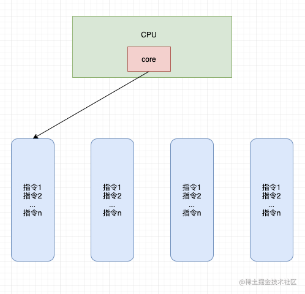
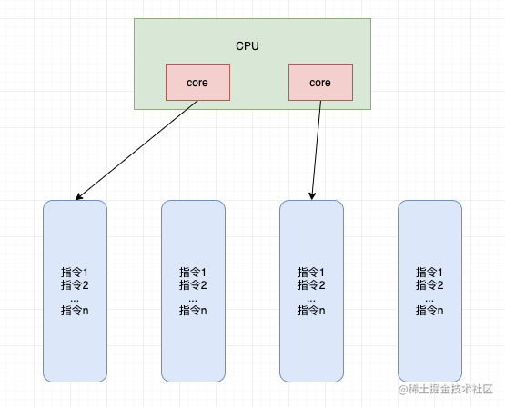

# 1. 基本概念
## 1.1 进程与线程
> 进程
- 程序由指令和数据组成，但这些指令要运行，数据要读写，就必须将指令加载进CPU，数据加载进内存。在指令运行过程中还需要用到磁盘、网络等设备。进程就是用来加载指令、管理内存、管理IO的
- 当一个程序被运行，从磁盘加载这个程序的代码至内存，这时就开启了一个进程
- 进程就可以视为程序的一个实例。大部分程序可以同时运行多个实例进程（例如记事本、华图、浏览器等），也有的程序只能启动一个实例进程（例如网易云音乐，系统安全卫士等）
> 线程
- 一个进程之内可以分为以到多个线程
- 一个线程就是一个指令流，将指令流中的一条条指令以一定的顺序交给CPU执行
- Java中，线程作为最小调度单元，进程作为资源分配的最小单元。在windows中进程时不活动的，只是作为线程的容器
> 二者对比
- 进程基本上相互独立的，而线程存在于进程内，是进程的一个子集
- 进程拥有共享的资源，如内存空间等，供内部的线程共享
- 进程间通信较为复杂
    - 同一台计算机的进程通信称为IPC（Inter-process Communication）
    - 不同计算机之间的进程通信，需要通过网络，并遵守共同的协议，如HTTP
- 线程间通信相对简单，因为它们共享进程内的内存，一个例子是多个线程可以访问同一个共享变量
- 线程更轻量，线程上下文切换成本一般上要比进程上下文切换低
## 1.2 并行与并发
单核cpu下，线程实际还是串行执行的。操作系统中有一个组件叫做任务调度器，将cpu的时间片（windows下时间片最小约为15毫秒）分给不同的线程使用，只是由于cpu在线程间（时间片很短）的切换非常快，人类感觉是同时运行的。总结为一句话为：微观串行，宏观并行

一般将这种线程轮流使用cpu的做法称为**并发（concurrent）**

| CPU  | 时间片1 | 时间片2 | 时间片3 | 时间片4 |
| ---- | ------- | ------- | ------- | ------- |
| core | 线程1   | 线程2   | 线程3   | 线程4   |

多核cpu下，每个核心core都可以调度运行线程，这时候线程可以是**并行（Parallel）** 的，

| CPU   | 时间片1 | 时间片2 | 时间片3 | 时间片4 |
| ----- | ------- | ------- | ------- | ------- |
| core1 | 线程1   | 线程1   | 线程3   | 线程3   |
| core2 | 线程2   | 线程4   | 线程2   | 线程4   |

引用Rob Pike的一段描述：
- 并发（concurrent）是同一时间应对（dealing with）多件事情的能力
- 并行（parallel）是同一时间动手做（doing）多件事情的能力