# 3. 共享模型之管程

## 3.1 共享带来的问题

> Java的体现

示例代码：

```java
@Slf4j(topic = "c.Test9")
public class Test9 {
    static int counter = 0;
    public static void main(String[] args) throws InterruptedException {
        Thread t1 = new Thread(() -> {
            for (int i = 0; i < 5000; i++) {
                counter++;
            }
        }, "t1");
        Thread t2 = new Thread(() -> {
            for (int i = 0; i < 5000; i++) {
                counter--;
            }
        }, "t2");

        t1.start();
        t2.start();
        t1.join();
        t2.join();
        log.debug("counter: {}", counter);
    }
}
```

输出：

```java
18:52:10.045 [main] c.Test9 - counter: -289
```

> 问题分析

以上的结果可能是正数、负数或者零。因为Java中对静态变量的自增、自减并不是原子操作。要彻底理解必须从字节码开始分析。

例如对于`i++`操作而言（i为静态变量），实际会产生如下的jvm字节码指令：

```java
getstatic i // 获取静态变量i的值
iconst_1    // 准备常量1
iadd        // 自增
putstatic i // 将修改后的值存入静态变量i
```

而对应`i--`操作，也是类似：

```java
getstatic i // 获取静态变量i的值
iconst_1    // 准备常量1
isub        // 自减
putstatic   // 将修改后的值存入静态变量i
```

而java的内存模型如下，完成静态变量的自增，自减需要在主存和工作内存中进行数据交换：

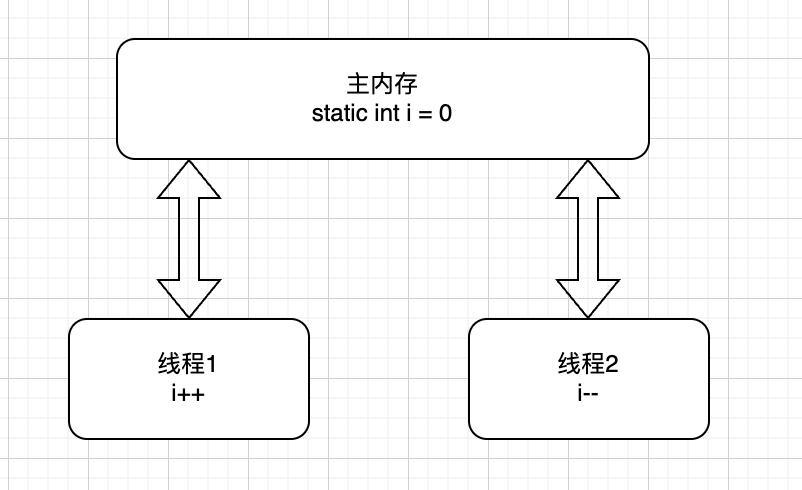

如果是单线程，以上8行代码是按顺序执行（不会交错），便没有问题：

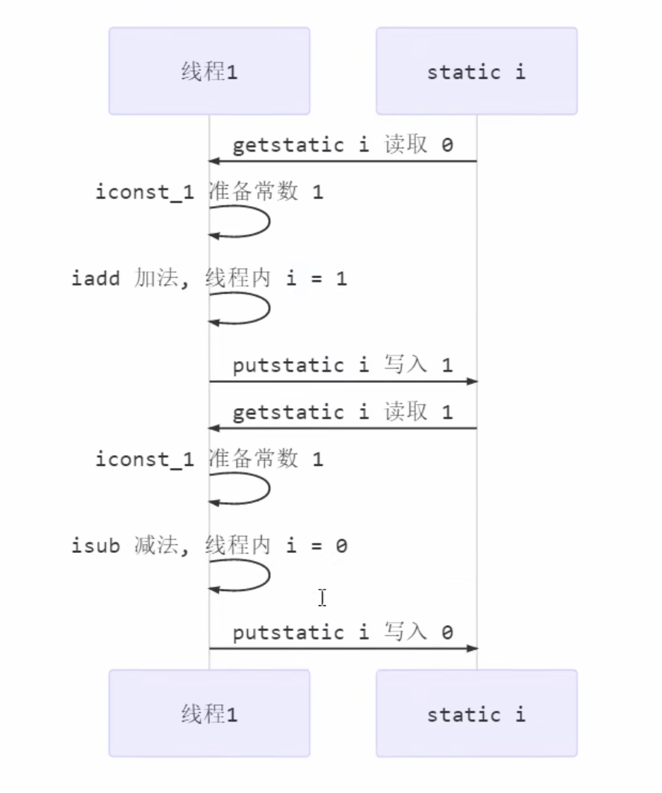

但如果是多线程，这8行代码可能出现交错运行。

出现负数的情况：

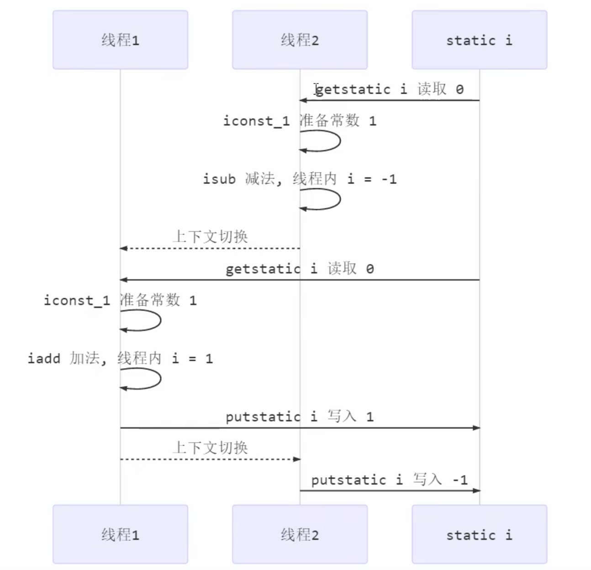

出现正数的情况：

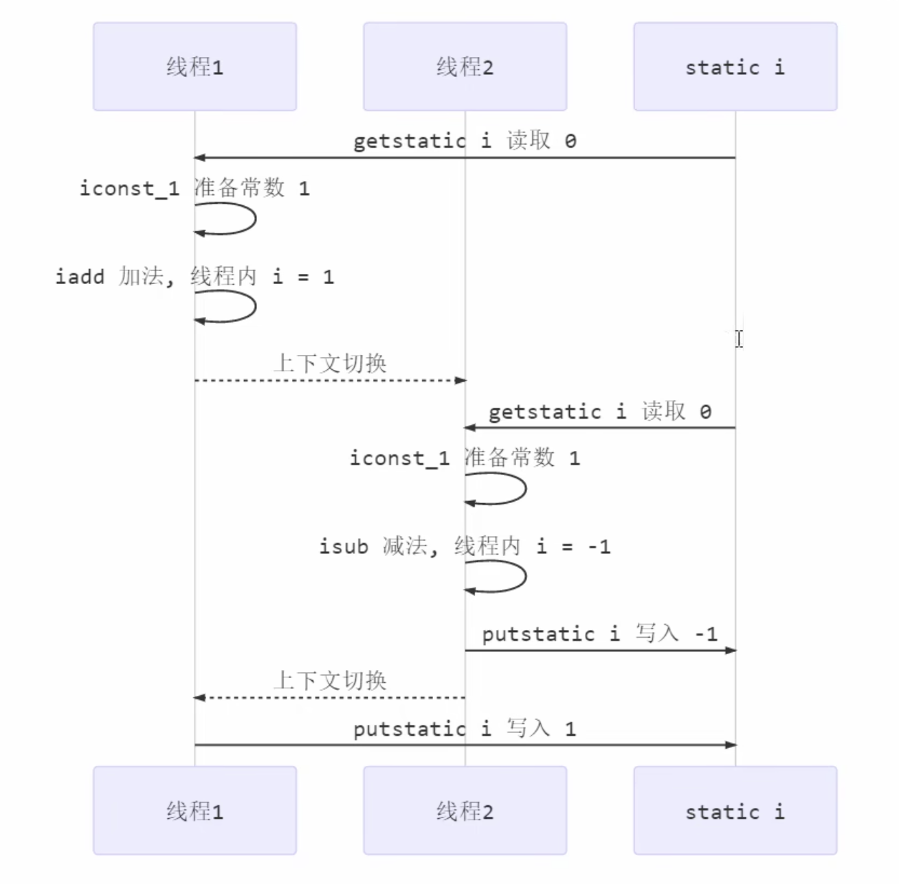

> 临界区 Critical Section

- 一个程序运行多个线程本身是没有问题的

- 问题出现在多个线程访问共享资源

  - 多个线程读取共享资源其实也没有问题
  - 在多个线程对共享资源读写操作发生指令交错，就会出现问题

- 一段代码块内如果存在对共享资源的多线程读写操作，称这块代码为临界区，例如：

  ```java
  static int counter = 0;
  
  static void increment()
  // 临界区
  {
    counter++;
  }
  
  static void decrement()
  // 临界区
  {
    counter--;
  }
  ```

> 竞态条件 Race Condition

多个线程在临界区内执行，由于代码的执行序列不同而导致结果无法预测，称之为发生了竞态条件

## 3.2 synchronized 解决方案

为了避免临界区的竞态条件发生，有多钟手段可以达到目的。

- 阻塞式解决方案：synchronize, Lock
- 非阻塞式解决方案：原子变量

本章节使用阻塞式解决方案synchronized，来解决上述问题，即俗称的“锁对象”。它采用互斥的方式让同一时刻至多只有一个线程能持有“锁对象”，其他线程再想获取这个锁对象时就会阻塞住。这样就能保证有锁的线程可以安全地执行临界区内的代码，不用担心线程上线文切换

注意，虽然java中互斥和同步都可以采用synchronized关键字来完成，但他们还是有区别的：

- 互斥是保证临界区的竞态条件发生，同一时刻只能有一个线程执行临界区代码
- 同步是由于线程执行的先后、顺序不同，需要一个线程等待其他线程运行到某个点

### 3.2.1 synchronized

语法：

```java
synchronized(对象) {
  // 临界区
}
```

示例代码：

```java
@Slf4j(topic = "c.Test9")
public class Test9 {
    static int counter = 0;
    static final Object room = new Object();
    public static void main(String[] args) throws InterruptedException {
        Thread t1 = new Thread(() -> {
            for (int i = 0; i < 5000; i++) {
                synchronized (room) {
                    counter++;
                }
            }
        }, "t1");
        Thread t2 = new Thread(() -> {
            for (int i = 0; i < 5000; i++) {
                synchronized (room) {
                    counter--;
                }
            }
        }, "t2");

        t1.start();
        t2.start();
        t1.join();
        t2.join();
        log.debug("counter: {}", counter);
    }
}
```

输出永远为：

```java
19:23:19.116 [main] c.Test9 - counter: 0
```

如何理解`synchronized`的作用？

- `synchronized(对象)`中的对象，可以想象为一个房间，有唯一的入口，房间只能一次进入一人进行计算。线程`t1`和`t2`想象成两个人
- 当线程`t1`执行到`synchronized(room)`时就好比`t1`进入到了这个房间，并锁住了门，拿走了钥匙，在门内执行`i++`代码
- 这时候如果`t2`也运行到了`synchronized(room)`时，它发现门被锁住了，只能在门外等待，发生了上下文切换，阻塞住了
- 这中间即使`t1`的cpu时间片不幸用完了，被踢出了门外（不要错误地理解为锁住了对象就能一直执行下去），这时门还是锁住的，`t1`仍然拿着钥匙，`t2`线程还在阻塞状态进不来，只有下次轮到`t1`自己再次获得时间片时才能开门进入
- 当`t1`执行完`synchronized{...}`块内的代码，这时候才会从房间出来，并解开锁，唤醒`t2`线程把钥匙给他。`t2`线程这时才能进入房间，锁住门拿上钥匙，执行它的`count--`代码

总结一下，`synchronized`实际是用对象锁保证了临界区内代码的原子性，临界区内的代码对外是不可分割的，不会被线程切换所打断。

为了加深理解，思考如下问题：

- 如果把`synchronized(obj)`放在`for`循环外面，如何理解？
  - 这样其实是把整个`for`循环作为一个整体来进行加锁
- 如果`t1 synchronized(obj_1)`，而`t2 synchronzied(obj_2)`会怎样运行？
  - 相当于两个线程进入了不同的房间，无法保证线程安全
- 如果`t1 synchronized(obj)` 而`t2`没有加锁，如何运行？
  - `t2`线程在想访问共享资源时候，无需尝试获取锁，所以依然存在线程安全问题

### 3.2.2 案例：计数（面向对象设计）

```java
@Slf4j(topic = "c.Test9")
public class Test9 {

    public static void main(String[] args) throws InterruptedException {
        Room room = new Room();
        Thread t1 = new Thread(() -> {
            for (int i = 0; i < 5000; i++) {
                room.increment();
            }
        }, "t1");
        Thread t2 = new Thread(() -> {
            for (int i = 0; i < 5000; i++) {
                room.decrement();
            }
        }, "t2");

        t1.start();
        t2.start();
        t1.join();
        t2.join();
        log.debug("counter: {}", room.getCounter());
    }
}

class Room {
    private int counter = 0;

    public void increment() {
        synchronized (this) {
            counter++;
        }
    }

    public void decrement() {
        synchronized (this) {
            counter--;
        }
    }

    public int getCounter() {
        synchronized (this) {
            return counter;
        }
    }
}
```

## 3.3 方法上的synchronized

语法：

```java
class Test {
  public synchronized void test() {
    
  }
}

// 等价于：
class Test {
  public void test() {
    synchronized(this) {
      
    }
  }
}
```

```java
class Test {
  public synchronized static void test() {
    
  }
}

// 等价于：
class Test {
  public static void test() {
    synchronized(Test.class) {
      
    }
  }
}
```

所以上一节案例中的`Room` class可以修改为：

```java
class Room {
    private int counter = 0;

    public synchronized void increment() {
        counter++;
    }

    public synchronized void decrement() {
        counter--;
    }

    public synchronized int getCounter() {
        return counter;
    }
}
```

### 3.3.1 案例：“线程八锁”

> Case 1

```java
@Slf4j(topic = "c.TestLocks")
public class TestLocks {
    public static void main(String[] args) {
        Number n1 = new Number();
        new Thread(n1::a).start();
        new Thread(n1::b).start();
    }
}

@Slf4j(topic = "c.Number")
class Number {
    public synchronized void a() {
        log.debug("1");
    }

    public synchronized void b() {
        log.debug("2");
    }
}
```

说明：两个线程锁住的是同一个对象`n1`，所以输出可能是`1 -> 2`或者`2 -> 1`

> Case 2

```java
@Slf4j(topic = "c.TestLocks")
public class TestLocks {
    public static void main(String[] args) {
        Number n1 = new Number();
        new Thread(n1::a).start();
        new Thread(n1::b).start();
    }
}

@Slf4j(topic = "c.Number")
class Number {
    public synchronized void a() {
        sleep(1); // sleep 1s
        log.debug("1");
    }

    public synchronized void b() {
        log.debug("2");
    }
}
```

说明：输出可能是`(1s) -> 1 -> 2`或者`2 -> (1s) -> 1`

> Case 3

```java
@Slf4j(topic = "c.TestLocks")
public class TestLocks {
    public static void main(String[] args) {
        Number n1 = new Number();
        new Thread(n1::a).start();
        new Thread(n1::b).start();
        new Thread(n1::c).start();
    }
}

@Slf4j(topic = "c.Number")
class Number {
    public synchronized void a() {
        sleep(1);
        log.debug("1");
    }

    public synchronized void b() {
        log.debug("2");
    }

    public void c() {
        log.debug("3");
    }
}
```

说明：输出可能是`3 -> (1s) -> 1 -> 2`或者`2 -> 3 -> (1s) -> 1`或者`3 -> 2 -> (1s) -> 1`

> Case 4

```java
@Slf4j(topic = "c.TestLocks")
public class TestLocks {
    public static void main(String[] args) {
        Number n1 = new Number();
        Number n2 = new Number();
        new Thread(n1::a).start();
        new Thread(n2::b).start();
    }
}

@Slf4j(topic = "c.Number")
class Number {
    public synchronized void a() {
        sleep(1);
        log.debug("1");
    }

    public synchronized void b() {
        log.debug("2");
    }
}
```

说明：两个线程执行时候锁住的对象不相同，不存在互斥情况，所以只会有一种输出情况：`2 -> (1s) -> 1`

> Case 5

```java
@Slf4j(topic = "c.TestLocks")
public class TestLocks {
    public static void main(String[] args) {
        Number n1 = new Number();
        new Thread(Number::a).start();
        new Thread(n1::b).start();
    }
}

@Slf4j(topic = "c.Number")
class Number {
    public static synchronized void a() {
        sleep(1);
        log.debug("1");
    }

    public synchronized void b() {
        log.debug("2");
    }
}
```

说明：由于`a()`方法为`static`，加锁的对象是`Number.class`，与方法`b()`锁住的`this`对象不同，不存在互斥现象，所以只会有一种输出情况：`2 -> (1s) -> 1`

> Case 6

```java
@Slf4j(topic = "c.TestLocks")
public class TestLocks {
    public static void main(String[] args) {
        Number n1 = new Number();
        new Thread(Number::a).start();
        new Thread(Number::b).start();
    }
}

@Slf4j(topic = "c.Number")
class Number {
    public static synchronized void a() {
        sleep(1);
        log.debug("1");
    }

    public static synchronized void b() {
        log.debug("2");
    }
}
```

说明：两个方法锁住的是同一个`Number.class`对象，存在互斥现象，所以输出可能是`(1s) -> 1 -> 2`或者`2 -> (1s) -> 1`

> Case 7

```java
@Slf4j(topic = "c.TestLocks")
public class TestLocks {
    public static void main(String[] args) {
        Number n2 = new Number();
        new Thread(Number::a).start();
        new Thread(n2::b).start();
    }
}

@Slf4j(topic = "c.Number")
class Number {
    public static synchronized void a() {
        sleep(1);
        log.debug("1");
    }

    public synchronized void b() {
        log.debug("2");
    }
}
```

说明：两个方法锁住的不是同一个对象，不存在互斥现象，输出只能是`2 -> (1s) -> 1`

> Case 8

```java
@Slf4j(topic = "c.TestLocks")
public class TestLocks {
    public static void main(String[] args) {
        Number n1 = new Number();
        Number n2 = new Number();
        new Thread(() -> n1.a()).start();
        new Thread(() -> n2.b()).start();
    }
}

@Slf4j(topic = "c.Number")
class Number {
    public static synchronized void a() {
        sleep(1);
        log.debug("1");
    }

    public static synchronized void b() {
        log.debug("2");
    }
}
```

说明：两个方法锁住的是同一个`Number.class`对象，所以输出可能是`(1s) -> 1 -> 2`或者`2 -> (1s) -> 1`

## 3.4 变量的线程安全分析

### 3.4.1 成员变量和静态变量是否线程安全

- 如果它们没有共享，则线程安全
- 如果它们被共享了，根据它们的状态是否能够改变，又分为两种情况
  - 如果只有读操作，则线程安全
  - 如果有读写操作，则这段代码是临界区，需要考虑线程安全问题

### 3.4.2 局部变量是否线程安全

- 局部变量是线程安全的
- 但是局部变量引用的对象则未必安全
  - 如果该对象没有逃离方法的作用域，它是线程安全的
  - 如果该对象逃离方法的作用域，则需要考虑线程安全问题

考虑如下代码：

```java
public static void test() {
  int i = 10;
  i++;
}
```

每个线程调用`test()`方法时局部变量`i`会在每个线程的栈帧内存中被创建多份，因此不存在共享情况：

```java
public static void test();
	descriptor: ()V
  flags: ACC_PUBLIC, ACC_STATIC
  Code:
    stack=1, locals=1, args_size=0
      0: bipush   10
      2: istore_0
      3: iine     0, 1
      6: return
    LineNumberTable:
      line 10: 0
      line 11: 3
      line 12: 6
    LocalVariableTable:
			Start  Length  Slot  Name  Signature
          3       4     0     i  I
```

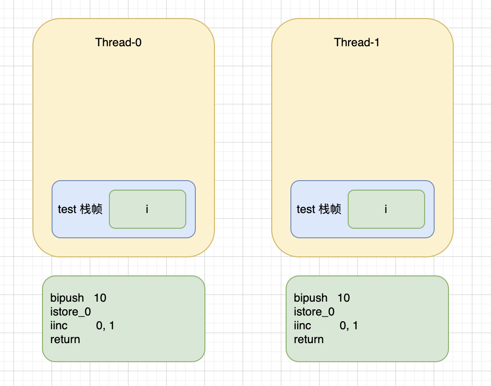

> 局部变量的引用稍有不同

先看一个成员变量的例子：

```java
public class TestThreadUnsafe {

    static final int THREAD_NUMBER = 2;
    static final int LOOP_NUMBER = 200;

    public static void main(String[] args) {
        ThreadUnsafe threadUnsafe = new ThreadUnsafe();
        for (int i = 0; i < THREAD_NUMBER; i++) {
            new Thread(() -> {
                threadUnsafe.method1(LOOP_NUMBER);
            }, "Thread" + (i + 1)).start();
        }
    }
}

class ThreadUnsafe {
    List<String> list = new ArrayList<>();

    public void method1(int loopNumber) {
        for (int i = 0; i < loopNumber; i++) {
            method2();
            method3();
        }
    }

    private void method2() {
        list.add("1");
    }

    private void method3() {
        list.remove(0);
    }
}
```

输出很容易报错：

```java
Exception in thread "Thread1" java.lang.IndexOutOfBoundsException: Index: 0, Size: 0
	at java.util.ArrayList.rangeCheck(ArrayList.java:659)
	at java.util.ArrayList.remove(ArrayList.java:498)
	at com.nasuf.concurrency.ThreadUnsafe.method3(TestThreadUnsafe.java:36)
	at com.nasuf.concurrency.ThreadUnsafe.method1(TestThreadUnsafe.java:27)
	at com.nasuf.concurrency.TestThreadUnsafe.lambda$main$0(TestThreadUnsafe.java:15)
	at java.lang.Thread.run(Thread.java:750)
```

报错原因是：如果线程2还未执行`add`操作，而线程1就开始执行`remove`操作。而无论哪个线程中的`method2`和`method3`引用的都是同一个对象中的`list`对象。

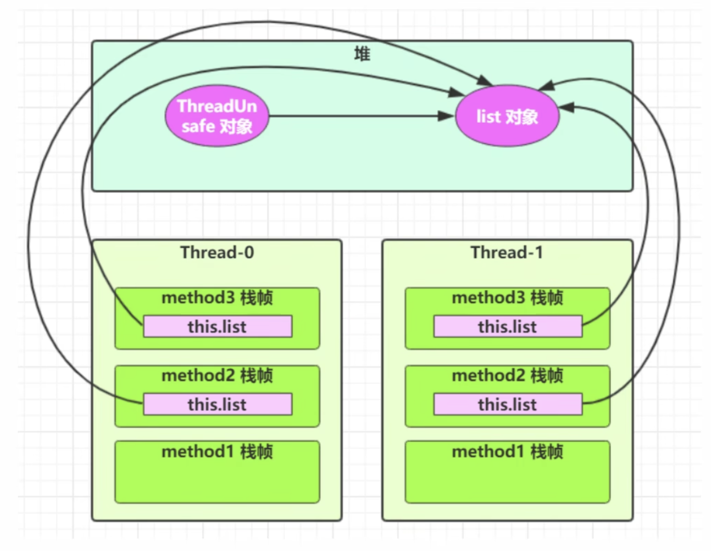

而如果将`list`作为`method1()`的局部变量，则不会出现上述问题：

```java
public class TestThreadUnsafe {

    static final int THREAD_NUMBER = 2;
    static final int LOOP_NUMBER = 200;

    public static void main(String[] args) {
        ThreadSafe threadSafe = new ThreadSafe();
        for (int i = 0; i < THREAD_NUMBER; i++) {
            new Thread(() -> {
                threadSafe.method1(LOOP_NUMBER);
            }, "Thread" + (i + 1)).start();
        }
    }
}

class ThreadSafe {

    public void method1(int loopNumber) {
        List<String> list = new ArrayList<>();
        for (int i = 0; i < loopNumber; i++) {
            method2(list);
            method3(list);
        }
    }

    private void method2(List<String> list) {
        list.add("1");
    }

    private void method3(List<String> list) {
        list.remove(0);
    }
}
```

分析：

- `list`是局部变量，每个线程调用时都会创建其不同实例，不会共享
- 而`method2()`的参数是从`method1()`中传递过来的，与`method1()`中引用的是同一个对象
- `method3()`的参数分析与`method2()`相同

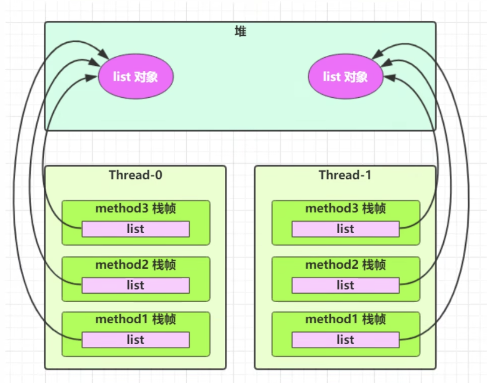

注意，上述代码`method2`和`method3`都是`private`修饰；如果改成`public`的，是否会存在线程安全问题？

- 情况一：如果有其他线程调用`method2`和`method3` -> 这种情况不会存在线程安全问题。因为其他线程调用的时候传递的参数是不同`list`对象的引用

- 情况二：在情况一的基础上，为`ThreadSafe`添加子类，子类覆盖`method2`或`method3`方法 ，而该方法另外开启线程执行操作-> 这种情况会出现线程安全问题。因为子类执行的`method3`方法跟父类执行的`method2`方法引用的是同一个`list`对象
  ```java
  public class TestThreadUnsafe {
  
      static final int THREAD_NUMBER = 2;
      static final int LOOP_NUMBER = 200;
  
      public static void main(String[] args) {
          ThreadSafeSubClass threadSafeSubClass = new ThreadSafeSubClass();
          for (int i = 0; i < THREAD_NUMBER; i++) {
              new Thread(() -> {
                  threadSafeSubClass.method1(LOOP_NUMBER);
              }, "Thread" + (i + 1)).start();
          }
      }
  }
  
  class ThreadSafe {
  
      public void method1(int loopNumber) {
          List<String> list = new ArrayList<>();
          for (int i = 0; i < loopNumber; i++) {
              method2(list);
              method3(list);
          }
      }
  
      public void method2(List<String> list) {
          list.add("1");
      }
  
      public void method3(List<String> list) {
          list.remove(0);
      }
  }
  
  class ThreadSafeSubClass extends ThreadSafe {
      @Override
      public void method3(List<String> list) {
          new Thread(() -> list.remove(0)).start();
      }
  }
  ```

可见访问修饰符会影响线程安全问题。`private`保证了子类不会重写父类的方法，从而避免了引用的共享导致的线程安全问题。另外也可以使用`final`来达到防止子类对父类方法重写的效果。

### 3.4.3 常见线程安全类

- String
- Integer
- StringBuffer
- Random
- Vector
- Hashtable
- java.util.concurrent包下的类

这里说它们是线程安全的，指的是多个线程调用它们同一个实例的某个方法时，是线程安全的。也可以理解为：

> 它们的每个方法是原子的。以下操作是线程安全的

```java
HashTable table = new HashTable();
new Thread(() -> table.put("key", "value1")).start();
new Thread(() -> table.put("key", "value2")).start();
```

> 但是它们多个方法的组合调用不是线程安全的

考虑下面代码：

```java
HashTable table = new HashTable();
// Thead1, Thread2同时调用下面代码：
if (table.get("key") == null) {
  table.put("key", "value");
}
```

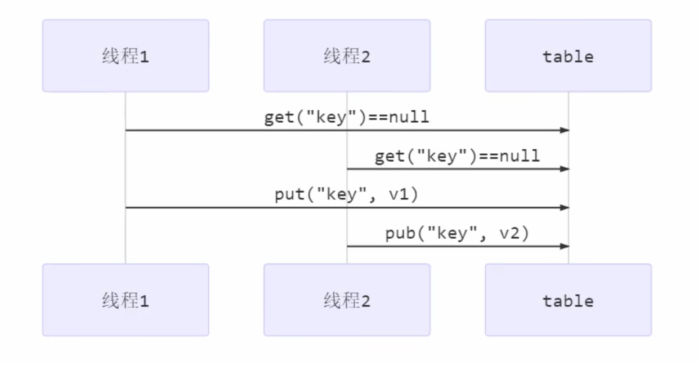

方法`put`和`get`分别都是线程安全的，但是组合一起使用，无法保证线程安全。

### 3.4.4 不可变类线程安全性

`String`、`Integer`等都是不可变类，因为其内部的状态不可以改变，因此它们的方法都是线程安全的。

> 测试1

```java
// Servlet只有一个实例，内部资源是共享的
public class MyServlet extends HttpServlet {
  Map<String, Object> map = new HashMap<>(); // 非线程安全
  String s1 = "..."; // 线程安全
  final String s2 = "..."; // 线程安全
  Date d1 = new Date(); // 非线程安全
  final Date d2 = new Date(); // 非线程安全
  
  public void doGet(HttpServletRequest request, HttpServletResponse response) {
    // 使用上述变量
  }
}
```

> 测试2

```java
// Servlet只有一个实例，内部资源是共享的
public class MyServlet extends HttpServlet {
  private UserService userService = new UserServiceImpl(); // 非线程安全
  
  public void doGet(HttpServletRequest request, HttpServletResponse response) {
    userService.update();
  }
}

public class UserServiceImpl implements UserService {
  // 记录调用次数
  private int count = 0;
  
  public void update() {
    count++; // count被多个线程共享，无法保证线程安全性
  }
}
```

> 测试3

```java
@Aspect
@Component // 默认为单例，内部资源在多个线程之间共享
public class MyAspect {
  private long start = 0L; // 非线程安全
  
  @Before("execution(* *(..))")
  public void before() {
    start = System.nanoTime();
  }
  
  @After("execution(* *(..))")
  public void after() {
    long end = System.nanoTime();
    System.out.println("cost time: " + (end - start));
  }
}

// 要解决上述代码线程安全问题，最好是使用环绕通知
```

> 测试4

```java
public class MyServlet extends HttpServlet {
  // 线程安全。userService内部线程安全
  private UserService userService = new UserServiceImpl(); 
  
  public void doGet(HttpServletRequest request, HttpServletResponse response) {
    userService.update();
  }
}

public class UserServiceImpl implements UserService {
  // 线程安全。因为虽然userDao被多个线程共享，但是userDao内部操作是线程安全的
  private UserDao userDao = new UserDaoImpl();
  
  public void update() {
    userDao.update();
  }
}

public class UserDaoImpl implements UserDao {
  // 线程安全。因为都是方法内的局部变量，不存在UserDaoImpl的实例变量，不存在资源共享问题
  public void update() {
    String sql = "update user set password = ? where username = ?";
    try (Connection conn = new DriverManager.getConnection(..)) {
      // ...
    } catch (Exception e) {
      // ...
    }
  }
}
```

> 测试5

```java
public class MyServlet extends HttpServlet {
  // 非线程安全。userServiceImpl内部不是线程安全
  private UserService userService = new UserServiceImpl(); 
  
  public void doGet(HttpServletRequest request, HttpServletResponse response) {
    userService.update();
  }
}

public class UserServiceImpl implements UserService {
  // 非线程安全。userDao内部不是线程安全的
  private UserDao userDao = new UserDaoImpl();
  
  public void update() {
    userDao.update();
  }
}

public class UserDaoImpl implements UserDao {
  // 非线程安全。conn为UserDaoImpl类的实例变量，会导致多个线程共享资源问题
  private Connection conn = null;
  public void update() {
    String sql = "update user set password = ? where username = ?";
    conn = DriverManager.getConnection(...);
    // ...
    conn.close();
  }
}
```

> 测试6

```java
public class MyServlet extends HttpServlet {
  // 线程安全。userService内部线程安全
  private UserService userService = new UserServiceImpl(); 
  
  public void doGet(HttpServletRequest request, HttpServletResponse response) {
    userService.update();
  }
}

public class UserServiceImpl implements UserService {
  // 线程安全。userDao是方法内局部变量
  public void update() {
    UserDao userDao = new UserDaoImpl();
    userDao.update();
  }
}

public class UserDaoImpl implements UserDao {
  // 非线程安全。conn为UserDaoImpl类的实例变量，会导致多个线程共享资源问题
  private Connection conn = null;
  public void update() {
    String sql = "update user set password = ? where username = ?";
    conn = DriverManager.getConnection(...);
    // ...
    conn.close();
  }
}
```

> 测试7

```java
public abstract class Test {
  public void bar() {
    SimpleDateFormat sdf = new SimpleDateFormat("yyyy-MM-dd HH:mm:ss");
    foo(sdf);
  }
  
  public abstract foo(SimpleDateFormat sdf);
  
  public static void main(String[] args) {
    new Test().bar();
  }
}
```

其中`foo`方法要被子类重写，行为是不确定的，可能导致线程安全问题发生，被称之为“外星方法”。例如：

```java
public void foo(SimpleDateFormat sdf) {
  String dateStr = "1999-10-11 00:00:00";
  for (int i = 0; i < 20; i++) {
    new Thread(() -> {
      try {
        sdf.parse(dateStr);
      } catch (ParseException e) {
        e.printStackTrace();
      }
    }).start();
  }
}
```

## 3.5 案例

### 3.5.1 卖票测试

```java
@Slf4j(topic = "c.TicketSelling")
public class TicketsSelling {
    public static void main(String[] args) throws InterruptedException {
        // 模拟多人买票
        TicketWindow window = new TicketWindow(1000);
        // 卖出的票数统计
        List<Integer> amountList = new Vector<>();
        // 所有线程集合
        List<Thread> threadList = new ArrayList<>();

        for (int i = 0; i < 4000; i++) {
            Thread thread = new Thread(() -> {
                int amount = window.sell(randomAmount());
                try {
                    Thread.sleep(randomAmount());
                } catch (InterruptedException e) {
                    throw new RuntimeException(e);
                }
                amountList.add(amount);
            });
            threadList.add(thread);
            thread.start();
        }
        for (Thread thread : threadList) {
            thread.join();
        }

        // 统计卖出票数和剩余票数
        log.debug("余票：{}", window.getRemaining());
        log.debug("卖出：{}", amountList.stream().mapToInt(i -> i).sum());
    }

    static Random random = new Random();

    public static int randomAmount() {
        return random.nextInt(5) + 1;
    }
}

class TicketWindow {
    private int remaining; // 实例变量，存在资源共享，导致线程安全问题

    public TicketWindow(int remaining) {
        this.remaining = remaining;
    }

    public int getRemaining() {
        return remaining;
    }

    public int sell(int amount) {
        if (this.remaining >= amount) {
            this.remaining -= amount;
            return amount;
        } else {
            return 0;
        }
    }
}
```

上述代码存在线程安全问题，容易得到如下不合理输出：

```java
14:01:17.916 [main] c.TicketSelling - 余票：0
14:01:17.931 [main] c.TicketSelling - 卖出：1002
```

修改代码如下：

```java
public synchronized int sell(int amount) {
  if (this.remaining >= amount) {
    this.remaining -= amount;
    return amount;
  } else {
    return 0;
  }
}
```

### 3.5.2 转账测试

```java
@Slf4j(topic = "c.TransferTest")
public class TransferTest {
    public static void main(String[] args) throws InterruptedException {
        Account a = new Account(1000);
        Account b = new Account(1000);
        Thread t1 = new Thread(() -> {
            for (int i = 0; i < 1000; i++) {
                a.transfer(b, randomAmount());
            }
        }, "t1");
        Thread t2 = new Thread(() -> {
            for (int i = 0; i < 1000; i++) {
                b.transfer(a, randomAmount());
            }
        }, "t2");
        t1.start();
        t2.start();
        t1.join();
        t2.join();
        log.debug("total: {}", a.getMoney() + b.getMoney());
    }

    static Random random = new Random();

    public static int randomAmount() {
        return random.nextInt(5) + 1;
    }
}

class Account {
    private int money;

    public Account(int money) {
        this.money = money;
    }

    public int getMoney() {
        return money;
    }

    public void setMoney(int money) {
        this.money = money;
    }

    public void transfer(Account target, int amount) {
        if (this.money > amount) {
            this.setMoney(this.getMoney() - amount);
            target.setMoney(target.getMoney() + amount);
        }
    }
}
```

上述代码依然存在线程安全问题，容易导致错误输出：

```java
14:23:03.339 [main] c.TransferTest - total: 3480
```

导致出问题的还是`transfer`方法。但是即使加上方法上的`synchronized`也不能保证线程安全：

```java
public synchronized void transfer(Account target, int amount) {
  if (this.money > amount) {
    this.setMoney(this.getMoney() - amount);
    target.setMoney(target.getMoney() + amount);
  }
}
```

相当于：

```java
public void transfer(Account target, int amount) {
  synchronized(this) {
      if (this.money > amount) {
        this.setMoney(this.getMoney() - amount);
        target.setMoney(target.getMoney() + amount);
      }
  }
}
```

加锁的对象是`this`，但是该方法会有另外的target也存在线程安全问题，没有被锁住。解决方法就是对`Account.class`进行加锁，这样可以同时锁住所有`Account`对象：

```java
public void transfer(Account target, int amount) {
  synchronized (Account.class) {
    if (this.money > amount) {
      this.setMoney(this.getMoney() - amount);
      target.setMoney(target.getMoney() + amount);
    }
  }
}
```

但是要注意，这种方式效率很低。后续我们会有更有效的解决方案。

## 3.6 Monitor概念

### 3.6.1 Java对象头

以32位虚拟机为例：

> 普通对象

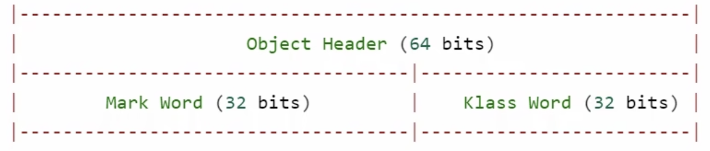

> 数组对象

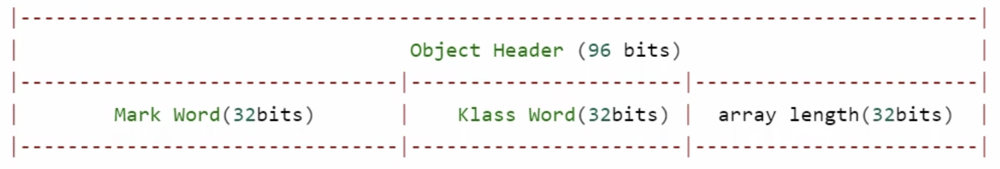

其中Mark Word结构为：

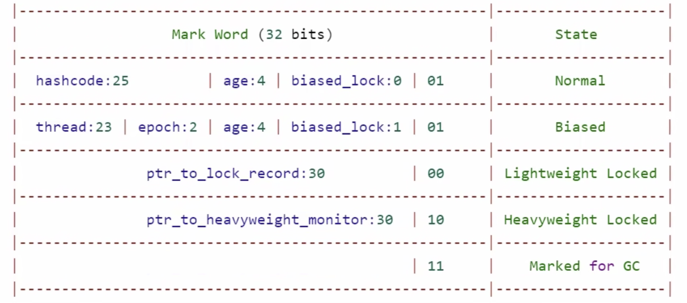

### 3.6.2 Monitor

Monitor被翻译为监视器或管程，每个Java对象都可以关联一个Monitor对象，如果使用`synchronized`给对象上锁（重量级）之后，改对象的Mark Word中就被设置指向Monitor对象的指针。

Monitor结构如下：

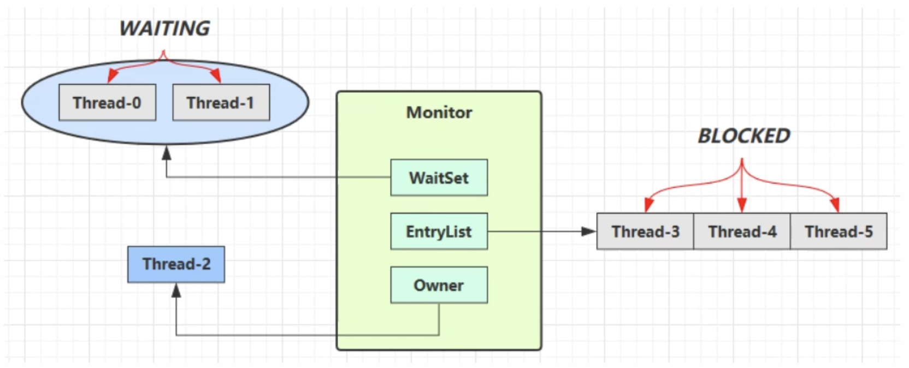

- 刚开始Monitor中`Owner`为`null`
- 当Thread-2执行`synchronized(obj)`，就会将Monitor的所有者`Owner`设置为`Thread-2`。Monitor中只能有一个Owner
- 在Thread-2上锁的过程中，如果Thread-3，Thread-4，Thread-5也来执行`synchronized(obj)`，就会进入`EntryList`(BLOCKED)
- Thread-2执行完同步代码块的内容，然后唤醒EntryList中等待的线程来竞争锁，竞争是非公平的，不会按照先进先出顺序，而是JDK实际的底层实现来进行
- 途中WaitSet中的Thread-0，Thread-1是之前获得过锁，但是条件不满足进入WAITING状态的线程。后面讲`wait-notify`时会分析

注意：

- `synchronized`必须是进入同一个对象的monitor才有上述效果
- 不加`synchronized`的对象不会关联监视器，不遵循以上规则

## 3.7 synchronized 原理进阶

### 3.7.1 字节码角度

考虑如下代码：

```java
static final Object lock = new Object();
static int counter = 0;

public static void main(String[] args) {
  synchronized(lock) {
    counter++;
  }
}
```

对应的字节码为：

```java
public static void main(java.lang.String[]);
	descriptor: ([Ljava/lang/String;])V
  flags: ACC_PUBLIC, ACC_STATIC
  Code:
		stack=2, locals=3, args_size=1
      0: getstatic  #2 // <- lock引用（synchronized开始）
      3: dup
      4: astore_1      // lock引用 -> slot 1
      5: monitorenter  // 将lock对象MarkWord置为Monitor指针
      6: getstatic  #3 // <- i
      9: iconst_1      // 准备常数 1
     10: iadd          // +1
     11: putstatic  #3 // -> i
     14: aload_1       // <- lock引用
     15: monitorexit   // 将lock对象MarkWord重置，唤醒EntryList
     16: goto       24
     19: astore_2      // e -> slot 2
     20: aload_1       // <- lock引用
     21: monitorexit   // 将lock对象MarkWord重置，唤醒EntryList
     22: aload_2       // <- slot 2 (e)
     23: athrow        // throw e
     24: return
   Exception table:
			from    to    target    type
         6    16        19     any
         19   22        19     any
```

### 3.7.2 轻量级锁

使用场景：如果一个对象虽然有多线程访问，但多线程访问的时间是错开的（也就是没有竞争），那么可以使用轻量级锁来优化。轻量级锁对使用者是透明的，即语法依然是`synchronized`。假设有两个方法同步块，利用同一个对象加锁：

```java
static final Object obj = new Object();

public static void method1() {
  synchronized (obj) {
    // 同步块A
    method2();
  }
}

public static void method2() {
  synchronized (obj) {
    // 同步块B
  }
}
```

- 创建锁记录（Lock Record）对象，每个线程的栈帧都会包含一个锁记录的结构，内部可以存储锁定对象的MarkWord

  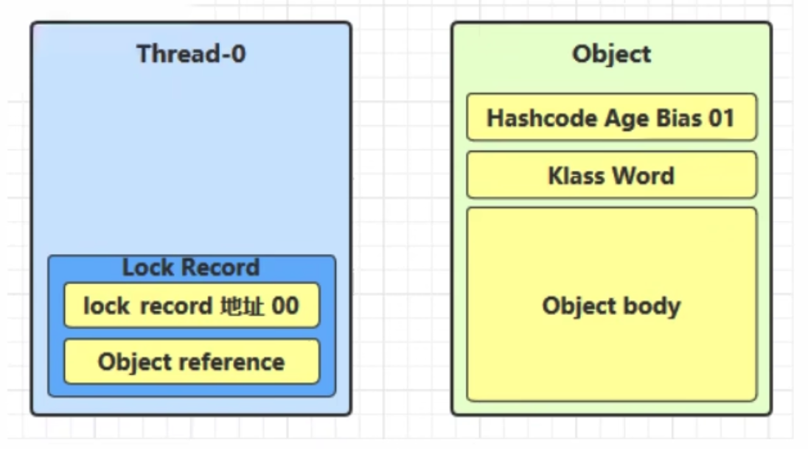

- 让锁记录中的`Object Reference`指向锁对象，并尝试用`cas`替换Object的`Mark Word`，将`Mark Word`的值存入锁记录
  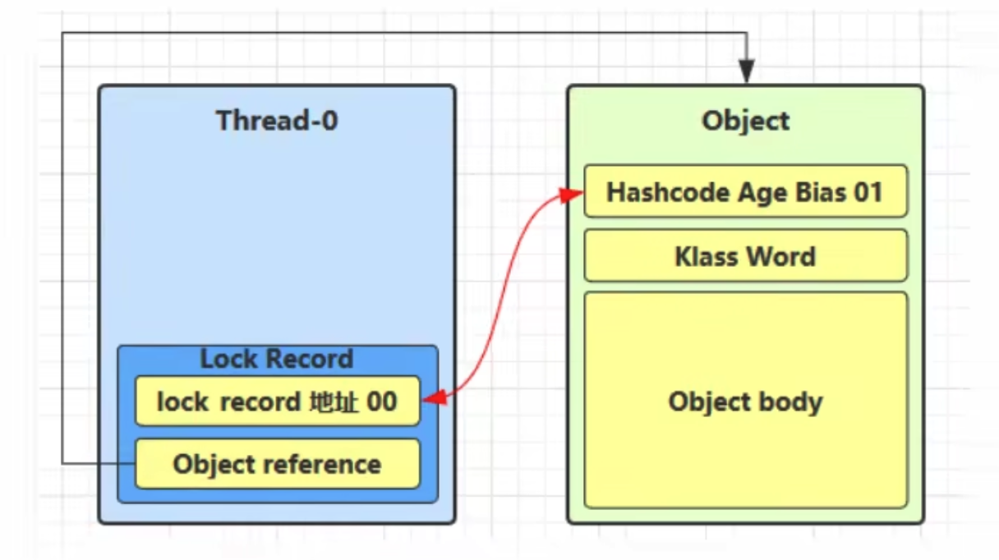

- 如果`cas`替换成功，对象头中存储了锁记录地址和状态`00`，表示由该线程给对象加锁，这时图示如下：

  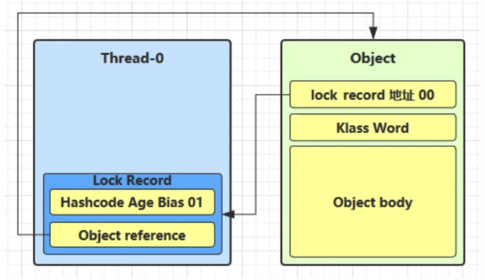

- 如果`cas`失败，有两种情况：

  - 如果是其他线程已经持有了该Object的轻量级锁，这时表明有竞争，进入锁膨胀过程
  - 如果是自己执行了`synchronized`锁重入（如上述代码），那么再添加一条`Lock Record`作为重入的计数
    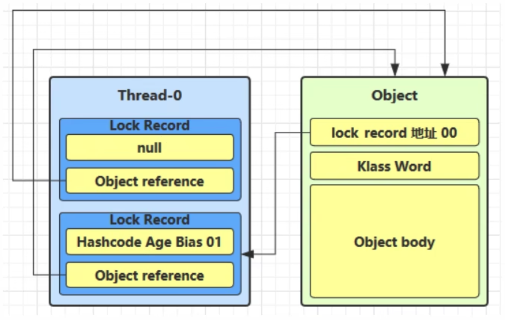

- 当退出`synchronized`代码块（解锁时），如果有取值为`null`的锁记录，表示有重入，这时重置锁记录，表示重入计数减一
  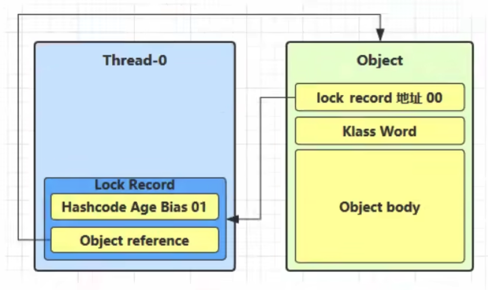

- 当退出`synchronized`代码块（解锁时），如果锁记录的值不为`null`，这时使用`cas`将`Mark Word`的值恢复给对象头

  - 成功，则解锁成功
  - 失败，说明轻量级锁进行了锁膨胀或已经升级为重量级锁，进入重量级锁解锁流程

### 3.7.3 锁膨胀

如果在尝试加轻量级锁的过程中，`cas`操作无法成功，这时一种情况就是有其他线程为此对象加上了轻量级锁（有竞争），这时需要进行锁膨胀，将轻量级锁变为重量级锁。参考如下代码：

```java
static Object obj = new Object();
public static void method1() {
  synchronized(obj) {
    // 同步块
  }
}
```

- 当Thread-1进行轻量级加锁时，Thread-0已经给该对象加了轻量级锁
  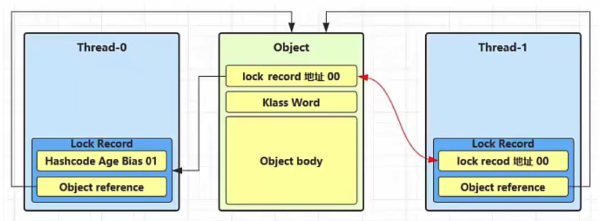
- 这时Thread-1加轻量级锁失败，进入锁膨胀流程
  - 即为Object对象申请Monitor锁，让Object指向重量级锁地址
  - 然后自己进入Monitor的EntryList BLOCKED
    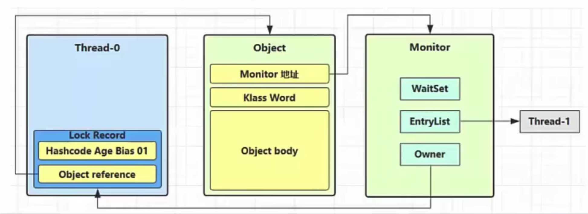
- 当Thread-0退出同步块解锁时，使用`cas`将MarkWord的值恢复给对象头，失败。这时会进入重量级解锁流程，即按照Monitor地址找到Monitor对象，设置Owner为`null`，唤醒EntryList中的BLOCKED线程

### 3.7.4 自旋优化

重量级锁竞争额时候，还可以使用自旋来进行优化。如果当前线程自旋成功（即这时候持锁线程已经退出了同步块，释放了锁），这时当前线程就可以避免阻塞。

> 自旋重试成功的情况：

| 线程1（cpu-1上）        | 对象Mark               | 线程2（cpu-2上）        |
| ----------------------- | ---------------------- | ----------------------- |
| -                       | 10（重量锁）           | -                       |
| 访问同步块，获取monitor | 10（重量锁）重量锁指针 | -                       |
| 成功（加锁）            | 10（重量锁）重量锁指针 | -                       |
| 执行同步块              | 10（重量锁）重量锁指针 | -                       |
| 执行同步块              | 10（重量锁）重量锁指针 | 访问同步块，获取monitor |
| 执行同步块              | 10（重量锁）重量锁指针 | 自旋重试                |
| 执行完毕                | 10（重量锁）重量锁指针 | 自旋重试                |
| 成功（解锁）            | 01（无锁）             | 自旋重试                |
| -                       | 10（重量锁）重量锁指针 | 成功（加锁）            |
| -                       | 10（重量锁）重量锁指针 | 执行同步块              |
| -                       | ...                    | ...                     |

> 自旋重试失败的情况：

| 线程1（cpu-1上）        | 对象Mark               | 线程2（cpu-2上）        |
| ----------------------- | ---------------------- | ----------------------- |
| -                       | 10（重量锁）           | -                       |
| 访问同步块，获取monitor | 10（重量锁）重量锁指针 | -                       |
| 成功（加锁）            | 10（重量锁）重量锁指针 | -                       |
| 执行同步块              | 10（重量锁）重量锁指针 | -                       |
| 执行同步块              | 10（重量锁）重量锁指针 | 访问同步块，获取monitor |
| 执行同步块              | 10（重量锁）重量锁指针 | 自旋重试                |
| 执行同步块              | 10（重量锁）重量锁指针 | 自旋重试                |
| 执行同步块              | 10（重量锁）重量锁指针 | 自旋重试                |
| 执行同步块              | 10（重量锁）重量锁指针 | 阻塞                    |
| -                       | ...                    | ...                     |

注意以下几点：

- 在Java6之后自旋锁是自适应的。比如对象刚刚的一次自旋操作成功过，那么认为这次自旋成功的可能性会高，就多自旋几次；反之，就少自旋甚至不自旋，总之比较智能
- 自旋会占用CPU时间，单核CPU自旋就是浪费，多核CPU自旋才能发挥优势
- Java7之后不能控制是否开启自旋功能

### 3.7.5 偏向锁

轻量级锁在没有竞争时（就自己这个线程），每次重入仍然需要执行CAS操作。Java6中引入了偏向锁来做进一步优化：只有第一次使用CAS将线程ID设置到对象的MarkWord头，之后发现这个线程ID是自己的就表示没有竞争，不用重新CAS。以后只要不发生竞争，这个对象就归该线程所有。参考如下代码：

```java
static final Object obj = new Object();

public static void m1() {
  synchronized(obj) {
    // 同步块A
    m2();
  }
}

public static void m2() {
  synchronized(obj) {
    // 同步块B
    m3();
  }
}

public static void m3() {
  synchronized(obj) {
    // 同步块C
  }
}
```

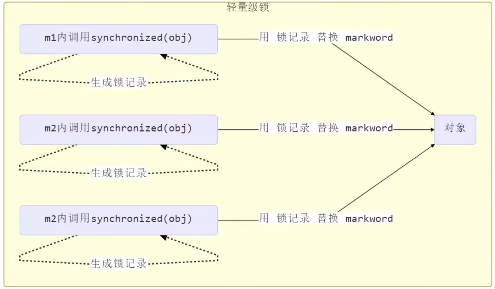

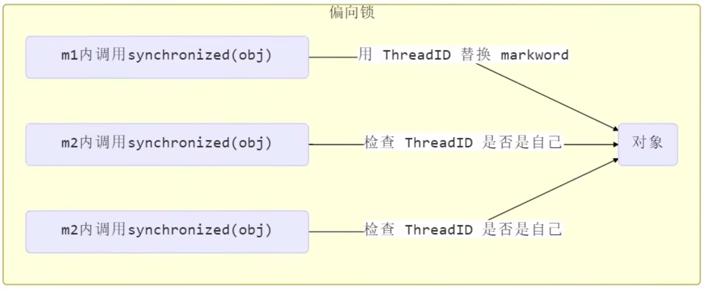

#### 3.7.5.1 偏向状态

回忆一下对象头格式：

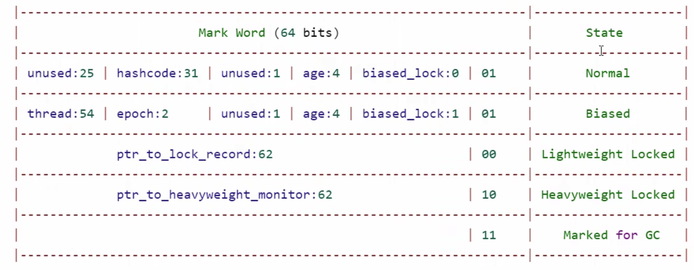

一个对象创建时：

- 如果开启了偏向锁（默认开启），那么对象创建后，MarkWord值为`0x05`即最后3位为`101`，这时它的thread、epoch、age都为0。

- 偏向锁是默认延迟的，不会在程序启动时立即生效，如果想避免延迟，可以加VM参数`-XX:BiasedLockingStartupDelay=0`来禁用延迟

  参考如下代码：

  ```java
  @Slf4j(topic = "c.TestBiased")
  public class TestBiased {
      public static void main(String[] args) {
          Dog dog = new Dog();
          log.debug(ClassLayout.parseInstance(dog).toPrintable());
      }
  }
  
  class Dog { }
  ```

  输出为：
  

  以上状态`001`表明该对象是`Normal`状态，因为偏向锁延迟开启。可以修改上述参数禁用延迟，或者将代码稍作修改：
  ```java
  @Slf4j(topic = "c.TestBiased")
  public class TestBiased {
      public static void main(String[] args) {
          Dog dog = new Dog();
          log.debug(ClassLayout.parseInstance(dog).toPrintable());
          Thread.sleep(4000);
          log.debug(ClassLayout.parseInstance(new Dog()).toPrintable());
      }
  }
  
  class Dog { }
  ```

  输出如下：
  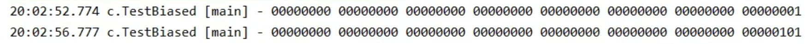


  可以看到两次输出有所不同，第二次变为了`101`，为`Biased`状态。
  当使用了`synchronized`，可以看到输出有所不同：

  ```java
  @Slf4j(topic = "c.TestBiased")
  public class TestBiased {
      public static void main(String[] args) {
          Dog dog = new Dog();
          log.debug(ClassLayout.parseInstance(dog).toPrintable());
  
          synchronized (dog) {
              log.debug(ClassLayout.parseInstance(dog).toPrintable());
          }
  
          log.debug(ClassLayout.parseInstance(dog).toPrintable());
      }
  }
  
  class Dog { }
  ```

  输出：
  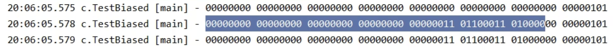

  

  可以看到高亮的部分是线程id。注意这个id不是jdk里面的线程id，而是操作系统层面的线程id。此处是主线程的线程id。当程序运行到最后一行离开了`synchronized`代码块，可以看到线程id依然没变。这就说明该对象锁定了main线程来被调用。

- 如果没有开启偏向锁，那么对象创建后，MarkWord值为`0x01`即最后3位为`001`，这时它的hashcode、age都为0，第一次用到hashcode时才会赋值

- 如果要禁用偏向锁，可以添加VM参数：`-XX:-UseBiasedLocking`
  同样的代码添加上述参数后，输出如下：
  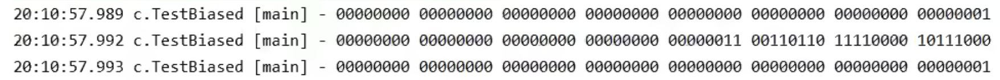

  

  锁状态从`Normal` -> `Lightweight Locked` -> `Normal`

#### 3.7.5.2 锁偏向的撤销（一）调用hashcode方法

参考如下代码：

```java
@Slf4j(topic = "c.TestBiased")
public class TestBiased {
    public static void main(String[] args) {
        Dog dog = new Dog();
      	d.hashCode(); // 禁用掉对象的偏向锁
        log.debug(ClassLayout.parseInstance(dog).toPrintable());

        synchronized (dog) {
            log.debug(ClassLayout.parseInstance(dog).toPrintable());
        }

        log.debug(ClassLayout.parseInstance(dog).toPrintable());
    }
}

class Dog { }
```

输出如下：
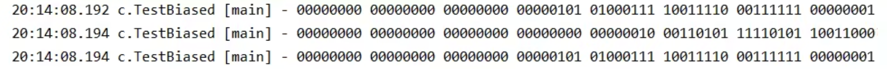


锁状态从`Normal` -> `Lightweight Locked` -> `Normal`

如果我们调用了对象的`hashcode`方法，就会禁用该对象的锁偏向。因为参考上面的对象头格式，如果要存储`hashcode`，就没有额外空间存储线程Id等信息，所以锁偏向状态会存储不全，只能取消所偏向状态，变成不可偏向的正常状态

- 轻量级锁会在线程栈帧的锁记录中记录hashcode
- 重量级锁会在Monitor中记录hashcode

#### 3.7.5.3 锁偏向的撤销（二）其他线程使用对象

查看如下测试代码，该代码保证了两个线程交错使用加锁对象：

```java
@Slf4j(topic = "c.TestBiased")
public class TestBiased {
    public static void main(String[] args) {
        Dog dog = new Dog();
        new Thread(() -> {
            log.debug(ClassLayout.parseInstance(dog).toPrintable());
            synchronized (dog) {
                log.debug(ClassLayout.parseInstance(dog).toPrintable());
            }
            log.debug(ClassLayout.parseInstance(dog).toPrintable());

            synchronized (TestBiased.class) {
                TestBiased.class.notify(); // 唤醒t2线程
            }
        }, "t1").start();

        new Thread(() -> {
            // t2线程开始后进入等待，直到t1线程跳出对dog对象的加锁代码块将其唤醒
            synchronized (TestBiased.class) { 
                try {
                    TestBiased.class.wait();
                } catch (InterruptedException e) {
                    throw new RuntimeException(e);
                }
            }
            log.debug(ClassLayout.parseInstance(dog).toPrintable());
            synchronized (dog) {
                log.debug(ClassLayout.parseInstance(dog).toPrintable());
            }
            log.debug(ClassLayout.parseInstance(dog).toPrintable());
        }, "t2").start();
    }
}

class Dog {
}
```

输出如下：

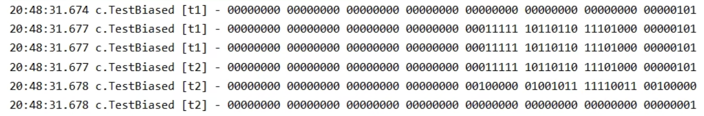

前三行`t1`线程的输出可以看出，对象`dog`加了偏向锁；后三行`t2`线程的输出表示，锁状态从偏向锁，变为轻量级锁，最后变为不可偏向状态`Normal`。

#### 3.7.5.4 锁偏向的撤销（三）调用wait/notify

Wait/notify只有重量级锁才会有，不会存在锁偏向状态。

#### 3.7.5.5 批量重偏向

如果对象虽然被多个线程访问，但没有竞争，这时偏向了线程T1的对象仍然有机会重新偏向T2，重偏向会重置对象的线程ID。当撤销偏向锁阈值超过20次后，jvm会认为偏向有误，于是会给这些对象加锁时重新偏向至加锁线程。

参考下面代码：

```java
@Slf4j(topic = "c.TestBiased")
public class TestBiased {
    public static void main(String[] args) {
        Vector<Dog> list = new Vector<>();
        new Thread(() -> {
            for (int i = 0; i < 30; i++) {
                Dog dog = new Dog();
                list.add(dog);
                synchronized (dog) {
                    log.debug(i + "\t" + ClassLayout.parseInstance(dog).toPrintable());
                }
            }
            synchronized (list) {
                list.notify();
            }
        }, "t1").start();

        new Thread(() -> {
            synchronized (list) {
                try {
                    list.wait();
                } catch (InterruptedException e) {
                    throw new RuntimeException(e);
                }
            }
            log.debug("===================>");
            for (int i = 0; i < 30; i++) {
                Dog dog = list.get(i);
                log.debug(i + "\t" + ClassLayout.parseInstance(dog).toPrintable());
                synchronized (dog) {
                    log.debug(i + "\t" + ClassLayout.parseInstance(dog).toPrintable());
                }
                log.debug(i + "\t" + ClassLayout.parseInstance(dog).toPrintable());
            }
        }, "t2").start();
    }
}

class Dog {
}
```

关键输出如下：

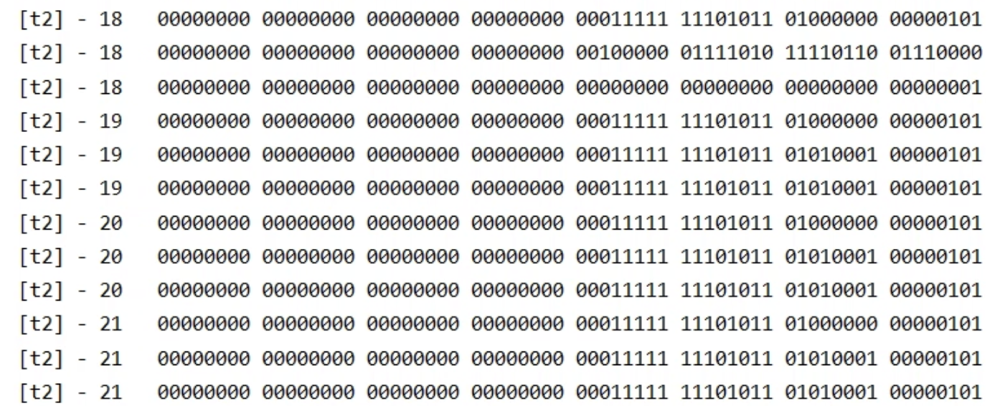

可以看到，线程`t2`从第20个对象开始（序号19），偏向状态不再撤销，而是改变了线程ID，偏向了`t2`线程。

#### 3.7.5.6 批量撤销

当撤销偏向锁阈值超过`40`次后，jvm会认为之前偏向错误，不应该偏向。于是该类的所有对象均变为不可偏向，新建的对象也是不可偏向。

测试如下代码：

```java
@Slf4j(topic = "c.TestBiased")
public class TestBiased {
    static Thread t1, t2, t3;

    public static void main(String[] args) throws InterruptedException {
        Vector<Dog> list = new Vector<>();
        int loopNumber = 39;
        t1 = new Thread(() -> {
            for (int i = 0; i < loopNumber; i++) {
                Dog dog = new Dog();
                list.add(dog);
                synchronized (dog) {
                    log.debug(i + "\t" + ClassLayout.parseInstance(dog).toPrintable());
                }
            }
            LockSupport.unpark(t2); // 唤醒t2
        }, "t1");
        t1.start();

        t2 = new Thread(() -> {
            LockSupport.park();
            log.debug("===================>");
            for (int i = 0; i < loopNumber; i++) {
                Dog dog = list.get(i);
                log.debug(i + "\t" + ClassLayout.parseInstance(dog).toPrintable());
                synchronized (dog) {
                    log.debug(i + "\t" + ClassLayout.parseInstance(dog).toPrintable());
                }
                log.debug(i + "\t" + ClassLayout.parseInstance(dog).toPrintable());
            }
            LockSupport.unpark(t3);  // 唤醒t3
        }, "t2");
        t2.start();

        t3 = new Thread(() -> {
            LockSupport.park();
            log.debug("===================>");
            for (int i = 0; i < loopNumber; i++) {
                Dog dog = list.get(i);
                log.debug(i + "\t" + ClassLayout.parseInstance(dog).toPrintable());
                synchronized (dog) {
                    log.debug(i + "\t" + ClassLayout.parseInstance(dog).toPrintable());
                }
                log.debug(i + "\t" + ClassLayout.parseInstance(dog).toPrintable());
            }
        }, "t3");
        t3.start();

        t3.join();
        log.debug(ClassLayout.parseInstance(new Dog()).toPrintable());
    }
}

class Dog {
}
```

输出的最终部分如下：
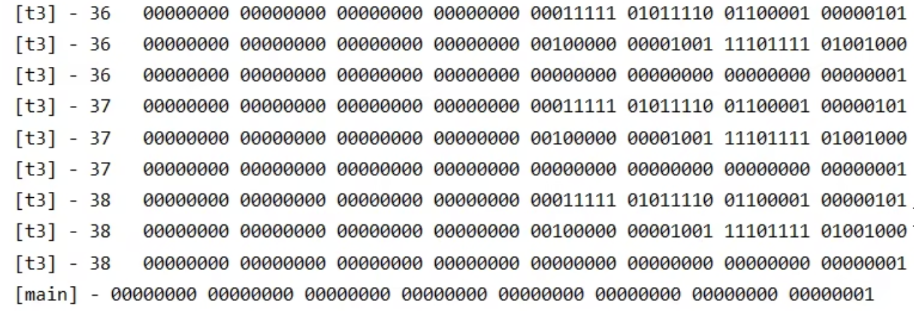


两个线程`t2`、`t3`分别撤销了20次，达到40次后，jvm不再为该类进行锁偏向设置，所以最后一次输出的新对象锁状态为不可偏向。

### 3.7.6 锁消除

测试案例：

创建`JMH`项目：

```java
mvn archetype:generate -DinteractiveMode=false -DarchetypeGroupId=org.openjdk.jmh -DarchetypeArtifactId=jmh-java-benchmark-archetype -DgroupId=com.nasuf.concurrency.benchmark -DartifactId=concurrency-benchmark -Dversion=1.0
```

测试代码如下：

```java
@Fork(1)
@BenchmarkMode(Mode.AverageTime)
@Warmup(iterations = 3)
@Measurement(iterations = 5)
@OutputTimeUnit(TimeUnit.NANOSECONDS)
public class CuncurrencyTest {
    static int x = 0;

    @Benchmark
    public void a() {
        x++;
    }

    @Benchmark
    public void b() {
        Object o = new Object();
        synchronized (o) {
            x++;
        }
    }
}
```

上述测试代码意图测试两个方法的平均用时。将上述项目打包后，会在`target`目录下生成`benchmarks.jar`文件，然后我们执行`java -jar benchmarks.jar`。最终结果输出如下：

```java
Benchmark          Mode  Cnt  Score   Error  Units
CuncurrencyTest.a  avgt    5  0.409 ± 0.006  ns/op
CuncurrencyTest.b  avgt    5  0.415 ± 0.008  ns/op
```

可以看到两个方法的`Score`基本一致，也就是说即使方法`b`进行了加锁，也没有影响性能。这是因为JDK的即时编译器`JIT`在编译时认为方法内的局部变量不会被共享，所以对该局部变量的加锁没有意义，因此优化后与方法`a`实际执行的字节码一致。这时JVM中默认的锁消除优化。如果要想去掉锁消除优化，需要加上`-XX:-EliminateLocks`参数。现在我们执行：`java -jar -XX:-EliminateLocks -jar benchmarks.jar`，可以看到结果差距变得很明显：

```java
Benchmark          Mode  Cnt  Score   Error  Units
CuncurrencyTest.a  avgt    5  0.407 ± 0.011  ns/op
CuncurrencyTest.b  avgt    5  5.937 ± 0.086  ns/op
```

## 3.8 wait-notify

### 3.8.1 原理

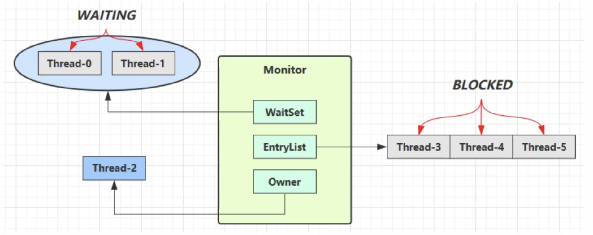

要区分两种状态：`WAITNG`和`BLOCKED`

- Owner线程发现条件不满足，调用`wait`方法，即可进入`WaitSet`变为`WAITING`状态
- `BLOCKED`和`WAITING`的线程都处于阻塞状态，不占用cpu时间片
- `BLOCKED`线程会在Ower线程释放锁是被唤醒
- `WAITING`线程会在Owner线程调用`notify`或`notifyAll`时被唤醒，但被唤醒后并不意味着立刻获得锁，仍需要进入`EntryList`重新竞争

### 3.8.2 API介绍

- `obj.wait()`让进入object监视器的线程到`WaitSet`中等待
- `obj.notify()`让在object上正在`WaitSet`中等待的线程中挑选一个唤醒
- `obj.notifyAll()`让在object上正在`WaitSet`中等待的全部线程都唤醒

它们都是线程之间进行协作的手段，都属于`Object`类的方法，必须获得此对象的锁，才能调用这几个方法。

#### 3.8.2.1 wait

```java
@Slf4j(topic = "c.WaitNotifyTest")
public class WaitNotifyTest {
    static Object lock = new Object();

    public static void main(String[] args) throws InterruptedException {
        lock.wait(); // 或者调用 lock.notify()
    }
}
```

输出：

```java
Exception in thread "main" java.lang.IllegalMonitorStateException
	at java.lang.Object.wait(Native Method)
	at java.lang.Object.wait(Object.java:502)
	at com.nasuf.concurrency.WaitNotifyTest.main(WaitNotifyTest.java:10)
```

由于主线程没有获得锁就直接调用`wait`方法，所以会直接抛出`IllegalMonitorStateException`，正确的写法是：

```java
@Slf4j(topic = "c.WaitNotifyTest")
public class WaitNotifyTest {
    static Object lock = new Object();

    public static void main(String[] args) throws InterruptedException {
        synchronized (lock) {
            lock.wait();
        }
    }
}
```

这样主线程会一直等待，不会报错。

`obj.wait()`有一个限制实现的等待方法：`obj.wait(long timeout) `，等待时间超时后，自动向下执行：

```java
@Slf4j(topic = "c.WaitNotifyTest")
public class WaitNotifyTest {
    final static Object obj = new Object();

    public static void main(String[] args) {
        new Thread(() -> {
            synchronized (obj) {
                log.debug("Executing now.");
                try {
                    obj.wait(1000);
                } catch (InterruptedException e) {
                    throw new RuntimeException(e);
                }
                log.debug("Running other codes.");
            }
        }, "t1").start();
    }
}
```

输出为：

```java
18:57:16.821 [t1] c.WaitNotifyTest - Executing now.
18:57:17.828 [t1] c.WaitNotifyTest - Running other codes.
```

如果在等待时限内被提前唤醒，那么设定的等待时限无效：

```java
@Slf4j(topic = "c.WaitNotifyTest")
public class WaitNotifyTest {
    final static Object obj = new Object();

    public static void main(String[] args) {
        new Thread(() -> {
            synchronized (obj) {
                log.debug("Executing now.");
                try {
                    obj.wait(2000); // 等待2s
                } catch (InterruptedException e) {
                    throw new RuntimeException(e);
                }
                log.debug("Running other codes.");
            }
        }, "t1").start();

        sleep(1); // 1s后唤醒所有等待在obj上的线程
        log.debug("Notify threads waiting on obj now.");
        synchronized (obj) {
            obj.notifyAll();
        }
    }
}
```

输出：

```java
19:01:06.263 [t1] c.WaitNotifyTest - Executing now.
19:01:07.265 [main] c.WaitNotifyTest - Notify threads waiting on obj now.
19:01:07.266 [t1] c.WaitNotifyTest - Running other codes.
```

其实还有一个`wait(long timeout, int nanos)`方法，源码如下：

```java
public final void wait(long timeout, int nanos) throws InterruptedException {
  if (timeout < 0) {
    throw new IllegalArgumentException("timeout value is negative");
  }

  if (nanos < 0 || nanos > 999999) {
    throw new IllegalArgumentException(
      "nanosecond timeout value out of range");
  }

  if (nanos > 0) {
    timeout++;
  }

  wait(timeout);
}
```

从源码可以看出，该方法并不是精确到`nano`。

#### 3.8.2.2 notify

```java
@Slf4j(topic = "c.WaitNotifyTest")
public class WaitNotifyTest {
    final static Object obj = new Object();

    public static void main(String[] args) {
        new Thread(() -> {
            synchronized (obj) {
                log.debug("Executing now.");
                try {
                    obj.wait();
                } catch (InterruptedException e) {
                    throw new RuntimeException(e);
                }
                log.debug("Running other codes.");
            }
        }, "t1").start();

        new Thread(() -> {
            synchronized (obj) {
                log.debug("Executing now.");
                try {
                    obj.wait();
                } catch (InterruptedException e) {
                    throw new RuntimeException(e);
                }
                log.debug("Running other codes.");
            }
        }, "t2").start();

        sleep(2);
        log.debug("Notify threads waiting on obj now.");
        synchronized (obj) {
            obj.notify(); // 唤醒等待在obj上的某一个线程
        }
    }
}
```

输出为：

```java
18:49:33.877 [t1] c.WaitNotifyTest - Executing now.
18:49:33.882 [t2] c.WaitNotifyTest - Executing now.
18:49:35.880 [main] c.WaitNotifyTest - Notify threads waiting on obj now.
18:49:35.881 [t1] c.WaitNotifyTest - Running other codes.
```

如果将最后一段代码换为：

```java
synchronized (obj) {
  obj.notifyAll(); // 唤醒等待在obj上的所有线程
}
```

输出变为：

```java
18:52:11.646 [t1] c.WaitNotifyTest - Executing now.
18:52:11.653 [t2] c.WaitNotifyTest - Executing now.
18:52:13.648 [main] c.WaitNotifyTest - Notify threads waiting on obj now.
18:52:13.649 [t2] c.WaitNotifyTest - Running other codes.
18:52:13.649 [t1] c.WaitNotifyTest - Running other codes.
```

### 3.8.3 wait-notify的正确使用方式

> sleep(long n)和wait(long n)的区别

- `sleep`是`Thread`类的方法，而`wait`是`Object`类的方法
- `sleep`不需要强制和`synchronized`配合使用，但`wait`需要和`synchronized`一起使用
- `sleep`在睡眠的同时，不会释放锁对象，但`wait`在等待的时候会释放锁对象
- 共同点：在进入`sleep`或者`wait`之后，线程状态一致，均为`TIMED_WAITING`状态

```java
@Slf4j(topic = "c.WaitNotifyTest")
public class WaitNotifyTest {
    final static Object obj = new Object();

    public static void main(String[] args) {
        new Thread(() -> {
            synchronized (obj) {
                log.debug("Executing now.");
                try {
                    Thread.sleep(2000);
                } catch (InterruptedException e) {
                    throw new RuntimeException(e);
                }
                log.debug("Running other codes.");
            }
        }, "t1").start();

        sleep(1);
        synchronized (obj) {
            log.debug("Main thread got lock");
        }
    }
}
```

输出如下：

```java
19:21:07.603 [t1] c.WaitNotifyTest - Executing now.
19:21:09.612 [t1] c.WaitNotifyTest - Running other codes.
19:21:09.613 [main] c.WaitNotifyTest - Main thread got lock
```

可见`sleep`并不会释放锁。而如果使用`wait`，就会释放锁：

```java
@Slf4j(topic = "c.WaitNotifyTest")
public class WaitNotifyTest {
    final static Object obj = new Object();

    public static void main(String[] args) {
        new Thread(() -> {
            synchronized (obj) {
                log.debug("Executing now.");
                try {
                    obj.wait();
                } catch (InterruptedException e) {
                    throw new RuntimeException(e);
                }
                log.debug("Running other codes.");
            }
        }, "t1").start();

        sleep(1);
        synchronized (obj) {
            log.debug("Main thread got lock");
        }
    }
}
```

输出如下：

```java
19:23:43.083 [t1] c.WaitNotifyTest - Executing now.
19:23:44.081 [main] c.WaitNotifyTest - Main thread got lock
```

#### 3.8.3.1 代码优化 step1

```java
@Slf4j(topic = "c.WaitNotifyTest")
public class WaitNotifyTest {
    static final Object room = new Object();
    static boolean hasCigarette = false;
    static boolean hasTakeout = false;

    public static void main(String[] args) {
        new Thread(() -> {
            synchronized (room) {
                log.debug("有烟没？[{}]", hasCigarette);
                if (!hasCigarette) {
                    log.debug("没烟，歇会儿！");
                    sleep(2);
                }
                log.debug("有烟没？[{}]", hasCigarette);
                if (hasCigarette) {
                    log.debug("可以开始干活了！");
                }
            }
        }, "PersonA").start();

        for (int i = 0; i < 5; i++) {
            new Thread(() -> {
                synchronized (room) {
                    log.debug("可以开始干活了！");
                }
            }, "OtherPerson").start();
        }

        sleep(1);
        new Thread(() -> {
            hasCigarette = true;
            log.debug("烟送到了！");
        }, "ManA").start();
    }
}
```

输出如下：

```java
10:31:34.848 [PersonA] c.WaitNotifyTest - 有烟没？[false]
10:31:34.855 [PersonA] c.WaitNotifyTest - 没烟，歇会儿！
10:31:35.855 [ManA] c.WaitNotifyTest - 烟送到了！
10:31:36.857 [PersonA] c.WaitNotifyTest - 有烟没？[true]
10:31:36.858 [PersonA] c.WaitNotifyTest - 可以开始干活了！
10:31:36.858 [OtherPerson] c.WaitNotifyTest - 可以开始干活了！
10:31:36.859 [OtherPerson] c.WaitNotifyTest - 可以开始干活了！
10:31:36.859 [OtherPerson] c.WaitNotifyTest - 可以开始干活了！
10:31:36.859 [OtherPerson] c.WaitNotifyTest - 可以开始干活了！
10:31:36.859 [OtherPerson] c.WaitNotifyTest - 可以开始干活了！
```

代码分析：

- ManA线程在1s后将烟送到，但是PersonA要sleep 2s
- PersonA sleep时，不会释放对象锁，其他五个线程无法工作

而如果把ManA线程代码修改如下：

```java
sleep(1);
new Thread(() -> {
  synchronized (room) {
    hasCigarette = true;
    log.debug("烟送到了！");
  }
}, "ManA").start();
```

依然无法达到效果，因为ManA线程无法获得room锁，直到PersonA线程执行完毕。输出如下：

```java
10:40:42.308 [PersonA] c.WaitNotifyTest - 有烟没？[false]
10:40:42.313 [PersonA] c.WaitNotifyTest - 没烟，歇会儿！
10:40:44.318 [PersonA] c.WaitNotifyTest - 有烟没？[false]
10:40:44.320 [ManA] c.WaitNotifyTest - 烟送到了！
10:40:44.320 [OtherPerson] c.WaitNotifyTest - 可以开始干活了！
10:40:44.321 [OtherPerson] c.WaitNotifyTest - 可以开始干活了！
10:40:44.321 [OtherPerson] c.WaitNotifyTest - 可以开始干活了！
10:40:44.321 [OtherPerson] c.WaitNotifyTest - 可以开始干活了！
10:40:44.321 [OtherPerson] c.WaitNotifyTest - 可以开始干活了！
```

#### 3.8.3.2 代码优化 step2

```java
@Slf4j(topic = "c.WaitNotifyTest")
public class WaitNotifyTest {
    static final Object room = new Object();
    static boolean hasCigarette = false;
    static boolean hasTakeout = false;

    public static void main(String[] args) {
        new Thread(() -> {
            synchronized (room) {
                log.debug("有烟没？[{}]", hasCigarette);
                if (!hasCigarette) {
                    log.debug("没烟，歇会儿！");
                    try {
                        room.wait(); // 替换sleep为wait方法
                    } catch (InterruptedException e) {
                        throw new RuntimeException(e);
                    }
                }
                log.debug("有烟没？[{}]", hasCigarette);
                if (hasCigarette) {
                    log.debug("可以开始干活了！");
                }
            }
        }, "PersonA").start();

        for (int i = 0; i < 5; i++) {
            new Thread(() -> {
                synchronized (room) {
                    log.debug("可以开始干活了！");
                }
            }, "OtherPerson").start();
        }

        sleep(1);
        new Thread(() -> {
            synchronized (room) {
                hasCigarette = true;
                log.debug("烟送到了！");
                room.notify(); // 烟送到后，notify等待在room锁上的线程
            }
        }, "ManA").start();
    }
}
```

输出如下：

```java
10:43:58.899 [PersonA] c.WaitNotifyTest - 有烟没？[false]
10:43:58.906 [PersonA] c.WaitNotifyTest - 没烟，歇会儿！
10:43:58.907 [OtherPerson] c.WaitNotifyTest - 可以开始干活了！
10:43:58.907 [OtherPerson] c.WaitNotifyTest - 可以开始干活了！
10:43:58.908 [OtherPerson] c.WaitNotifyTest - 可以开始干活了！
10:43:58.908 [OtherPerson] c.WaitNotifyTest - 可以开始干活了！
10:43:58.908 [OtherPerson] c.WaitNotifyTest - 可以开始干活了！
10:43:59.905 [ManA] c.WaitNotifyTest - 烟送到了！
10:43:59.906 [PersonA] c.WaitNotifyTest - 有烟没？[true]
10:43:59.906 [PersonA] c.WaitNotifyTest - 可以开始干活了！
```

代码分析：

- PersonA线程wait之后，会释放room对象锁，OtherPerson线程可以拿到锁继续执行自己的代码
- ManA线程notify等待在room锁对象上的线程后，PersonA可以继续执行自己的任务代码
- 但是，如果同时有其他线程也等待在room对象锁上，ManA线程执行notify后，有可能会错误唤醒了其他线程，而非PersonA线程。参考下面的章节代码

#### 3.8.3.3 代码优化 step3

```java
@Slf4j(topic = "c.WaitNotifyTest")
public class WaitNotifyTest {
    static final Object room = new Object();
    static boolean hasCigarette = false;
    static boolean hasTakeout = false;

    public static void main(String[] args) {
        new Thread(() -> {
            synchronized (room) {
                log.debug("有烟没？[{}]", hasCigarette);
                if (!hasCigarette) {
                    log.debug("没烟，歇会儿！");
                    try {
                        room.wait();
                    } catch (InterruptedException e) {
                        throw new RuntimeException(e);
                    }
                }
                log.debug("有烟没？[{}]", hasCigarette);
                if (hasCigarette) {
                    log.debug("可以开始干活了！");
                } else {
                    log.debug("没干成活...");
                }
            }
        }, "PersonA").start();

        new Thread(() -> {
            synchronized (room) {
                log.debug("外卖送到没？[{}]", hasTakeout);
                if (!hasTakeout) {
                    log.debug("没外卖，歇会儿！");
                    try {
                        room.wait();
                    } catch (InterruptedException e) {
                        throw new RuntimeException(e);
                    }
                }
                log.debug("外卖送到没？[{}]", hasTakeout);
                if (hasTakeout) {
                    log.debug("可以开始干活了！");
                } else {
                    log.debug("没干成活...");
                }
            }
        }, "PersonB").start();

        sleep(1);
        new Thread(() -> {
            synchronized (room) {
                hasTakeout = true;
                log.debug("外卖送到了！");
                room.notify(); // 虚假唤醒
            }
        }, "ManA").start();
    }
}
```

输出如下：

```java
10:54:16.103 [PersonA] c.WaitNotifyTest - 有烟没？[false]
10:54:16.110 [PersonA] c.WaitNotifyTest - 没烟，歇会儿！
10:54:16.110 [PersonB] c.WaitNotifyTest - 外卖送到没？[false]
10:54:16.110 [PersonB] c.WaitNotifyTest - 没外卖，歇会儿！
10:54:17.107 [ManA] c.WaitNotifyTest - 外卖送到了！
10:54:17.108 [PersonA] c.WaitNotifyTest - 有烟没？[false]
10:54:17.108 [PersonA] c.WaitNotifyTest - 没干成活...
```

代码分析：

- ManA线程随机唤醒了等待在room对象锁上的线程PersonA，而非期望的PersonB线程。导致PersonA线程并没有完成任务代码

解决方案：

```java
new Thread(() -> {
  synchronized (room) {
    hasTakeout = true;
    log.debug("外卖送到了！");
    room.notifyAll(); // 唤醒所有等待在room对象锁上的线程
  }
}, "ManA").start();
```

输出如下：

```java
11:00:45.007 [PersonA] c.WaitNotifyTest - 有烟没？[false]
11:00:45.014 [PersonA] c.WaitNotifyTest - 没烟，歇会儿！
11:00:45.014 [PersonB] c.WaitNotifyTest - 外卖送到没？[false]
11:00:45.014 [PersonB] c.WaitNotifyTest - 没外卖，歇会儿！
11:00:46.007 [ManA] c.WaitNotifyTest - 外卖送到了！
11:00:46.007 [PersonB] c.WaitNotifyTest - 外卖送到没？[true]
11:00:46.007 [PersonB] c.WaitNotifyTest - 可以开始干活了！
11:00:46.007 [PersonA] c.WaitNotifyTest - 有烟没？[false]
11:00:46.007 [PersonA] c.WaitNotifyTest - 没干成活...
```

这时可以唤醒PersonB，但是PersonA线程也被唤醒错误唤醒，无法正确执行任务代码

#### 3.8.3.4 代码优化 step4

```java
@Slf4j(topic = "c.WaitNotifyTest")
public class WaitNotifyTest {
    static final Object room = new Object();
    static boolean hasCigarette = false;
    static boolean hasTakeout = false;

    public static void main(String[] args) {
        new Thread(() -> {
            synchronized (room) {
                log.debug("有烟没？[{}]", hasCigarette);
                while (!hasCigarette) {  // 将if替换为while循环
                    log.debug("没烟，歇会儿！");
                    try {
                        room.wait();
                    } catch (InterruptedException e) {
                        throw new RuntimeException(e);
                    }
                }
                log.debug("有烟没？[{}]", hasCigarette);
                if (hasCigarette) {
                    log.debug("可以开始干活了！");
                } else {
                    log.debug("没干成活...");
                }
            }
        }, "PersonA").start();

        new Thread(() -> {
            synchronized (room) {
                log.debug("外卖送到没？[{}]", hasTakeout);
                while (!hasTakeout) {  // 将if替换为while循环
                    log.debug("没外卖，歇会儿！");
                    try {
                        room.wait();
                    } catch (InterruptedException e) {
                        throw new RuntimeException(e);
                    }
                }
                log.debug("外卖送到没？[{}]", hasTakeout);
                if (hasTakeout) {
                    log.debug("可以开始干活了！");
                } else {
                    log.debug("没干成活...");
                }
            }
        }, "PersonB").start();

        sleep(1);
        new Thread(() -> {
            synchronized (room) {
                hasTakeout = true;
                log.debug("外卖送到了！");
                room.notifyAll();
            }
        }, "ManA").start();
    }
}
```

输出如下：

```java
11:05:48.898 [PersonA] c.WaitNotifyTest - 有烟没？[false]
11:05:48.904 [PersonA] c.WaitNotifyTest - 没烟，歇会儿！
11:05:48.904 [PersonB] c.WaitNotifyTest - 外卖送到没？[false]
11:05:48.904 [PersonB] c.WaitNotifyTest - 没外卖，歇会儿！
11:05:49.902 [ManA] c.WaitNotifyTest - 外卖送到了！
11:05:49.902 [PersonB] c.WaitNotifyTest - 外卖送到没？[true]
11:05:49.903 [PersonB] c.WaitNotifyTest - 可以开始干活了！
11:05:49.903 [PersonA] c.WaitNotifyTest - 没烟，歇会儿！
```

将if替换为while循环，这样将一次性的判断改为了循环判断，就不会出现被错误唤醒后而任务代码没有执行成功的情况。大致的模式如下：

```java
synchronized(lock) {
  while (条件不成立) {
    lock.wait()
  }
  // Other task.
}

// 另一个线程
synchronized(lock) {
  lock.notifyAll();
}
```

### 3.8.3 同步模式之保护性暂停

即`Guarded Suspension`，用在一个线程等待另一个线程的执行结果

要点：

- 有一个结果需要从一个线程传递到另一个线程，让它们关联同一个`GuardedObject`
- 如果有结果不断从一个线程到另一个线程，那么可以使用消息队列（生产者/消费者）
- JDK中，join的视线、Future的视线，采用的就是此模式
- 因为要等待另一方的结果，因此归类到同步模式


案例代码：

```java
@Slf4j(topic = "c.GuardedObject")
public class TestGuard {
    // 线程1等待线程2的下载结果
    public static void main(String[] args) {
        GuardedObject guardedObject = new GuardedObject();
        new Thread(() -> {
            log.debug("等待结果");
            List<String> list = (List<String>) guardedObject.get();
            log.debug("结果大小：{}", list.size());
        }, "t1").start();

        new Thread(() -> {
            log.debug("执行下载");
            try {
                List<String> list = Downloader.download();
                guardedObject.complete(list);
            } catch (IOException e) {
                throw new RuntimeException(e);
            }
        }, "t2").start();
    }
}

class GuardedObject {
    private Object response;

    public Object get() {
        synchronized (this) {
            while (response == null) {
                try {
                    this.wait();
                } catch (InterruptedException e) {
                    throw new RuntimeException(e);
                }
            }
            return response;
        }
    }

    public void complete(Object response) {
        synchronized (this) {
            this.response = response;
            this.notifyAll();
        }
    }
}

class Downloader {
    public static List<String> download() throws IOException {
        HttpURLConnection conn = (HttpURLConnection) new URL("https://www.baidu.com").openConnection();
        List<String> lines = new ArrayList<>();
        try (BufferedReader reader =
                     new BufferedReader(new InputStreamReader(conn.getInputStream(), StandardCharsets.UTF_8))) {
            String line;
            while ((line = reader.readLine()) != null) {
                lines.add(line);
            }
        }
        return lines;
    }
}
```

输出如下：

```java
17:47:38.553 [t2] c.GuardedObject - 执行下载
17:47:38.553 [t1] c.GuardedObject - 等待结果
17:47:39.265 [t1] c.GuardedObject - 结果大小：3
```

下面考虑一种等待超时的优化。假如设定了等待超时时间，代码应该如何设计？
```java
@Slf4j(topic = "c.GuardedObject")
public class TestGuard {
    // 线程1等待线程2的下载结果
    public static void main(String[] args) {
        GuardedObject guardedObject = new GuardedObject();
        new Thread(() -> {
            log.debug("等待结果");
            Object response = guardedObject.get(2000);
            log.debug("结果：{}", response);
        }, "t1").start();

        new Thread(() -> {
            log.debug("执行下载");
            sleep(3);
            guardedObject.complete(new Object());
        }, "t2").start();
    }
}

class GuardedObject {
    private Object response;

    public Object get(long timeout) {
        synchronized (this) {
            // 记录开始/等待时间
            long start = System.currentTimeMillis();
            long passed = 0;
            while (response == null) {
                // 经历的事件超过了最大等待时间，退出循环
                if (passed >= timeout) {
                    break;
                }
                try {
                    // 此处确保了被虚假唤醒后，再次进入等待后，导致等待时间超过timeout时间的问题
                    this.wait(timeout - passed);
                } catch (InterruptedException e) {
                    throw new RuntimeException(e);
                }
                passed = System.currentTimeMillis() - start;

            }
            return response;
        }
    }

    public void complete(Object response) {
        synchronized (this) {
            this.response = response;
            this.notifyAll();
        }
    }
}
```

上述情况下，超时时间设定为2s，但是模拟下载时间为3s，发生了超时，所以输出如下：

```java
18:03:57.259 [t1] c.GuardedObject - 等待结果
18:03:57.259 [t2] c.GuardedObject - 执行下载
18:03:59.270 [t1] c.GuardedObject - 结果：null
```

另外一种情况是“虚假唤醒”。修改代码如下：

```java
@Slf4j(topic = "c.GuardedObject")
public class TestGuard {
    // 线程1等待线程2的下载结果
    public static void main(String[] args) {
        GuardedObject guardedObject = new GuardedObject();
        new Thread(() -> {
            log.debug("等待结果");
            Object response = guardedObject.get(2000);
            log.debug("结果：{}", response);
        }, "t1").start();

        new Thread(() -> {
            log.debug("执行下载");
            sleep(1);
            guardedObject.complete(null);
        }, "t2").start();
    }
}
```

模拟下载时间1s后，传递null（虚假唤醒），导致线程t1需要继续等待1s后完成，返回null值。输出如下：

```java
18:07:41.223 [t2] c.GuardedObject - 执行下载
18:07:41.223 [t1] c.GuardedObject - 等待结果
18:07:43.233 [t1] c.GuardedObject - 结果：null
```

参考jdk8源码里面对`Thread.join()`方法的设计：

```java
public final synchronized void join(long millis)
  throws InterruptedException {
  long base = System.currentTimeMillis();
  long now = 0;

  if (millis < 0) {
    throw new IllegalArgumentException("timeout value is negative");
  }

  if (millis == 0) {
    while (isAlive()) {
      wait(0);
    }
  } else {
    while (isAlive()) {
      long delay = millis - now;
      if (delay <= 0) {
        break;
      }
      wait(delay);
      now = System.currentTimeMillis() - base;
    }
  }
}
```

### 3.8.3.1 保护性暂停-扩展（一）

图中Futures就好比居民楼一层的信箱（每个信箱有房间编号），左侧的t0, t2, t4就好比等待邮件的居民，右侧t1, t3, t5就好比邮递员。如果需要在多个类之间使用`GuardedObject`对象，作为参数传递不是很方便，因此设计一个用来解耦的中间类，这样不仅能够解耦“结果等待者”和“结果生产者”，还能够同时支持多个任务的管理

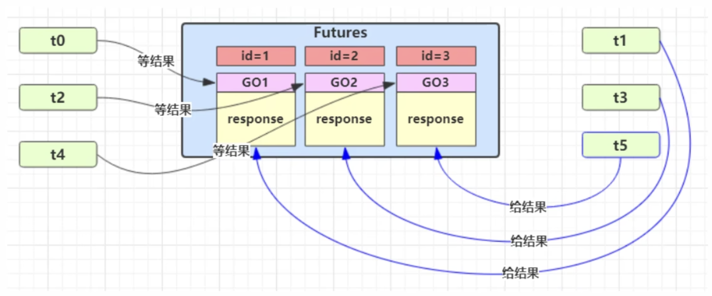

测试代码：

```java
@Slf4j(topic = "c.GuardedObject")
public class TestGuard {
    public static void main(String[] args) {
        for (int i = 0; i < 3; i++) {
            new People().start();
        }
        sleep(1);
        for (Integer id : MailBoxes.getIds()) {
            new Postman(id, "内容 " + id).start();
        }
    }
}

@Slf4j(topic = "c.People")
class People extends Thread {
    @Override
    public void run() {
        GuardedObject guardedObject = MailBoxes.createGuardedObject();
        log.debug("开始收信 {}", guardedObject.getId());
        Object mail = guardedObject.get(5000);
        log.debug("收到信 id: {}, 内容: {}", guardedObject.getId(), mail);
    }
}

@Slf4j(topic = "c.Postman")
class Postman extends Thread {
    private int mailId;
    private String mailContent;

    public Postman(int mailId, String mailContent) {
        this.mailId = mailId;
        this.mailContent = mailContent;
    }

    @Override
    public void run() {
        GuardedObject guardedObject = MailBoxes.getGuardedObject(mailId);
        log.debug("送信 id: {}, 内容: {}", mailId, mailContent);
        guardedObject.complete(mailContent);
    }
}

class MailBoxes {
    private static Map<Integer, GuardedObject> boxes = new ConcurrentHashMap<>();
    private static int id = 1;

    public static synchronized int generateId() {
        return id++;
    }

    public static GuardedObject getGuardedObject(int id) {
        return boxes.remove(id);
    }

    public static GuardedObject createGuardedObject() {
        GuardedObject guardedObject = new GuardedObject(generateId());
        boxes.put(guardedObject.getId(), guardedObject);
        return guardedObject;
    }

    public static Set<Integer> getIds() {
        return boxes.keySet();
    }
}

class GuardedObject {
    // 标识 Guarded Object
    private int id;

    public GuardedObject(int id) {
        this.id = id;
    }

    public int getId() {
        return id;
    }

    private Object response;

    public Object get(long timeout) {
        synchronized (this) {
            long start = System.currentTimeMillis();
            long passed = 0;
            while (response == null) {
                if (passed >= timeout) {
                    break;
                }
                try {
                    this.wait(timeout - passed);
                } catch (InterruptedException e) {
                    throw new RuntimeException(e);
                }
                passed = System.currentTimeMillis() - start;

            }
            return response;
        }
    }

    public void complete(Object response) {
        synchronized (this) {
            this.response = response;
            this.notifyAll();
        }
    }
}
```

输出：

```java
10:46:23.583 [Thread-0] c.People - 开始收信 3
10:46:23.583 [Thread-2] c.People - 开始收信 2
10:46:23.583 [Thread-1] c.People - 开始收信 1
10:46:24.596 [Thread-4] c.Postman - 送信 id: 2, 内容: 内容 2
10:46:24.596 [Thread-3] c.Postman - 送信 id: 3, 内容: 内容 3
10:46:24.597 [Thread-5] c.Postman - 送信 id: 1, 内容: 内容 1
10:46:24.597 [Thread-2] c.People - 收到信 id: 2, 内容: 内容 2
10:46:24.597 [Thread-0] c.People - 收到信 id: 3, 内容: 内容 3
10:46:24.598 [Thread-1] c.People - 收到信 id: 1, 内容: 内容 1
```

需要注意，这种**保护性暂停模式**，是一一对应的模式，即一个线程产生的结果，需要固定的另一个线程来处理。如果是非一一对应模式，就是下一节的**生产者消费者模式**

### 3.8.4 异步模式之生产者 / 消费者

> 要点

- 与前面的保护性暂停模式中的`GuardedObject`不同，不需要产生结果和消费结果的线程一一对应
- 消费队列可以用来平衡生产和消费的线程资源
- 生产者仅负责产生结果数据，不关心数据该如何处理；而消费者专心处理结果数据
- 消息队列是有容量限制的，容量满时不会再加入数据，空时不会再消费数据
- JDK中各种阻塞队列，采用的就是这种模式

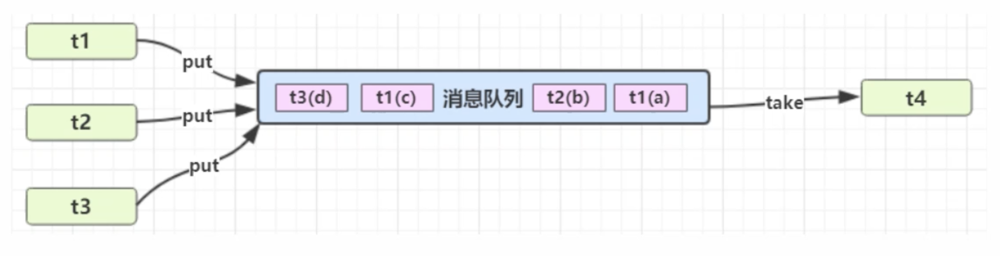

测试代码：

```java
@Slf4j(topic = "c.Test10")
public class Test10 {
    public static void main(String[] args) {
        MessageQueue queue = new MessageQueue(2);
        for (int i = 0; i < 3; i++) {
            int id = i;
            new Thread(() -> {
                queue.put(new Message(id, "内容: " + id));
            }, "Producer#" + i).start();
        }

        new Thread(() -> {
            while (true) {
                sleep(1);
                queue.take();
            }
        }).start();
    }
}

@Slf4j(topic = "c.MessageQueue")
class MessageQueue {
    private final LinkedList<Message> list = new LinkedList<>();
    private int capacity;

    public MessageQueue(int capacity) {
        this.capacity = capacity;
    }

    public Message take() {
        // 需要先检查队列是否为空
        synchronized (list) {
            while (list.isEmpty()) {
                try {
                    log.debug("队列为空，消费者线程等待");
                    list.wait();
                } catch (InterruptedException e) {
                    throw new RuntimeException(e);
                }
            }
            Message message = list.removeFirst();
            log.debug("已消费消息: {}", message);
            // 唤醒等待在list上的生产者线程
            list.notifyAll();
            return message;
        }
    }

    public void put(Message message) {
        // 需要检查队列是否已满
        synchronized (list) {
            while (list.size() == capacity) {
                log.debug("队列已满，生产者线程等待");
                try {
                    list.wait();
                } catch (InterruptedException e) {
                    throw new RuntimeException(e);
                }
            }
            log.debug("已生产消息: {}", message);
            list.addLast(message);
            // 唤醒等待在list上的消费者线程
            list.notifyAll();
        }
    }
}

final class Message {
    private int id;
    private Object value;

    public Message(int id, Object value) {
        this.id = id;
        this.value = value;
    }

    public int getId() {
        return id;
    }

    public Object getValue() {
        return value;
    }

    @Override
    public String toString() {
        return "Message{" +
                "id=" + id +
                ", value=" + value +
                '}';
    }
}
```

输出如下：

```java
11:23:54.276 [Producer#0] c.MessageQueue - 已生产消息: Message{id=0, value=内容: 0}
11:23:54.285 [Producer#1] c.MessageQueue - 已生产消息: Message{id=1, value=内容: 1}
11:23:54.285 [Producer#2] c.MessageQueue - 队列已满，生产者线程等待
11:23:55.280 [Thread-0] c.MessageQueue - 已消费消息: Message{id=0, value=内容: 0}
11:23:55.282 [Producer#2] c.MessageQueue - 已生产消息: Message{id=2, value=内容: 2}
11:23:56.282 [Thread-0] c.MessageQueue - 已消费消息: Message{id=1, value=内容: 1}
11:23:57.288 [Thread-0] c.MessageQueue - 已消费消息: Message{id=2, value=内容: 2}
11:23:58.290 [Thread-0] c.MessageQueue - 队列为空，消费者线程等待
```

## 3.9 Park & Unpark

基本使用：

```java
// 暂停当前线程
LockSupport.part();

// 恢复某个线程的运行
LockSupport.unpark(暂停线程对象);
```

测试代码：

```java
@Slf4j(topic = "c.LockSupportTest")
public class LockSupportTest {
    public static void main(String[] args) {
        Thread t1 = new Thread(() -> {
            log.debug("start...");
            sleep(1);
            log.debug("park t1");
            LockSupport.park();
            log.debug("t1 resumed");
        }, "t1");
        t1.start();

        sleep(2);
        log.debug("unpark t1");
        LockSupport.unpark(t1);
    }
}
```

输出：

```java
13:50:35.306 [t1] c.LockSupportTest - start...
13:50:36.310 [t1] c.LockSupportTest - park t1
13:50:37.305 [main] c.LockSupportTest - unpark t1
13:50:37.305 [t1] c.LockSupportTest - t1 resumed
```

注意，有个特殊之处如下：

```java
@Slf4j(topic = "c.LockSupportTest")
public class LockSupportTest {
    public static void main(String[] args) {
        Thread t1 = new Thread(() -> {
            log.debug("start...");
            sleep(2);
            log.debug("park t1");
            LockSupport.park();
            log.debug("t1 resumed");
        }, "t1");
        t1.start();

        sleep(1);
        log.debug("unpark t1");
        LockSupport.unpark(t1);
    }
}
```

主线程1s后就执行`unpark(t1)`，此时线程t1还未进入`park()`，2s后线程t1依然可以执行到`t1 resumed`。输出如下：

```java
13:55:21.293 [t1] c.LockSupportTest - start...
13:55:22.293 [main] c.LockSupportTest - unpark t1
13:55:23.303 [t1] c.LockSupportTest - park t1
13:55:23.304 [t1] c.LockSupportTest - t1 resumed
```

总结与Object的`wait & notify`相比：

- `wait`，`notify`，`notifyAll`必须配合`Object Monitor`一起使用，而`park & unpark`不必
- `park & unpark`是以线程为单位来阻塞和唤醒线程的，而`notify`只能随机唤醒一个等待线程，`notifyAll`是唤醒所有等待线程，不那么精确
- `park & unpark`可以先`unpark`，而`wait & notify`不可以先`notify`

### 3.9.1  原理之park & unpark

每个线程都有自己的一个Parker对象（底层由C语言实现），由三部分组成：`_counter`，`_cond`和`_mutex`。打个比喻：

- 线程就像一个旅人，Parker就像他随身携带的背包，条件变量就好比背包中的帐篷。`_counter`是背包中的备用干粮（0为耗尽，1为充足）
- 调用`park`就是要看需不需要停下来休息
  - 如果备用干粮耗尽，那么钻进帐篷休息
  - 如果备用干粮充足，那么不需停留，继续前进
- 调用`unpark`就是要令干粮充足
  - 如果这时线程还在帐篷，就唤醒让他继续前进
  - 如果这是线程还在运行，那么下次他调用`park`时，仅是消耗掉备用干粮，不需停留继续前进。因为背包空间有限，多次调用`unpark`仅会补充一份备用干粮

> Case 1


- 当前线程调用`Unsafe.park()`方法
- 检查`_counter`，本情况为0，这时获得`_mutex`互斥锁
- 线程进入`_cond`条件变量阻塞
- 设置`_counter=0`

> Case 2

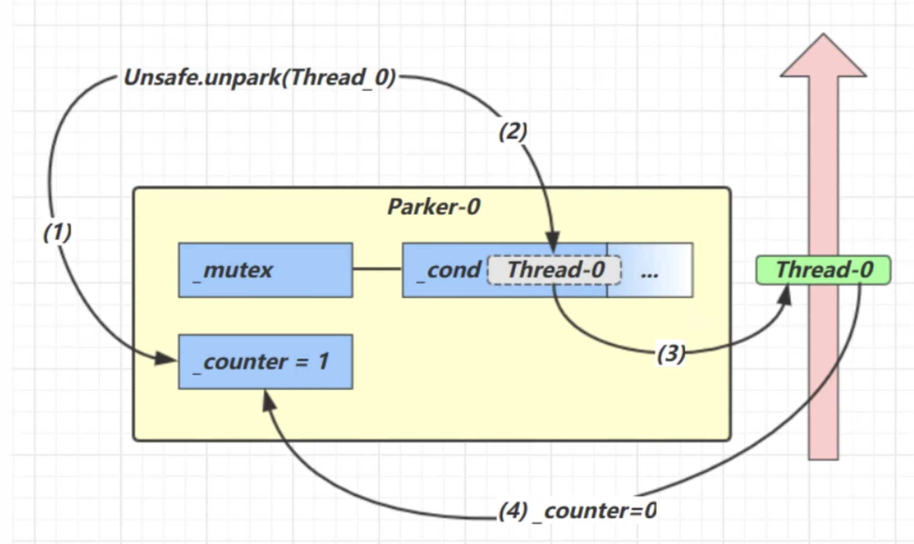

- 调用`Unsafe.unpark(Thread_0)`方法，设置`_counter`为1
- 唤醒`_cond`条件变量中的`Thread_0`
- `Thread_0`恢复运行
- 设置`_counter`为0

> Case 3

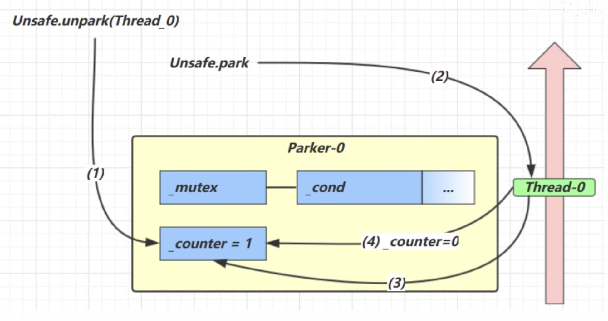

- 调用`Unsafe.unpark(Thread_0)`方法，设置`_counter`为1
- 当前线程调用`Unsafe.park()`方法
- 检查`_counter`，本情况为1，这时线程无需阻塞，继续运行
- 设置`_counter`为0

## 3.10 重新理解线程状态转换

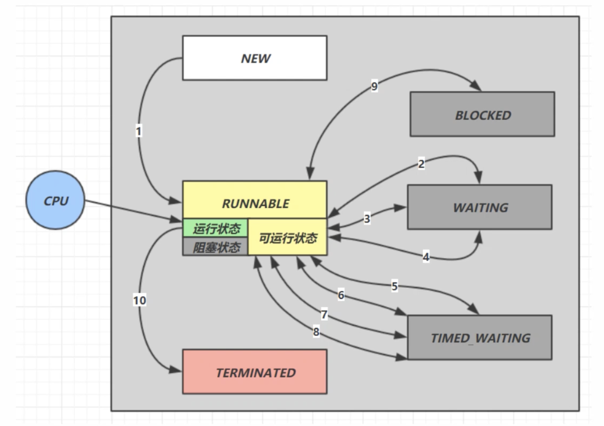

假设有线程`Thread t`:

> Case 1: NEW -> RUNNABLE

- 当调用`t.start()`方法时，由NEW -> RUNNABLE

> Case 2: RUNNABLE <--> WAITING

t线程调用`synchronized(obj)`获取了对象锁后：

- 调用`obj.wait()`方法时，t线程从RUNNABLE -> WAITING
- 调用`obj.notify()`，`obj.notifyAll()`， `t.interrupt`时
  - 竞争锁成功，t线程从WAITING -> RUNNALBE
  - 竞争锁失败，t线程从WAITING -> BLOCKED

代码测试：

```java
@Slf4j(topic = "c.TestWaitNotify")
public class TestWaitNotify {
    final static Object obj = new Object();

    public static void main(String[] args) {
        new Thread(() -> {
            synchronized (obj) {
                log.debug("执行...");
                try {
                    obj.wait();
                } catch (InterruptedException e) {
                    throw new RuntimeException(e);
                }
                log.debug("其他代码...");
            }
        }, "t1").start();

        new Thread(() -> {
            synchronized (obj) {
                log.debug("执行...");
                try {
                    obj.wait();
                } catch (InterruptedException e) {
                    throw new RuntimeException(e);
                }
                log.debug("其他代码...");
            }
        }, "t2").start();

        sleep(1);

        log.debug("唤醒obj上其他线程");
        synchronized (obj) {
            obj.notifyAll();
        }
    }
}
```

首先确保断点为`Thread`模式：

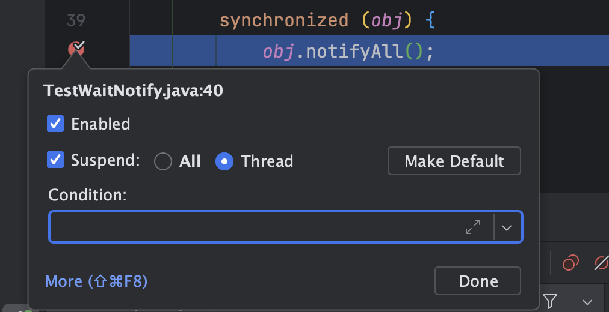

当代码执行到`obj.notifyAll();`时，我们查看两个线程状态，均为WAIT状态

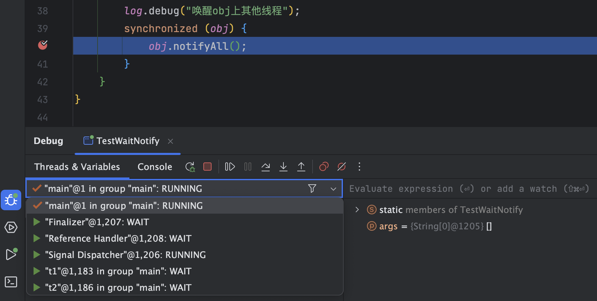

此时继续向下执行一步，主线程执行完了`obj.notifyAll`方法，但是还没有跳出`synchronized`代码块，其余两个线程还无法获得对象锁，因此状态应该是BLOCKED（在IDE里面显示的是MONITOR状态）

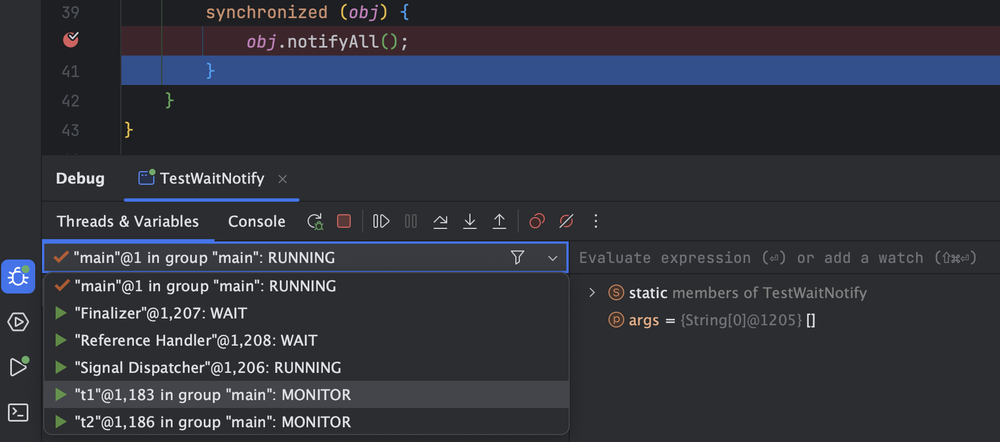

继续向下执行，主线程跳出了`synchronized`代码块，此时对象锁被主线程释放，另外两个线程开始争抢锁。线程`t2`抢到了锁，变成RUNNING 状态，线程t1抢锁失败，变成WAITING状态

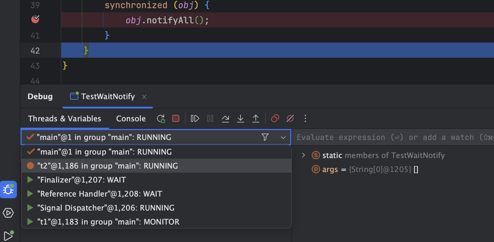

转到t2线程运行的代码，并执行到`synchronized`代码块结束处，可以看到两个线程都变为了RUNNING（RUNNABLE）状态

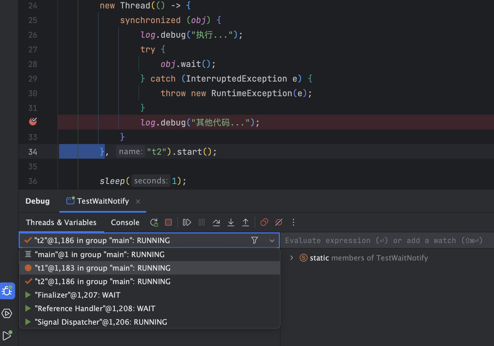

> Case 3:  RUNNABLE <--> WAITING

- 当前线程调用`t.join()`方法时，当前线程从RUNNABLE -> WAITING。注意，是当前线程在t线程对象的监视器上等待
- t线程运行结束，或调用了当前线程的`interrupt`方法时，当前线程从WAITING -> RUNNABLE.

> Case 4: RUNNABLE <--> WAITING

- 当前线程调用`LockSupport.park()`方法会让当前线程从RUNNABLE -> WAITING
- 当前线程调用`LockSupport.unpark(目标线程)`或调用了线程的`interrupt`方法，会让目标线程从WAITING -> RUNNABLE

> Case 5: RUNNALBE <--> TIMED_WAITING

t线程用`synchronized(obj)`获取了对象锁后：

- 调用`obj.wait(long n)`方法时，t线程从RUNNALBE -> TIMED_WAITING
- t线程等待时间超过了n毫秒，或调用`obj.notify()`，`obj.notifyAll()`，`t.interrupt()`时
  - 竞争锁成功，t线程从TIMED_WAITING -> RUNNABLE
  - 竞争锁失败，t线程从TIMED_WAITING -> BLOCKED

> Case 6: RUNNABLE <--> TIMED_WAITING

- 当前线程调用`t.join(long n)`方法时，当前线程从RUNNABLE -> TIMED_WAITING. 注意，是当前线程在t线程对象的监视器上等待
- 当前线程等待时间超过了n毫秒，或tt线程运行结束，或调用了当前线程的`interrupt`方法时，当前线程从TIMED_WAITING -> RUNNABLE.

> Case 7: RUNNABLE <--> TIMED_WAITING

- 当前线程调用`Thread.sleep(long n)，当前线程从RUNNABLE -> TIMED_WAITING
- 当前线程等待时间超过了n毫秒，当前线程从TIMED_WAITING -> RUNNABLE

> Case 8: RUNNABLE <--> TIMED_WAITING

- 当前线程调用`LockSupport.parkNanos(long nanos)`或`LockSupport.parkUntil(long millis)`时，当前线程从RUNNABLE -> TIMED_WAITING
- 调用`LockSupport.unpark(目标线程)`或调用了线程的`interrupt()`，或是等待超时，会让目标线程从TIMED_WAITING -> RUNNABLE

> Case 9: RUNNABLE <--> BLOCKED

- t线程用`synchronized(obj)`获取了对象锁时如果竞争失败，从RUNNABLE -> BLOCKED
- 持obj锁线程的同步代码块执行完毕，会唤醒该对象上所有BLOCKED的线程重新竞争，如果其中t线程竞争成功，从BLOCKED -> RUNNABLE，其他失败的线程仍然BLOCKED

> Case 10: RUNNABLE <--> TERMINATED

- 当前线程所有代码运行完毕，进入TERMINATED

## 3.11 多把锁

问题：一间大屋子有两个功能：学习、睡觉，互不相干。现在A要学习，B要睡觉，但如果只用一间屋子（一个对象锁）的话，并发度很低。解决方法是准备多个房间（多个对象锁）

参考如下问题代码：

```java
@Slf4j(topic = "c.TestMultiLocks")
public class TestMultiLocks {
    public static void main(String[] args) {
        BigRoom room = new BigRoom();
        new Thread(room::sleep, "A").start();
        new Thread(room::study, "B").start();
    }
}

@Slf4j(topic = "c.Room")
class BigRoom {
    public void sleep() {
        synchronized (this) {
            log.debug("sleeping 2 hrs.");
            ThreadUtils.sleep(2);
        }
    }

    public void study() {
        synchronized (this) {
            log.debug("study 1 hr.");
            ThreadUtils.sleep(1);
        }
    }
}
```

输出：

```java
13:54:47.008 [A] c.Room - sleeping 2 hrs.
13:54:49.015 [B] c.Room - study 1 hr.
```

解决方案：创建多个房间（多个锁对象）

```java
@Slf4j(topic = "c.TestMultiLocks")
public class TestMultiLocks {
    public static void main(String[] args) {
        BigRoom room = new BigRoom();
        new Thread(room::sleep, "A").start();
        new Thread(room::study, "B").start();
    }
}

@Slf4j(topic = "c.Room")
class BigRoom {
    private final Object studyRoom = new Object();
    private final Object bedRoom = new Object();

    public void sleep() {
        synchronized (bedRoom) {
            log.debug("sleeping 2 hrs.");
            ThreadUtils.sleep(2);
        }
    }

    public void study() {
        synchronized (studyRoom) {
            log.debug("study 1 hr.");
            ThreadUtils.sleep(1);
        }
    }
}
```

输出：

```java
13:57:00.184 [A] c.Room - sleeping 2 hrs.
13:57:00.184 [B] c.Room - study 1 hr.
```

将锁的粒度细分：

- 好处是可以增强并发度
- 坏处是如果一个线程需要同时获得多把锁，就容易发生死锁

## 3.12 活跃性

### 3.12.1 死锁

有这样的情况：一个线程需要同时获取多把锁，这时就容易发生死锁：

- t1线程获得A对象锁，接下来想获取B对象锁
- t2线程获得B对象锁，接下来想获取A对象锁

```java
@Slf4j(topic = "c.TestDeadLock")
public class TestDeadLock {
    public static void main(String[] args) {
        Object a = new Object();
        Object b = new Object();

        Thread t1 = new Thread(() -> {
            synchronized (a) {
                log.debug("lock A");
                sleep(2);
                synchronized (b) {
                    log.debug("lock B");
                    log.debug("Other operations.");
                }
            }
        }, "t1");
        
        Thread t2 = new Thread(() -> {
            synchronized (b) {
                log.debug("lock B");
                sleep(1);
                synchronized (a) {
                    log.debug("lock A");
                    log.debug("Other operations.");
                }
            }
        }, "t2");

        t1.start();
        t2.start();
    }
}
```

输出如下，程序锁住不会停止：

```java
14:04:14.833 [t1] c.TestDeadLock - lock A
14:04:14.833 [t2] c.TestDeadLock - lock B
```

### 3.12.2 定位死锁

> jstack

执行命令如下：

首先用`jps`查看进程id

```java
~/Projects/Concurrency ❯ jps                                                                                                                                         at 02:06:13 PM
12432 RemoteMavenServer36
529 
69141 TestDeadLock
69140 Launcher
70043 Jps
40511 Test10
```

然后使用`jstack {pid}`查看线程在状况：

```java

~/Projects/Concurrency ❯ jstack 69141                                                                                                                                at 02:06:29 PM
2024-03-03 14:06:45
Full thread dump Java HotSpot(TM) 64-Bit Server VM (25.341-b10 mixed mode):

"Attach Listener" #14 daemon prio=9 os_prio=31 tid=0x00007fbf1883e000 nid=0x6903 waiting on condition [0x0000000000000000]
   java.lang.Thread.State: RUNNABLE

"DestroyJavaVM" #13 prio=5 os_prio=31 tid=0x00007fbef80d7800 nid=0x2703 waiting on condition [0x0000000000000000]
   java.lang.Thread.State: RUNNABLE

"t2" #12 prio=5 os_prio=31 tid=0x00007fbef80ee800 nid=0x6b03 waiting for monitor entry [0x000000090e94d000]
   java.lang.Thread.State: BLOCKED (on object monitor)
        at com.nasuf.concurrency.TestDeadLock.lambda$main$1(TestDeadLock.java:29)
        - waiting to lock <0x000000070eb90098> (a java.lang.Object)
        - locked <0x000000070eb900a8> (a java.lang.Object)
        at com.nasuf.concurrency.TestDeadLock$$Lambda$2/679890578.run(Unknown Source)
        at java.lang.Thread.run(Thread.java:750)

"t1" #11 prio=5 os_prio=31 tid=0x00007fbf0f95f800 nid=0x5f43 waiting for monitor entry [0x000000090e84a000]
   java.lang.Thread.State: BLOCKED (on object monitor)
        at com.nasuf.concurrency.TestDeadLock.lambda$main$0(TestDeadLock.java:18)
        - waiting to lock <0x000000070eb900a8> (a java.lang.Object)
        - locked <0x000000070eb90098> (a java.lang.Object)
        at com.nasuf.concurrency.TestDeadLock$$Lambda$1/1416233903.run(Unknown Source)
        at java.lang.Thread.run(Thread.java:750)

"Service Thread" #10 daemon prio=9 os_prio=31 tid=0x00007fbf0f850800 nid=0x5b0f runnable [0x0000000000000000]
   java.lang.Thread.State: RUNNABLE

"C1 CompilerThread3" #9 daemon prio=9 os_prio=31 tid=0x00007fbf0f83d800 nid=0x7403 waiting on condition [0x0000000000000000]
   java.lang.Thread.State: RUNNABLE

"C2 CompilerThread2" #8 daemon prio=9 os_prio=31 tid=0x00007fbf0f83d000 nid=0x7603 waiting on condition [0x0000000000000000]
   java.lang.Thread.State: RUNNABLE

"C2 CompilerThread1" #7 daemon prio=9 os_prio=31 tid=0x00007fbf0f83c000 nid=0x7803 waiting on condition [0x0000000000000000]
   java.lang.Thread.State: RUNNABLE

"C2 CompilerThread0" #6 daemon prio=9 os_prio=31 tid=0x00007fbf0f83b000 nid=0x7903 waiting on condition [0x0000000000000000]
   java.lang.Thread.State: RUNNABLE

"Monitor Ctrl-Break" #5 daemon prio=5 os_prio=31 tid=0x00007fbf0f839000 nid=0x7b47 runnable [0x000000090e135000]
   java.lang.Thread.State: RUNNABLE
        at java.net.SocketInputStream.socketRead0(Native Method)
        at java.net.SocketInputStream.socketRead(SocketInputStream.java:116)
        at java.net.SocketInputStream.read(SocketInputStream.java:171)
        at java.net.SocketInputStream.read(SocketInputStream.java:141)
        at sun.nio.cs.StreamDecoder.readBytes(StreamDecoder.java:284)
        at sun.nio.cs.StreamDecoder.implRead(StreamDecoder.java:326)
        at sun.nio.cs.StreamDecoder.read(StreamDecoder.java:178)
        - locked <0x000000070d9f4d80> (a java.io.InputStreamReader)
        at java.io.InputStreamReader.read(InputStreamReader.java:184)
        at java.io.BufferedReader.fill(BufferedReader.java:161)
        at java.io.BufferedReader.readLine(BufferedReader.java:324)
        - locked <0x000000070d9f4d80> (a java.io.InputStreamReader)
        at java.io.BufferedReader.readLine(BufferedReader.java:389)
        at com.intellij.rt.execution.application.AppMainV2$1.run(AppMainV2.java:53)

"Signal Dispatcher" #4 daemon prio=9 os_prio=31 tid=0x00007fbf0f81d000 nid=0x5703 runnable [0x0000000000000000]
   java.lang.Thread.State: RUNNABLE

"Finalizer" #3 daemon prio=8 os_prio=31 tid=0x00007fbf1880d800 nid=0x461f in Object.wait() [0x000000090de21000]
   java.lang.Thread.State: WAITING (on object monitor)
        at java.lang.Object.wait(Native Method)
        - waiting on <0x000000070d208ef0> (a java.lang.ref.ReferenceQueue$Lock)
        at java.lang.ref.ReferenceQueue.remove(ReferenceQueue.java:150)
        - locked <0x000000070d208ef0> (a java.lang.ref.ReferenceQueue$Lock)
        at java.lang.ref.ReferenceQueue.remove(ReferenceQueue.java:171)
        at java.lang.ref.Finalizer$FinalizerThread.run(Finalizer.java:216)

"Reference Handler" #2 daemon prio=10 os_prio=31 tid=0x00007fbf1880b000 nid=0x5223 in Object.wait() [0x000000090dd1e000]
   java.lang.Thread.State: WAITING (on object monitor)
        at java.lang.Object.wait(Native Method)
        - waiting on <0x000000070d206c08> (a java.lang.ref.Reference$Lock)
        at java.lang.Object.wait(Object.java:502)
        at java.lang.ref.Reference.tryHandlePending(Reference.java:191)
        - locked <0x000000070d206c08> (a java.lang.ref.Reference$Lock)
        at java.lang.ref.Reference$ReferenceHandler.run(Reference.java:153)

"VM Thread" os_prio=31 tid=0x00007fbf2f854800 nid=0x4403 runnable 

"GC task thread#0 (ParallelGC)" os_prio=31 tid=0x00007fbf30812000 nid=0x304b runnable 

"GC task thread#1 (ParallelGC)" os_prio=31 tid=0x00007fbf18808800 nid=0x3c03 runnable 

"GC task thread#2 (ParallelGC)" os_prio=31 tid=0x00007fbf1f80a000 nid=0x3203 runnable 

"GC task thread#3 (ParallelGC)" os_prio=31 tid=0x00007fbf1f80a800 nid=0x3a03 runnable 

"GC task thread#4 (ParallelGC)" os_prio=31 tid=0x00007fbf2f812800 nid=0x3303 runnable 

"GC task thread#5 (ParallelGC)" os_prio=31 tid=0x00007fbf2f80d800 nid=0x3803 runnable 

"GC task thread#6 (ParallelGC)" os_prio=31 tid=0x00007fbf2800d800 nid=0x3503 runnable 

"GC task thread#7 (ParallelGC)" os_prio=31 tid=0x00007fbf2f80e000 nid=0x4003 runnable 

"GC task thread#8 (ParallelGC)" os_prio=31 tid=0x00007fbf2f814800 nid=0x4103 runnable 

"GC task thread#9 (ParallelGC)" os_prio=31 tid=0x00007fbf2f815800 nid=0x5303 runnable 

"VM Periodic Task Thread" os_prio=31 tid=0x00007fbf3080e000 nid=0x6e3f waiting on condition 

JNI global references: 319


Found one Java-level deadlock:
=============================
"t2":
  waiting to lock monitor 0x00007fbf28014dc8 (object 0x000000070eb90098, a java.lang.Object),
  which is held by "t1"
"t1":
  waiting to lock monitor 0x00007fbf28012ab8 (object 0x000000070eb900a8, a java.lang.Object),
  which is held by "t2"

Java stack information for the threads listed above:
===================================================
"t2":
        at com.nasuf.concurrency.TestDeadLock.lambda$main$1(TestDeadLock.java:29)
        - waiting to lock <0x000000070eb90098> (a java.lang.Object)
        - locked <0x000000070eb900a8> (a java.lang.Object)
        at com.nasuf.concurrency.TestDeadLock$$Lambda$2/679890578.run(Unknown Source)
        at java.lang.Thread.run(Thread.java:750)
"t1":
        at com.nasuf.concurrency.TestDeadLock.lambda$main$0(TestDeadLock.java:18)
        - waiting to lock <0x000000070eb900a8> (a java.lang.Object)
        - locked <0x000000070eb90098> (a java.lang.Object)
        at com.nasuf.concurrency.TestDeadLock$$Lambda$1/1416233903.run(Unknown Source)
        at java.lang.Thread.run(Thread.java:750)

Found 1 deadlock.

```

> jconsole

在终端输入`jconsole`然后连接需要检查的进程id

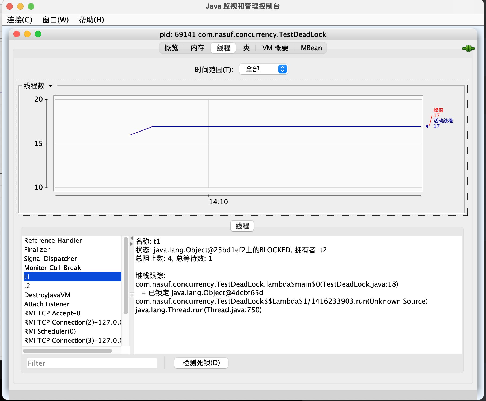

点击检查死锁，可以查看到如下死锁状态：

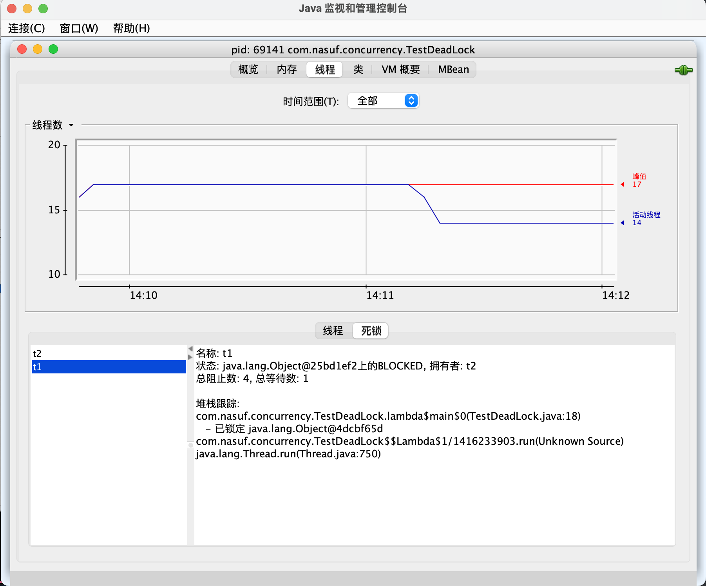

### 3.12.3 哲学家就餐问题

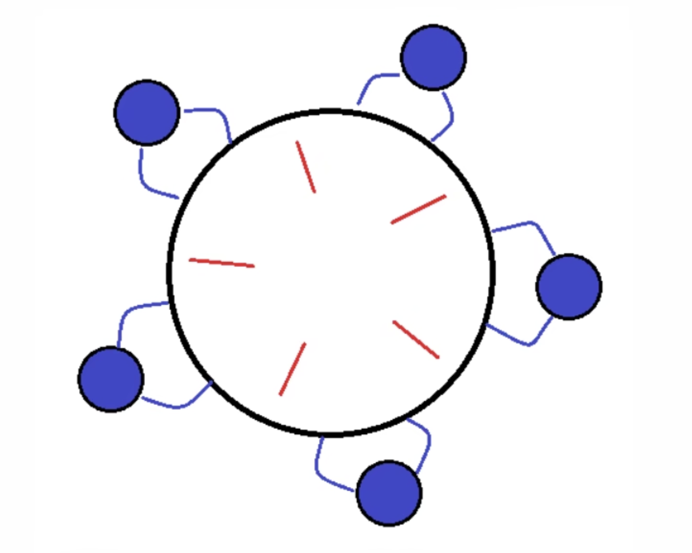

有五位哲学家，围坐在圆桌旁：

- 他们只做两件事：思考和吃饭。思考一会儿吃一口饭，吃完饭接着思考
- 吃饭时要用两根筷子吃，桌上共有5根筷子，每位哲学家左右手边各有一根筷子
- 如果筷子被身边的人拿着，自己需要等待

测试代码：

```java
@Slf4j(topic = "c.TestDeadLock")
public class TestDeadLock {
    public static void main(String[] args) {
        Chopstick c1 = new Chopstick("1");
        Chopstick c2 = new Chopstick("2");
        Chopstick c3 = new Chopstick("3");
        Chopstick c4 = new Chopstick("4");
        Chopstick c5 = new Chopstick("5");
        new Philosopher("苏格拉底", c1, c2).start();
        new Philosopher("柏拉图", c2, c3).start();
        new Philosopher("亚里士多德", c3, c4).start();
        new Philosopher("赫拉克利特", c4, c5).start();
        new Philosopher("阿基米德", c5, c1).start();
    }
}

@Slf4j(topic = "c.Philosopher")
class Philosopher extends Thread {
    final Chopstick left;
    final Chopstick right;

    public Philosopher(String name, Chopstick left, Chopstick right) {
        super(name);
        this.left = left;
        this.right = right;
    }

    @Override
    public void run() {
        while (true) {
            synchronized (left) {
                synchronized (right) {
                    eat();
                }
            }
        }
    }

    private void eat() {
        log.debug("eating...");
        ThreadUtils.sleep(1);
    }
}

class Chopstick {
    String name;

    public Chopstick(String name) {
        this.name = name;
    }

    @Override
    public String toString() {
        return "Chopstick{" +
                "name='" + name + '\'' +
                '}';
    }
}
```

输出：

```java
14:26:42.392 [亚里士多德] c.Philosopher - eating...
14:26:42.392 [苏格拉底] c.Philosopher - eating...
14:26:43.404 [苏格拉底] c.Philosopher - eating...
```

程序死锁，不再输出，此时使用`jconsole`检查死锁状态：

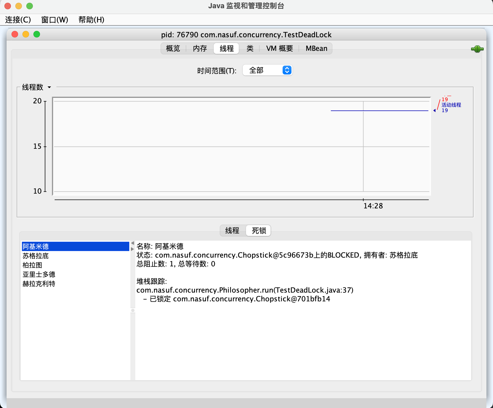

同样`jstack`会输出如下死锁信息：

```java
Found one Java-level deadlock:
=============================
"阿基米德":
  waiting to lock monitor 0x00007f9f3d122e08 (object 0x000000070f192528, a com.nasuf.concurrency.Chopstick),
  which is held by "苏格拉底"
"苏格拉底":
  waiting to lock monitor 0x00007f9f3f82aff8 (object 0x000000070f192538, a com.nasuf.concurrency.Chopstick),
  which is held by "柏拉图"
"柏拉图":
  waiting to lock monitor 0x00007f9f3f82af48 (object 0x000000070f192548, a com.nasuf.concurrency.Chopstick),
  which is held by "亚里士多德"
"亚里士多德":
  waiting to lock monitor 0x00007f9f3f82b158 (object 0x000000070f192558, a com.nasuf.concurrency.Chopstick),
  which is held by "赫拉克利特"
"赫拉克利特":
  waiting to lock monitor 0x00007f9f3f82b0a8 (object 0x000000070f192568, a com.nasuf.concurrency.Chopstick),
  which is held by "阿基米德"
```

