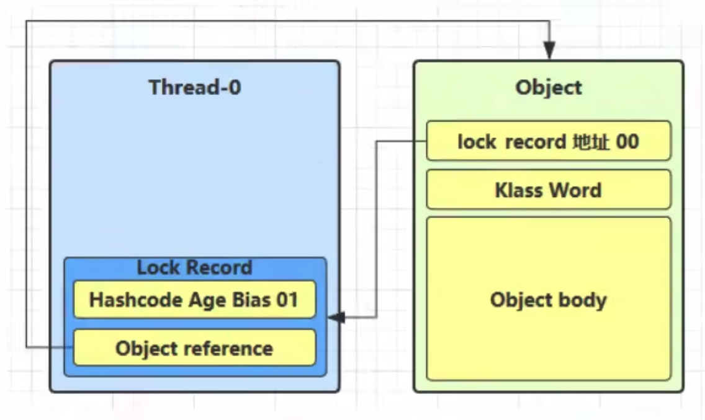
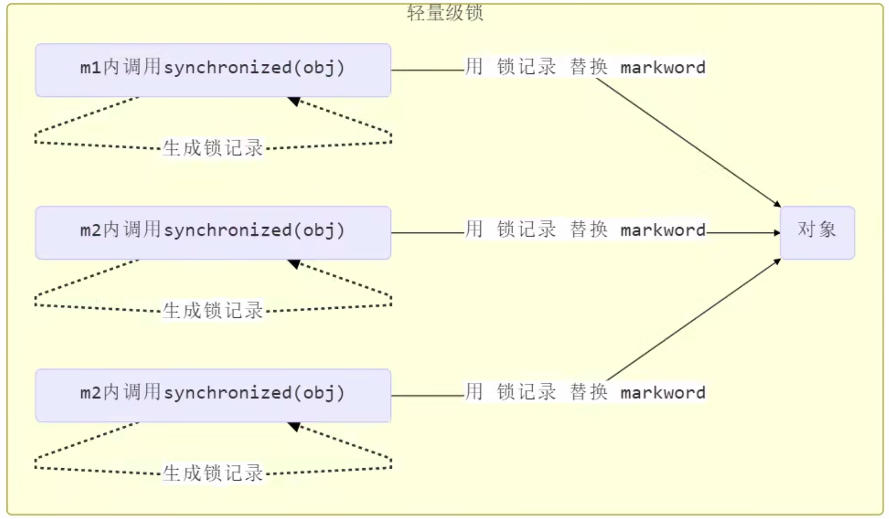
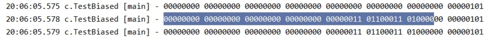
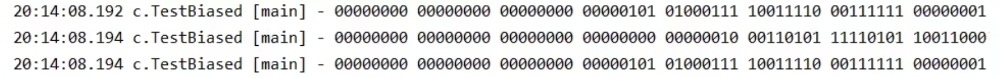
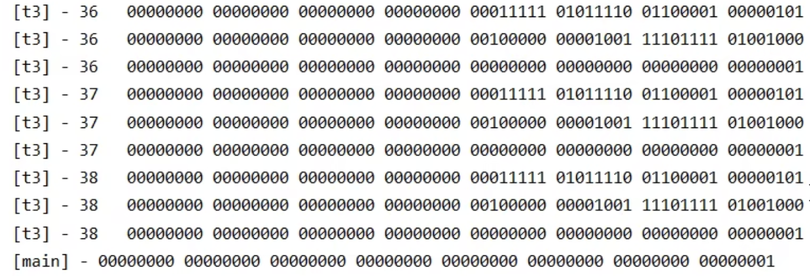

## 4 synchronized 原理进阶

### 4.1 字节码角度

考虑如下代码：

```java
static final Object lock = new Object();
static int counter = 0;

public static void main(String[] args) {
  synchronized(lock) {
    counter++;
  }
}
```

对应的字节码为：

```java
public static void main(java.lang.String[]);
	descriptor: ([Ljava/lang/String;])V
  flags: ACC_PUBLIC, ACC_STATIC
  Code:
		stack=2, locals=3, args_size=1
      0: getstatic  #2 // <- lock引用（synchronized开始）
      3: dup
      4: astore_1      // lock引用 -> slot 1
      5: monitorenter  // 将lock对象MarkWord置为Monitor指针
      6: getstatic  #3 // <- i
      9: iconst_1      // 准备常数 1
     10: iadd          // +1
     11: putstatic  #3 // -> i
     14: aload_1       // <- lock引用
     15: monitorexit   // 将lock对象MarkWord重置，唤醒EntryList
     16: goto       24
     19: astore_2      // e -> slot 2
     20: aload_1       // <- lock引用
     21: monitorexit   // 将lock对象MarkWord重置，唤醒EntryList
     22: aload_2       // <- slot 2 (e)
     23: athrow        // throw e
     24: return
   Exception table:
			from    to    target    type
         6    16        19     any
         19   22        19     any
```

### 4.2 轻量级锁

使用场景：如果一个对象虽然有多线程访问，但多线程访问的时间是错开的（也就是没有竞争），那么可以使用轻量级锁来优化。轻量级锁对使用者是透明的，即语法依然是`synchronized`。假设有两个方法同步块，利用同一个对象加锁：

```java
static final Object obj = new Object();

public static void method1() {
  synchronized (obj) {
    // 同步块A
    method2();
  }
}

public static void method2() {
  synchronized (obj) {
    // 同步块B
  }
}
```

- 创建锁记录（Lock Record）对象，每个线程的栈帧都会包含一个锁记录的结构，内部可以存储锁定对象的MarkWord

  

- 让锁记录中的`Object Reference`指向锁对象，并尝试用`cas`替换Object的`Mark Word`，将`Mark Word`的值存入锁记录
  

- 如果`cas`替换成功，对象头中存储了锁记录地址和状态`00`，表示由该线程给对象加锁，这时图示如下：

  

- 如果`cas`失败，有两种情况：

  - 如果是其他线程已经持有了该Object的轻量级锁，这时表明有竞争，进入锁膨胀过程
  - 如果是自己执行了`synchronized`锁重入（如上述代码），那么再添加一条`Lock Record`作为重入的计数
    

- 当退出`synchronized`代码块（解锁时），如果有取值为`null`的锁记录，表示有重入，这时重置锁记录，表示重入计数减一
  

- 当退出`synchronized`代码块（解锁时），如果锁记录的值不为`null`，这时使用`cas`将`Mark Word`的值恢复给对象头

  - 成功，则解锁成功
  - 失败，说明轻量级锁进行了锁膨胀或已经升级为重量级锁，进入重量级锁解锁流程

### 4.3 锁膨胀

如果在尝试加轻量级锁的过程中，`cas`操作无法成功，这时一种情况就是有其他线程为此对象加上了轻量级锁（有竞争），这时需要进行锁膨胀，将轻量级锁变为重量级锁。参考如下代码：

```java
static Object obj = new Object();
public static void method1() {
  synchronized(obj) {
    // 同步块
  }
}
```

- 当Thread-1进行轻量级加锁时，Thread-0已经给该对象加了轻量级锁
  
- 这时Thread-1加轻量级锁失败，进入锁膨胀流程
  - 即为Object对象申请Monitor锁，让Object指向重量级锁地址
  - 然后自己进入Monitor的EntryList BLOCKED
    
- 当Thread-0退出同步块解锁时，使用`cas`将MarkWord的值恢复给对象头，失败。这时会进入重量级解锁流程，即按照Monitor地址找到Monitor对象，设置Owner为`null`，唤醒EntryList中的BLOCKED线程

### 4.4 自旋优化

重量级锁竞争额时候，还可以使用自旋来进行优化。如果当前线程自旋成功（即这时候持锁线程已经退出了同步块，释放了锁），这时当前线程就可以避免阻塞。

> 自旋重试成功的情况：

| 线程1（cpu-1上）        | 对象Mark               | 线程2（cpu-2上）        |
| ----------------------- | ---------------------- | ----------------------- |
| -                       | 10（重量锁）           | -                       |
| 访问同步块，获取monitor | 10（重量锁）重量锁指针 | -                       |
| 成功（加锁）            | 10（重量锁）重量锁指针 | -                       |
| 执行同步块              | 10（重量锁）重量锁指针 | -                       |
| 执行同步块              | 10（重量锁）重量锁指针 | 访问同步块，获取monitor |
| 执行同步块              | 10（重量锁）重量锁指针 | 自旋重试                |
| 执行完毕                | 10（重量锁）重量锁指针 | 自旋重试                |
| 成功（解锁）            | 01（无锁）             | 自旋重试                |
| -                       | 10（重量锁）重量锁指针 | 成功（加锁）            |
| -                       | 10（重量锁）重量锁指针 | 执行同步块              |
| -                       | ...                    | ...                     |

> 自旋重试失败的情况：

| 线程1（cpu-1上）        | 对象Mark               | 线程2（cpu-2上）        |
| ----------------------- | ---------------------- | ----------------------- |
| -                       | 10（重量锁）           | -                       |
| 访问同步块，获取monitor | 10（重量锁）重量锁指针 | -                       |
| 成功（加锁）            | 10（重量锁）重量锁指针 | -                       |
| 执行同步块              | 10（重量锁）重量锁指针 | -                       |
| 执行同步块              | 10（重量锁）重量锁指针 | 访问同步块，获取monitor |
| 执行同步块              | 10（重量锁）重量锁指针 | 自旋重试                |
| 执行同步块              | 10（重量锁）重量锁指针 | 自旋重试                |
| 执行同步块              | 10（重量锁）重量锁指针 | 自旋重试                |
| 执行同步块              | 10（重量锁）重量锁指针 | 阻塞                    |
| -                       | ...                    | ...                     |

注意以下几点：

- 在Java6之后自旋锁是自适应的。比如对象刚刚的一次自旋操作成功过，那么认为这次自旋成功的可能性会高，就多自旋几次；反之，就少自旋甚至不自旋，总之比较智能
- 自旋会占用CPU时间，单核CPU自旋就是浪费，多核CPU自旋才能发挥优势
- Java7之后不能控制是否开启自旋功能

### 4.5 偏向锁

轻量级锁在没有竞争时（就自己这个线程），每次重入仍然需要执行CAS操作。Java6中引入了偏向锁来做进一步优化：只有第一次使用CAS将线程ID设置到对象的MarkWord头，之后发现这个线程ID是自己的就表示没有竞争，不用重新CAS。以后只要不发生竞争，这个对象就归该线程所有。参考如下代码：

```java
static final Object obj = new Object();

public static void m1() {
  synchronized(obj) {
    // 同步块A
    m2();
  }
}

public static void m2() {
  synchronized(obj) {
    // 同步块B
    m3();
  }
}

public static void m3() {
  synchronized(obj) {
    // 同步块C
  }
}
```




#### 4.5.1 偏向状态

回忆一下对象头格式：


一个对象创建时：

- 如果开启了偏向锁（默认开启），那么对象创建后，MarkWord值为`0x05`即最后3位为`101`，这时它的thread、epoch、age都为0。

- 偏向锁是默认延迟的，不会在程序启动时立即生效，如果想避免延迟，可以加VM参数`-XX:BiasedLockingStartupDelay=0`来禁用延迟

  参考如下代码：

  ```java
  @Slf4j(topic = "c.TestBiased")
  public class TestBiased {
      public static void main(String[] args) {
          Dog dog = new Dog();
          log.debug(ClassLayout.parseInstance(dog).toPrintable());
      }
  }
  
  class Dog { }
  ```

  输出为：
  

  以上状态`001`表明该对象是`Normal`状态，因为偏向锁延迟开启。可以修改上述参数禁用延迟，或者将代码稍作修改：
  ```java
  @Slf4j(topic = "c.TestBiased")
  public class TestBiased {
      public static void main(String[] args) {
          Dog dog = new Dog();
          log.debug(ClassLayout.parseInstance(dog).toPrintable());
          Thread.sleep(4000);
          log.debug(ClassLayout.parseInstance(new Dog()).toPrintable());
      }
  }
  
  class Dog { }
  ```

  输出如下：
  


  可以看到两次输出有所不同，第二次变为了`101`，为`Biased`状态。
  当使用了`synchronized`，可以看到输出有所不同：

  ```java
  @Slf4j(topic = "c.TestBiased")
  public class TestBiased {
      public static void main(String[] args) {
          Dog dog = new Dog();
          log.debug(ClassLayout.parseInstance(dog).toPrintable());
  
          synchronized (dog) {
              log.debug(ClassLayout.parseInstance(dog).toPrintable());
          }
  
          log.debug(ClassLayout.parseInstance(dog).toPrintable());
      }
  }
  
  class Dog { }
  ```

  输出：
  

  

  可以看到高亮的部分是线程id。注意这个id不是jdk里面的线程id，而是操作系统层面的线程id。此处是主线程的线程id。当程序运行到最后一行离开了`synchronized`代码块，可以看到线程id依然没变。这就说明该对象锁定了main线程来被调用。

- 如果没有开启偏向锁，那么对象创建后，MarkWord值为`0x01`即最后3位为`001`，这时它的hashcode、age都为0，第一次用到hashcode时才会赋值

- 如果要禁用偏向锁，可以添加VM参数：`-XX:-UseBiasedLocking`
  同样的代码添加上述参数后，输出如下：
  

  

  锁状态从`Normal` -> `Lightweight Locked` -> `Normal`

#### 4.5.2 锁偏向的撤销（一）调用hashcode方法

参考如下代码：

```java
@Slf4j(topic = "c.TestBiased")
public class TestBiased {
    public static void main(String[] args) {
        Dog dog = new Dog();
      	d.hashCode(); // 禁用掉对象的偏向锁
        log.debug(ClassLayout.parseInstance(dog).toPrintable());

        synchronized (dog) {
            log.debug(ClassLayout.parseInstance(dog).toPrintable());
        }

        log.debug(ClassLayout.parseInstance(dog).toPrintable());
    }
}

class Dog { }
```

输出如下：



锁状态从`Normal` -> `Lightweight Locked` -> `Normal`

如果我们调用了对象的`hashcode`方法，就会禁用该对象的锁偏向。因为参考上面的对象头格式，如果要存储`hashcode`，就没有额外空间存储线程Id等信息，所以锁偏向状态会存储不全，只能取消所偏向状态，变成不可偏向的正常状态

- 轻量级锁会在线程栈帧的锁记录中记录hashcode
- 重量级锁会在Monitor中记录hashcode

#### 4.5.3 锁偏向的撤销（二）其他线程使用对象

查看如下测试代码，该代码保证了两个线程交错使用加锁对象：

```java
@Slf4j(topic = "c.TestBiased")
public class TestBiased {
    public static void main(String[] args) {
        Dog dog = new Dog();
        new Thread(() -> {
            log.debug(ClassLayout.parseInstance(dog).toPrintable());
            synchronized (dog) {
                log.debug(ClassLayout.parseInstance(dog).toPrintable());
            }
            log.debug(ClassLayout.parseInstance(dog).toPrintable());

            synchronized (TestBiased.class) {
                TestBiased.class.notify(); // 唤醒t2线程
            }
        }, "t1").start();

        new Thread(() -> {
            // t2线程开始后进入等待，直到t1线程跳出对dog对象的加锁代码块将其唤醒
            synchronized (TestBiased.class) { 
                try {
                    TestBiased.class.wait();
                } catch (InterruptedException e) {
                    throw new RuntimeException(e);
                }
            }
            log.debug(ClassLayout.parseInstance(dog).toPrintable());
            synchronized (dog) {
                log.debug(ClassLayout.parseInstance(dog).toPrintable());
            }
            log.debug(ClassLayout.parseInstance(dog).toPrintable());
        }, "t2").start();
    }
}

class Dog {
}
```

输出如下：


前三行`t1`线程的输出可以看出，对象`dog`加了偏向锁；后三行`t2`线程的输出表示，锁状态从偏向锁，变为轻量级锁，最后变为不可偏向状态`Normal`。

#### 4.5.4 锁偏向的撤销（三）调用wait/notify

Wait/notify只有重量级锁才会有，不会存在锁偏向状态。

#### 4.5.5 批量重偏向

如果对象虽然被多个线程访问，但没有竞争，这时偏向了线程T1的对象仍然有机会重新偏向T2，重偏向会重置对象的线程ID。当撤销偏向锁阈值超过20次后，jvm会认为偏向有误，于是会给这些对象加锁时重新偏向至加锁线程。

参考下面代码：

```java
@Slf4j(topic = "c.TestBiased")
public class TestBiased {
    public static void main(String[] args) {
        Vector<Dog> list = new Vector<>();
        new Thread(() -> {
            for (int i = 0; i < 30; i++) {
                Dog dog = new Dog();
                list.add(dog);
                synchronized (dog) {
                    log.debug(i + "\t" + ClassLayout.parseInstance(dog).toPrintable());
                }
            }
            synchronized (list) {
                list.notify();
            }
        }, "t1").start();

        new Thread(() -> {
            synchronized (list) {
                try {
                    list.wait();
                } catch (InterruptedException e) {
                    throw new RuntimeException(e);
                }
            }
            log.debug("===================>");
            for (int i = 0; i < 30; i++) {
                Dog dog = list.get(i);
                log.debug(i + "\t" + ClassLayout.parseInstance(dog).toPrintable());
                synchronized (dog) {
                    log.debug(i + "\t" + ClassLayout.parseInstance(dog).toPrintable());
                }
                log.debug(i + "\t" + ClassLayout.parseInstance(dog).toPrintable());
            }
        }, "t2").start();
    }
}

class Dog {
}
```

关键输出如下：


可以看到，线程`t2`从第20个对象开始（序号19），偏向状态不再撤销，而是改变了线程ID，偏向了`t2`线程。

#### 4.5.6 批量撤销

当撤销偏向锁阈值超过`40`次后，jvm会认为之前偏向错误，不应该偏向。于是该类的所有对象均变为不可偏向，新建的对象也是不可偏向。

测试如下代码：

```java
@Slf4j(topic = "c.TestBiased")
public class TestBiased {
    static Thread t1, t2, t3;

    public static void main(String[] args) throws InterruptedException {
        Vector<Dog> list = new Vector<>();
        int loopNumber = 39;
        t1 = new Thread(() -> {
            for (int i = 0; i < loopNumber; i++) {
                Dog dog = new Dog();
                list.add(dog);
                synchronized (dog) {
                    log.debug(i + "\t" + ClassLayout.parseInstance(dog).toPrintable());
                }
            }
            LockSupport.unpark(t2); // 唤醒t2
        }, "t1");
        t1.start();

        t2 = new Thread(() -> {
            LockSupport.park();
            log.debug("===================>");
            for (int i = 0; i < loopNumber; i++) {
                Dog dog = list.get(i);
                log.debug(i + "\t" + ClassLayout.parseInstance(dog).toPrintable());
                synchronized (dog) {
                    log.debug(i + "\t" + ClassLayout.parseInstance(dog).toPrintable());
                }
                log.debug(i + "\t" + ClassLayout.parseInstance(dog).toPrintable());
            }
            LockSupport.unpark(t3);  // 唤醒t3
        }, "t2");
        t2.start();

        t3 = new Thread(() -> {
            LockSupport.park();
            log.debug("===================>");
            for (int i = 0; i < loopNumber; i++) {
                Dog dog = list.get(i);
                log.debug(i + "\t" + ClassLayout.parseInstance(dog).toPrintable());
                synchronized (dog) {
                    log.debug(i + "\t" + ClassLayout.parseInstance(dog).toPrintable());
                }
                log.debug(i + "\t" + ClassLayout.parseInstance(dog).toPrintable());
            }
        }, "t3");
        t3.start();

        t3.join();
        log.debug(ClassLayout.parseInstance(new Dog()).toPrintable());
    }
}

class Dog {
}
```

输出的最终部分如下：



两个线程`t2`、`t3`分别撤销了20次，达到40次后，jvm不再为该类进行锁偏向设置，所以最后一次输出的新对象锁状态为不可偏向。

### 4.6 锁消除

测试案例：

创建`JMH`项目：

```java
mvn archetype:generate -DinteractiveMode=false -DarchetypeGroupId=org.openjdk.jmh -DarchetypeArtifactId=jmh-java-benchmark-archetype -DgroupId=com.nasuf.concurrency.benchmark -DartifactId=concurrency-benchmark -Dversion=1.0
```

测试代码如下：

```java
@Fork(1)
@BenchmarkMode(Mode.AverageTime)
@Warmup(iterations = 3)
@Measurement(iterations = 5)
@OutputTimeUnit(TimeUnit.NANOSECONDS)
public class CuncurrencyTest {
    static int x = 0;

    @Benchmark
    public void a() {
        x++;
    }

    @Benchmark
    public void b() {
        Object o = new Object();
        synchronized (o) {
            x++;
        }
    }
}
```

上述测试代码意图测试两个方法的平均用时。将上述项目打包后，会在`target`目录下生成`benchmarks.jar`文件，然后我们执行`java -jar benchmarks.jar`。最终结果输出如下：

```java
Benchmark          Mode  Cnt  Score   Error  Units
CuncurrencyTest.a  avgt    5  0.409 ± 0.006  ns/op
CuncurrencyTest.b  avgt    5  0.415 ± 0.008  ns/op
```

可以看到两个方法的`Score`基本一致，也就是说即使方法`b`进行了加锁，也没有影响性能。这是因为JDK的即时编译器`JIT`在编译时认为方法内的局部变量不会被共享，所以对该局部变量的加锁没有意义，因此优化后与方法`a`实际执行的字节码一致。这时JVM中默认的锁消除优化。如果要想去掉锁消除优化，需要加上`-XX:-EliminateLocks`参数。现在我们执行：`java -jar -XX:-EliminateLocks -jar benchmarks.jar`，可以看到结果差距变得很明显：

```java
Benchmark          Mode  Cnt  Score   Error  Units
CuncurrencyTest.a  avgt    5  0.407 ± 0.011  ns/op
CuncurrencyTest.b  avgt    5  5.937 ± 0.086  ns/op
```
