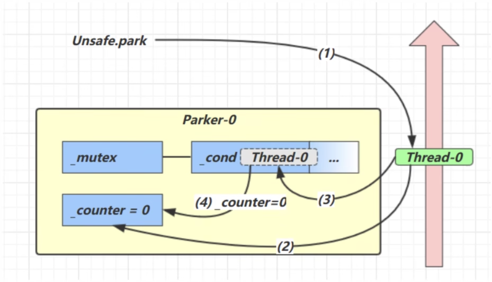
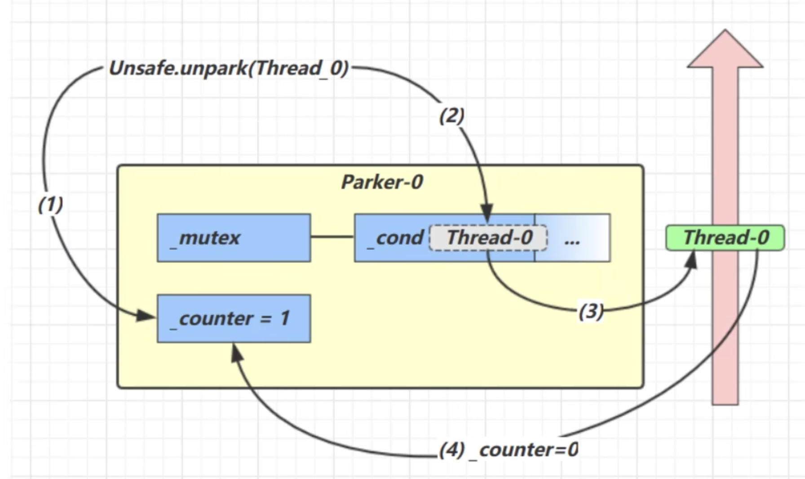
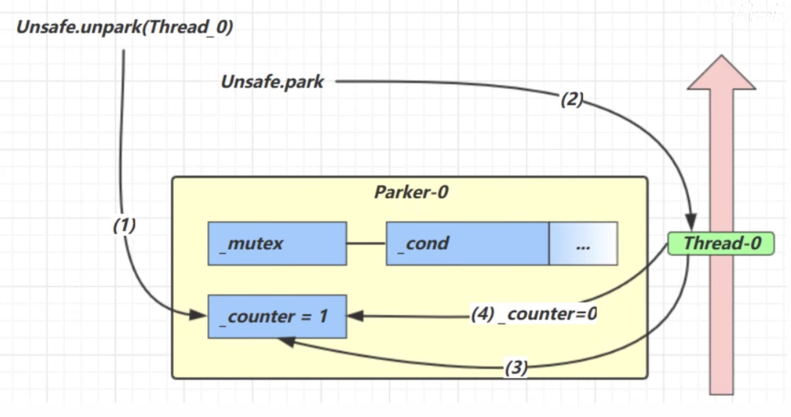

## 6 Park & Unpark

基本使用：

```java
// 暂停当前线程
LockSupport.part();

// 恢复某个线程的运行
LockSupport.unpark(暂停线程对象);
```

测试代码：

```java
@Slf4j(topic = "c.LockSupportTest")
public class LockSupportTest {
    public static void main(String[] args) {
        Thread t1 = new Thread(() -> {
            log.debug("start...");
            sleep(1);
            log.debug("park t1");
            LockSupport.park();
            log.debug("t1 resumed");
        }, "t1");
        t1.start();

        sleep(2);
        log.debug("unpark t1");
        LockSupport.unpark(t1);
    }
}
```

输出：

```java
13:50:35.306 [t1] c.LockSupportTest - start...
13:50:36.310 [t1] c.LockSupportTest - park t1
13:50:37.305 [main] c.LockSupportTest - unpark t1
13:50:37.305 [t1] c.LockSupportTest - t1 resumed
```

注意，有个特殊之处如下：

```java
@Slf4j(topic = "c.LockSupportTest")
public class LockSupportTest {
    public static void main(String[] args) {
        Thread t1 = new Thread(() -> {
            log.debug("start...");
            sleep(2);
            log.debug("park t1");
            LockSupport.park();
            log.debug("t1 resumed");
        }, "t1");
        t1.start();

        sleep(1);
        log.debug("unpark t1");
        LockSupport.unpark(t1);
    }
}
```

主线程1s后就执行`unpark(t1)`，此时线程t1还未进入`park()`，2s后线程t1依然可以执行到`t1 resumed`。输出如下：

```java
13:55:21.293 [t1] c.LockSupportTest - start...
13:55:22.293 [main] c.LockSupportTest - unpark t1
13:55:23.303 [t1] c.LockSupportTest - park t1
13:55:23.304 [t1] c.LockSupportTest - t1 resumed
```

总结与Object的`wait & notify`相比：

- `wait`，`notify`，`notifyAll`必须配合`Object Monitor`一起使用，而`park & unpark`不必
- `park & unpark`是以线程为单位来阻塞和唤醒线程的，而`notify`只能随机唤醒一个等待线程，`notifyAll`是唤醒所有等待线程，不那么精确
- `park & unpark`可以先`unpark`，而`wait & notify`不可以先`notify`

### 6.1  原理之park & unpark

每个线程都有自己的一个Parker对象（底层由C语言实现），由三部分组成：`_counter`，`_cond`和`_mutex`。打个比喻：

- 线程就像一个旅人，Parker就像他随身携带的背包，条件变量就好比背包中的帐篷。`_counter`是背包中的备用干粮（0为耗尽，1为充足）
- 调用`park`就是要看需不需要停下来休息
  - 如果备用干粮耗尽，那么钻进帐篷休息
  - 如果备用干粮充足，那么不需停留，继续前进
- 调用`unpark`就是要令干粮充足
  - 如果这时线程还在帐篷，就唤醒让他继续前进
  - 如果这是线程还在运行，那么下次他调用`park`时，仅是消耗掉备用干粮，不需停留继续前进。因为背包空间有限，多次调用`unpark`仅会补充一份备用干粮

> Case 1



- 当前线程调用`Unsafe.park()`方法
- 检查`_counter`，本情况为0，这时获得`_mutex`互斥锁
- 线程进入`_cond`条件变量阻塞
- 设置`_counter=0`

> Case 2



- 调用`Unsafe.unpark(Thread_0)`方法，设置`_counter`为1
- 唤醒`_cond`条件变量中的`Thread_0`
- `Thread_0`恢复运行
- 设置`_counter`为0

> Case 3



- 调用`Unsafe.unpark(Thread_0)`方法，设置`_counter`为1
- 当前线程调用`Unsafe.park()`方法
- 检查`_counter`，本情况为1，这时线程无需阻塞，继续运行
- 设置`_counter`为0