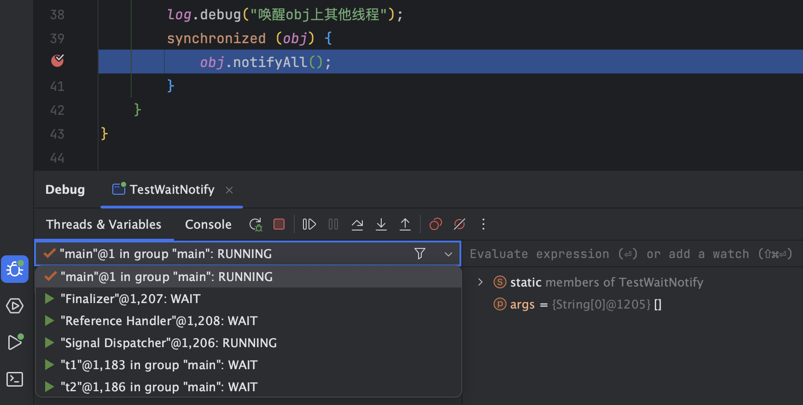
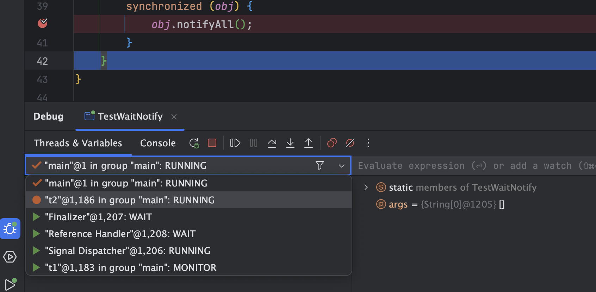

# 7 重新理解线程状态转换


假设有线程`Thread t`:

> Case 1: NEW -> RUNNABLE

- 当调用`t.start()`方法时，由NEW -> RUNNABLE

> Case 2: RUNNABLE <--> WAITING

t线程调用`synchronized(obj)`获取了对象锁后：

- 调用`obj.wait()`方法时，t线程从RUNNABLE -> WAITING
- 调用`obj.notify()`，`obj.notifyAll()`， `t.interrupt`时
  - 竞争锁成功，t线程从WAITING -> RUNNALBE
  - 竞争锁失败，t线程从WAITING -> BLOCKED

代码测试：

```java
@Slf4j(topic = "c.TestWaitNotify")
public class TestWaitNotify {
    final static Object obj = new Object();

    public static void main(String[] args) {
        new Thread(() -> {
            synchronized (obj) {
                log.debug("执行...");
                try {
                    obj.wait();
                } catch (InterruptedException e) {
                    throw new RuntimeException(e);
                }
                log.debug("其他代码...");
            }
        }, "t1").start();

        new Thread(() -> {
            synchronized (obj) {
                log.debug("执行...");
                try {
                    obj.wait();
                } catch (InterruptedException e) {
                    throw new RuntimeException(e);
                }
                log.debug("其他代码...");
            }
        }, "t2").start();

        sleep(1);

        log.debug("唤醒obj上其他线程");
        synchronized (obj) {
            obj.notifyAll();
        }
    }
}
```

首先确保断点为`Thread`模式：


当代码执行到`obj.notifyAll();`时，我们查看两个线程状态，均为WAIT状态



此时继续向下执行一步，主线程执行完了`obj.notifyAll`方法，但是还没有跳出`synchronized`代码块，其余两个线程还无法获得对象锁，因此状态应该是BLOCKED（在IDE里面显示的是MONITOR状态）


继续向下执行，主线程跳出了`synchronized`代码块，此时对象锁被主线程释放，另外两个线程开始争抢锁。线程`t2`抢到了锁，变成RUNNING 状态，线程t1抢锁失败，变成WAITING状态



转到t2线程运行的代码，并执行到`synchronized`代码块结束处，可以看到两个线程都变为了RUNNING（RUNNABLE）状态


> Case 3:  RUNNABLE <--> WAITING

- 当前线程调用`t.join()`方法时，当前线程从RUNNABLE -> WAITING。注意，是当前线程在t线程对象的监视器上等待
- t线程运行结束，或调用了当前线程的`interrupt`方法时，当前线程从WAITING -> RUNNABLE.

> Case 4: RUNNABLE <--> WAITING

- 当前线程调用`LockSupport.park()`方法会让当前线程从RUNNABLE -> WAITING
- 当前线程调用`LockSupport.unpark(目标线程)`或调用了线程的`interrupt`方法，会让目标线程从WAITING -> RUNNABLE

> Case 5: RUNNALBE <--> TIMED_WAITING

t线程用`synchronized(obj)`获取了对象锁后：

- 调用`obj.wait(long n)`方法时，t线程从RUNNALBE -> TIMED_WAITING
- t线程等待时间超过了n毫秒，或调用`obj.notify()`，`obj.notifyAll()`，`t.interrupt()`时
  - 竞争锁成功，t线程从TIMED_WAITING -> RUNNABLE
  - 竞争锁失败，t线程从TIMED_WAITING -> BLOCKED

> Case 6: RUNNABLE <--> TIMED_WAITING

- 当前线程调用`t.join(long n)`方法时，当前线程从RUNNABLE -> TIMED_WAITING. 注意，是当前线程在t线程对象的监视器上等待
- 当前线程等待时间超过了n毫秒，或tt线程运行结束，或调用了当前线程的`interrupt`方法时，当前线程从TIMED_WAITING -> RUNNABLE.

> Case 7: RUNNABLE <--> TIMED_WAITING

- 当前线程调用`Thread.sleep(long n)，当前线程从RUNNABLE -> TIMED_WAITING
- 当前线程等待时间超过了n毫秒，当前线程从TIMED_WAITING -> RUNNABLE

> Case 8: RUNNABLE <--> TIMED_WAITING

- 当前线程调用`LockSupport.parkNanos(long nanos)`或`LockSupport.parkUntil(long millis)`时，当前线程从RUNNABLE -> TIMED_WAITING
- 调用`LockSupport.unpark(目标线程)`或调用了线程的`interrupt()`，或是等待超时，会让目标线程从TIMED_WAITING -> RUNNABLE

> Case 9: RUNNABLE <--> BLOCKED

- t线程用`synchronized(obj)`获取了对象锁时如果竞争失败，从RUNNABLE -> BLOCKED
- 持obj锁线程的同步代码块执行完毕，会唤醒该对象上所有BLOCKED的线程重新竞争，如果其中t线程竞争成功，从BLOCKED -> RUNNABLE，其他失败的线程仍然BLOCKED

> Case 10: RUNNABLE <--> TERMINATED

- 当前线程所有代码运行完毕，进入TERMINATED