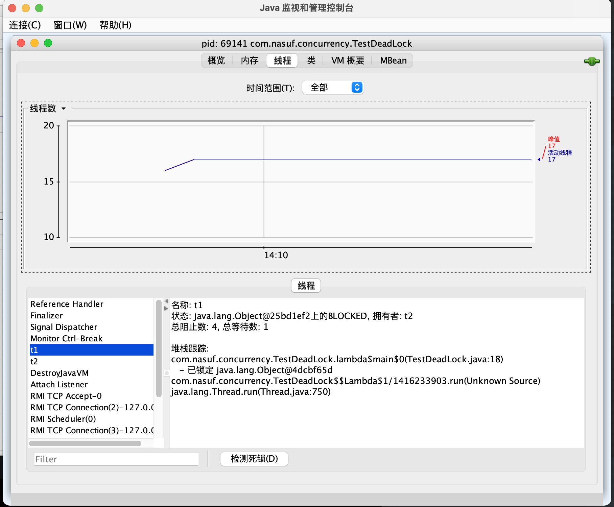
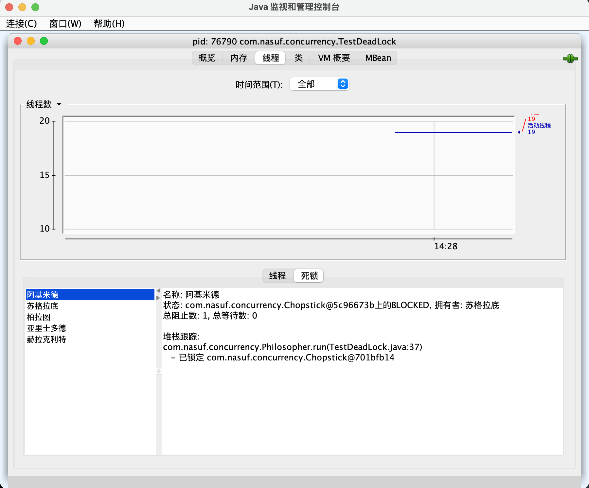

## 8 活跃性

## 8.1 多把锁

问题：一间大屋子有两个功能：学习、睡觉，互不相干。现在A要学习，B要睡觉，但如果只用一间屋子（一个对象锁）的话，并发度很低。解决方法是准备多个房间（多个对象锁）

参考如下问题代码：

```java
@Slf4j(topic = "c.TestMultiLocks")
public class TestMultiLocks {
    public static void main(String[] args) {
        BigRoom room = new BigRoom();
        new Thread(room::sleep, "A").start();
        new Thread(room::study, "B").start();
    }
}

@Slf4j(topic = "c.Room")
class BigRoom {
    public void sleep() {
        synchronized (this) {
            log.debug("sleeping 2 hrs.");
            ThreadUtils.sleep(2);
        }
    }

    public void study() {
        synchronized (this) {
            log.debug("study 1 hr.");
            ThreadUtils.sleep(1);
        }
    }
}
```

输出：

```java
13:54:47.008 [A] c.Room - sleeping 2 hrs.
13:54:49.015 [B] c.Room - study 1 hr.
```

解决方案：创建多个房间（多个锁对象）

```java
@Slf4j(topic = "c.TestMultiLocks")
public class TestMultiLocks {
    public static void main(String[] args) {
        BigRoom room = new BigRoom();
        new Thread(room::sleep, "A").start();
        new Thread(room::study, "B").start();
    }
}

@Slf4j(topic = "c.Room")
class BigRoom {
    private final Object studyRoom = new Object();
    private final Object bedRoom = new Object();

    public void sleep() {
        synchronized (bedRoom) {
            log.debug("sleeping 2 hrs.");
            ThreadUtils.sleep(2);
        }
    }

    public void study() {
        synchronized (studyRoom) {
            log.debug("study 1 hr.");
            ThreadUtils.sleep(1);
        }
    }
}
```

输出：

```java
13:57:00.184 [A] c.Room - sleeping 2 hrs.
13:57:00.184 [B] c.Room - study 1 hr.
```

将锁的粒度细分：

- 好处是可以增强并发度
- 坏处是如果一个线程需要同时获得多把锁，就容易发生死锁

### 8.2 死锁

有这样的情况：一个线程需要同时获取多把锁，这时就容易发生死锁：

- t1线程获得A对象锁，接下来想获取B对象锁
- t2线程获得B对象锁，接下来想获取A对象锁

```java
@Slf4j(topic = "c.TestDeadLock")
public class TestDeadLock {
    public static void main(String[] args) {
        Object a = new Object();
        Object b = new Object();

        Thread t1 = new Thread(() -> {
            synchronized (a) {
                log.debug("lock A");
                sleep(2);
                synchronized (b) {
                    log.debug("lock B");
                    log.debug("Other operations.");
                }
            }
        }, "t1");
        
        Thread t2 = new Thread(() -> {
            synchronized (b) {
                log.debug("lock B");
                sleep(1);
                synchronized (a) {
                    log.debug("lock A");
                    log.debug("Other operations.");
                }
            }
        }, "t2");

        t1.start();
        t2.start();
    }
}
```

输出如下，程序锁住不会停止：

```java
14:04:14.833 [t1] c.TestDeadLock - lock A
14:04:14.833 [t2] c.TestDeadLock - lock B
```

### 8.3 定位死锁

> jstack

执行命令如下：

首先用`jps`查看进程id

```java
~/Projects/Concurrency ❯ jps                                                                                                                                         at 02:06:13 PM
12432 RemoteMavenServer36
529 
69141 TestDeadLock
69140 Launcher
70043 Jps
40511 Test10
```

然后使用`jstack {pid}`查看线程在状况：

```java

~/Projects/Concurrency ❯ jstack 69141                                                                                                                                at 02:06:29 PM
2024-03-03 14:06:45
Full thread dump Java HotSpot(TM) 64-Bit Server VM (25.341-b10 mixed mode):

"Attach Listener" #14 daemon prio=9 os_prio=31 tid=0x00007fbf1883e000 nid=0x6903 waiting on condition [0x0000000000000000]
   java.lang.Thread.State: RUNNABLE

"DestroyJavaVM" #13 prio=5 os_prio=31 tid=0x00007fbef80d7800 nid=0x2703 waiting on condition [0x0000000000000000]
   java.lang.Thread.State: RUNNABLE

"t2" #12 prio=5 os_prio=31 tid=0x00007fbef80ee800 nid=0x6b03 waiting for monitor entry [0x000000090e94d000]
   java.lang.Thread.State: BLOCKED (on object monitor)
        at com.nasuf.concurrency.TestDeadLock.lambda$main$1(TestDeadLock.java:29)
        - waiting to lock <0x000000070eb90098> (a java.lang.Object)
        - locked <0x000000070eb900a8> (a java.lang.Object)
        at com.nasuf.concurrency.TestDeadLock$$Lambda$2/679890578.run(Unknown Source)
        at java.lang.Thread.run(Thread.java:750)

"t1" #11 prio=5 os_prio=31 tid=0x00007fbf0f95f800 nid=0x5f43 waiting for monitor entry [0x000000090e84a000]
   java.lang.Thread.State: BLOCKED (on object monitor)
        at com.nasuf.concurrency.TestDeadLock.lambda$main$0(TestDeadLock.java:18)
        - waiting to lock <0x000000070eb900a8> (a java.lang.Object)
        - locked <0x000000070eb90098> (a java.lang.Object)
        at com.nasuf.concurrency.TestDeadLock$$Lambda$1/1416233903.run(Unknown Source)
        at java.lang.Thread.run(Thread.java:750)

"Service Thread" #10 daemon prio=9 os_prio=31 tid=0x00007fbf0f850800 nid=0x5b0f runnable [0x0000000000000000]
   java.lang.Thread.State: RUNNABLE

"C1 CompilerThread3" #9 daemon prio=9 os_prio=31 tid=0x00007fbf0f83d800 nid=0x7403 waiting on condition [0x0000000000000000]
   java.lang.Thread.State: RUNNABLE

"C2 CompilerThread2" #8 daemon prio=9 os_prio=31 tid=0x00007fbf0f83d000 nid=0x7603 waiting on condition [0x0000000000000000]
   java.lang.Thread.State: RUNNABLE

"C2 CompilerThread1" #7 daemon prio=9 os_prio=31 tid=0x00007fbf0f83c000 nid=0x7803 waiting on condition [0x0000000000000000]
   java.lang.Thread.State: RUNNABLE

"C2 CompilerThread0" #6 daemon prio=9 os_prio=31 tid=0x00007fbf0f83b000 nid=0x7903 waiting on condition [0x0000000000000000]
   java.lang.Thread.State: RUNNABLE

"Monitor Ctrl-Break" #5 daemon prio=5 os_prio=31 tid=0x00007fbf0f839000 nid=0x7b47 runnable [0x000000090e135000]
   java.lang.Thread.State: RUNNABLE
        at java.net.SocketInputStream.socketRead0(Native Method)
        at java.net.SocketInputStream.socketRead(SocketInputStream.java:116)
        at java.net.SocketInputStream.read(SocketInputStream.java:171)
        at java.net.SocketInputStream.read(SocketInputStream.java:141)
        at sun.nio.cs.StreamDecoder.readBytes(StreamDecoder.java:284)
        at sun.nio.cs.StreamDecoder.implRead(StreamDecoder.java:326)
        at sun.nio.cs.StreamDecoder.read(StreamDecoder.java:178)
        - locked <0x000000070d9f4d80> (a java.io.InputStreamReader)
        at java.io.InputStreamReader.read(InputStreamReader.java:184)
        at java.io.BufferedReader.fill(BufferedReader.java:161)
        at java.io.BufferedReader.readLine(BufferedReader.java:324)
        - locked <0x000000070d9f4d80> (a java.io.InputStreamReader)
        at java.io.BufferedReader.readLine(BufferedReader.java:389)
        at com.intellij.rt.execution.application.AppMainV2$1.run(AppMainV2.java:53)

"Signal Dispatcher" #4 daemon prio=9 os_prio=31 tid=0x00007fbf0f81d000 nid=0x5703 runnable [0x0000000000000000]
   java.lang.Thread.State: RUNNABLE

"Finalizer" #3 daemon prio=8 os_prio=31 tid=0x00007fbf1880d800 nid=0x461f in Object.wait() [0x000000090de21000]
   java.lang.Thread.State: WAITING (on object monitor)
        at java.lang.Object.wait(Native Method)
        - waiting on <0x000000070d208ef0> (a java.lang.ref.ReferenceQueue$Lock)
        at java.lang.ref.ReferenceQueue.remove(ReferenceQueue.java:150)
        - locked <0x000000070d208ef0> (a java.lang.ref.ReferenceQueue$Lock)
        at java.lang.ref.ReferenceQueue.remove(ReferenceQueue.java:171)
        at java.lang.ref.Finalizer$FinalizerThread.run(Finalizer.java:216)

"Reference Handler" #2 daemon prio=10 os_prio=31 tid=0x00007fbf1880b000 nid=0x5223 in Object.wait() [0x000000090dd1e000]
   java.lang.Thread.State: WAITING (on object monitor)
        at java.lang.Object.wait(Native Method)
        - waiting on <0x000000070d206c08> (a java.lang.ref.Reference$Lock)
        at java.lang.Object.wait(Object.java:502)
        at java.lang.ref.Reference.tryHandlePending(Reference.java:191)
        - locked <0x000000070d206c08> (a java.lang.ref.Reference$Lock)
        at java.lang.ref.Reference$ReferenceHandler.run(Reference.java:153)

"VM Thread" os_prio=31 tid=0x00007fbf2f854800 nid=0x4403 runnable 

"GC task thread#0 (ParallelGC)" os_prio=31 tid=0x00007fbf30812000 nid=0x304b runnable 

"GC task thread#1 (ParallelGC)" os_prio=31 tid=0x00007fbf18808800 nid=0x3c03 runnable 

"GC task thread#2 (ParallelGC)" os_prio=31 tid=0x00007fbf1f80a000 nid=0x3203 runnable 

"GC task thread#3 (ParallelGC)" os_prio=31 tid=0x00007fbf1f80a800 nid=0x3a03 runnable 

"GC task thread#4 (ParallelGC)" os_prio=31 tid=0x00007fbf2f812800 nid=0x3303 runnable 

"GC task thread#5 (ParallelGC)" os_prio=31 tid=0x00007fbf2f80d800 nid=0x3803 runnable 

"GC task thread#6 (ParallelGC)" os_prio=31 tid=0x00007fbf2800d800 nid=0x3503 runnable 

"GC task thread#7 (ParallelGC)" os_prio=31 tid=0x00007fbf2f80e000 nid=0x4003 runnable 

"GC task thread#8 (ParallelGC)" os_prio=31 tid=0x00007fbf2f814800 nid=0x4103 runnable 

"GC task thread#9 (ParallelGC)" os_prio=31 tid=0x00007fbf2f815800 nid=0x5303 runnable 

"VM Periodic Task Thread" os_prio=31 tid=0x00007fbf3080e000 nid=0x6e3f waiting on condition 

JNI global references: 319


Found one Java-level deadlock:
=============================
"t2":
  waiting to lock monitor 0x00007fbf28014dc8 (object 0x000000070eb90098, a java.lang.Object),
  which is held by "t1"
"t1":
  waiting to lock monitor 0x00007fbf28012ab8 (object 0x000000070eb900a8, a java.lang.Object),
  which is held by "t2"

Java stack information for the threads listed above:
===================================================
"t2":
        at com.nasuf.concurrency.TestDeadLock.lambda$main$1(TestDeadLock.java:29)
        - waiting to lock <0x000000070eb90098> (a java.lang.Object)
        - locked <0x000000070eb900a8> (a java.lang.Object)
        at com.nasuf.concurrency.TestDeadLock$$Lambda$2/679890578.run(Unknown Source)
        at java.lang.Thread.run(Thread.java:750)
"t1":
        at com.nasuf.concurrency.TestDeadLock.lambda$main$0(TestDeadLock.java:18)
        - waiting to lock <0x000000070eb900a8> (a java.lang.Object)
        - locked <0x000000070eb90098> (a java.lang.Object)
        at com.nasuf.concurrency.TestDeadLock$$Lambda$1/1416233903.run(Unknown Source)
        at java.lang.Thread.run(Thread.java:750)

Found 1 deadlock.

```

> jconsole

在终端输入`jconsole`然后连接需要检查的进程id



点击检查死锁，可以查看到如下死锁状态：


### 8.4 哲学家就餐问题


有五位哲学家，围坐在圆桌旁：

- 他们只做两件事：思考和吃饭。思考一会儿吃一口饭，吃完饭接着思考
- 吃饭时要用两根筷子吃，桌上共有5根筷子，每位哲学家左右手边各有一根筷子
- 如果筷子被身边的人拿着，自己需要等待

测试代码：

```java
@Slf4j(topic = "c.TestDeadLock")
public class TestDeadLock {
    public static void main(String[] args) {
        Chopstick c1 = new Chopstick("1");
        Chopstick c2 = new Chopstick("2");
        Chopstick c3 = new Chopstick("3");
        Chopstick c4 = new Chopstick("4");
        Chopstick c5 = new Chopstick("5");
        new Philosopher("苏格拉底", c1, c2).start();
        new Philosopher("柏拉图", c2, c3).start();
        new Philosopher("亚里士多德", c3, c4).start();
        new Philosopher("赫拉克利特", c4, c5).start();
        new Philosopher("阿基米德", c5, c1).start();
    }
}

@Slf4j(topic = "c.Philosopher")
class Philosopher extends Thread {
    final Chopstick left;
    final Chopstick right;

    public Philosopher(String name, Chopstick left, Chopstick right) {
        super(name);
        this.left = left;
        this.right = right;
    }

    @Override
    public void run() {
        while (true) {
            synchronized (left) {
                synchronized (right) {
                    eat();
                }
            }
        }
    }

    private void eat() {
        log.debug("eating...");
        ThreadUtils.sleep(1);
    }
}

class Chopstick {
    String name;

    public Chopstick(String name) {
        this.name = name;
    }

    @Override
    public String toString() {
        return "Chopstick{" +
                "name='" + name + '\'' +
                '}';
    }
}
```

输出：

```java
14:26:42.392 [亚里士多德] c.Philosopher - eating...
14:26:42.392 [苏格拉底] c.Philosopher - eating...
14:26:43.404 [苏格拉底] c.Philosopher - eating...
```

程序死锁，不再输出，此时使用`jconsole`检查死锁状态：



同样`jstack`会输出如下死锁信息：

```java
Found one Java-level deadlock:
=============================
"阿基米德":
  waiting to lock monitor 0x00007f9f3d122e08 (object 0x000000070f192528, a com.nasuf.concurrency.Chopstick),
  which is held by "苏格拉底"
"苏格拉底":
  waiting to lock monitor 0x00007f9f3f82aff8 (object 0x000000070f192538, a com.nasuf.concurrency.Chopstick),
  which is held by "柏拉图"
"柏拉图":
  waiting to lock monitor 0x00007f9f3f82af48 (object 0x000000070f192548, a com.nasuf.concurrency.Chopstick),
  which is held by "亚里士多德"
"亚里士多德":
  waiting to lock monitor 0x00007f9f3f82b158 (object 0x000000070f192558, a com.nasuf.concurrency.Chopstick),
  which is held by "赫拉克利特"
"赫拉克利特":
  waiting to lock monitor 0x00007f9f3f82b0a8 (object 0x000000070f192568, a com.nasuf.concurrency.Chopstick),
  which is held by "阿基米德"
```

### 8.5 活锁

活锁出现在两个线程互相改变对方的结束条件，最后谁也无法结束。例如：

```java
@Slf4j(topic = "c.LiveLock")
public class LiveLock {
    static volatile int count = 10;

    public static void main(String[] args) {
        new Thread(() -> {
            while (count > 0) {
                sleep(1);
                count--;
                log.debug("count: {}", count);
            }
        }, "t1").start();

        new Thread(() -> {
            while (count < 20) {
                sleep(1);
                count++;
                log.debug("count: {}", count);
            }
        }, "t2").start();
    }
}
```

### 8.6 饥饿

对于“饥饿”，有些定义为：一个线程由于优先级太低，始终得不到CPU调度执行，也不能够结束。饥饿的情况不易展示，讲读写锁时会涉及饥饿问题。下面是一个线程饥饿例子，先来看看使用顺序加锁的方式解决之前的死锁问题：


顺序加锁的解决方案：


考虑之前的哲学家就餐问题，假如我们改变哲学家对筷子对象的加锁顺序，一律保持从小到大，没有从大到小的逻辑，就不会出现死锁情况：

```java
@Slf4j(topic = "c.TestDeadLock")
public class TestDeadLock {
    public static void main(String[] args) {
        Chopstick c1 = new Chopstick("1");
        Chopstick c2 = new Chopstick("2");
        Chopstick c3 = new Chopstick("3");
        Chopstick c4 = new Chopstick("4");
        Chopstick c5 = new Chopstick("5");
        new Philosopher("苏格拉底", c1, c2).start();
        new Philosopher("柏拉图", c2, c3).start();
        new Philosopher("亚里士多德", c3, c4).start();
        new Philosopher("赫拉克利特", c4, c5).start();
        new Philosopher("阿基米德", c1, c5).start(); // 注意，此处是c1, c5，而非之前的c5, c1
    }
}

@Slf4j(topic = "c.Philosopher")
class Philosopher extends Thread {
    final Chopstick left;
    final Chopstick right;

    public Philosopher(String name, Chopstick left, Chopstick right) {
        super(name);
        this.left = left;
        this.right = right;
    }

    @Override
    public void run() {
        while (true) {
            synchronized (left) {
                synchronized (right) {
                    eat();
                }
            }
        }
    }

    private void eat() {
        log.debug("eating...");
        ThreadUtils.sleep(1);
    }
}

class Chopstick {
    String name;

    public Chopstick(String name) {
        this.name = name;
    }

    @Override
    public String toString() {
        return "Chopstick{" +
                "name='" + name + '\'' +
                '}';
    }
}

```

但是这样虽然没有产生死锁，但是会产生饥饿现象，某一个哲学家线程一直处于就餐状态，其他哲学家线程无法获得机会。后面我们会用`ReentrantLock`来解决这个问题。