# 10. 共享模型之内存

## 10.1 Java内存模型

JMM即Java Memory Model，它定义了主存、工作内存抽象概念，底层对应着CPU寄存器、缓存、硬件内存、CPU指令优化等。

JMM体现在以下几个方面：

- 原子性：保证指令不会受到线程上下文切换的影响
- 可见性：保证指令不会受到CPU缓存的影响
- 有序性：保证指令不会受到CPU指令并行优化的影响

## 10.2 可见性

先来看一个现象，main线程对run变量的修改，对于线程t1不可见，导致t1线程无法停止：

```java
@Slf4j(topic = "c.Test11")
public class Test11 {
    static boolean run = true;

    public static void main(String[] args) {
        new Thread(() -> {
            while (run) {
                // ...
            }
        }, "t1").start();
        sleep(1);
        log.debug("stop thread t1");
        run = false;
    }
}
```

> 分析

1. 初始状态，t1线程刚开始从主内存读取了run的值到工作内存
   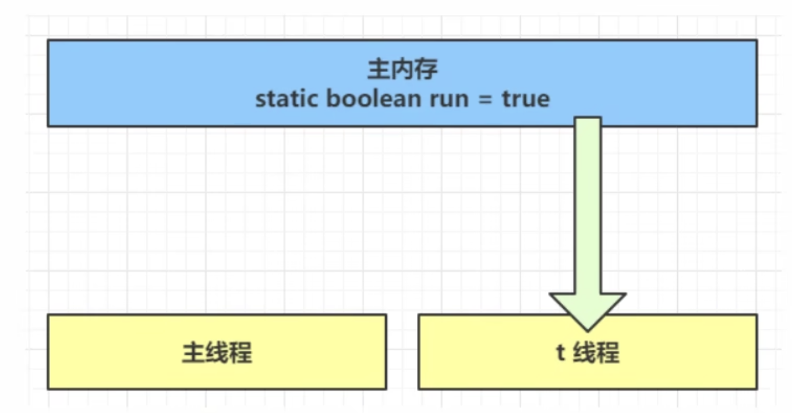
2. 因为t1线程要频繁从主内存中读取run的值，JIT编译器会将run的值缓存到自己工作内存中的高速缓存中，减少对主存中run的访问，提高效率
   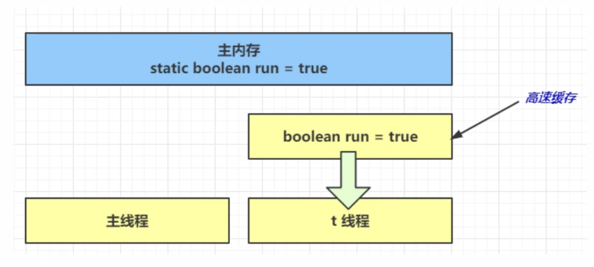
3. 1s后，main线程修改了run的值，并同步至主内存，而t1线程是从自己工作内存中的高速缓存中读取这个变量的值，结果永远是旧值
   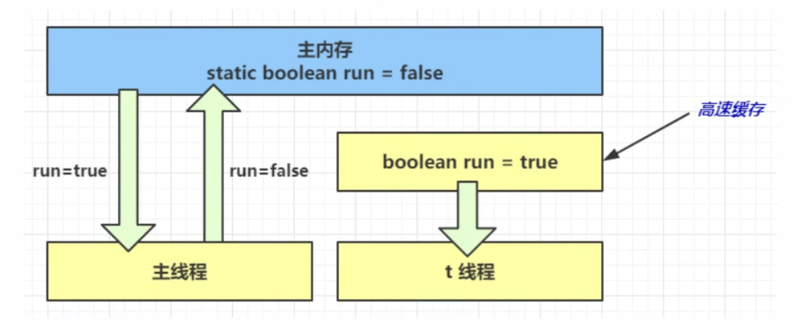


> 解决方案

使用`volatile`关键字。它可以用来修饰成员变量和静态成员变量，可以避免线程从自己的工作缓存中查找变量的值，必须要主存中获取它的值。线程操作volatile变量都是直接操作主存。

```java
@Slf4j(topic = "c.Test11")
public class Test11 {
    volatile static boolean run = true;

    public static void main(String[] args) {
        new Thread(() -> {
            while (run) {
                // ...
            }
        }, "t1").start();
        sleep(1);
        log.debug("stop thread t1");
        run = false;
    }
}
```

另外，使用`synchronized`关键字也可以解决可见性的问题，但是相对于`volatile`更重量级一些

```java
@Slf4j(topic = "c.Test11")
public class Test11 {
    static boolean run = true;
    final static Object lock = new Object(); // 不使用volatile关键字

    public static void main(String[] args) {
        new Thread(() -> {
            while (true) {
                synchronized (lock) {
                    if (!run) {
                        break;
                    }
                }
            }
        }, "t1").start();
        sleep(1);
        log.debug("stop thread t1");
        synchronized (lock) {
            run = false;
        }
    }
}
```

其次如果不使用`volatile`和`synchronized`关键字，而是在while循环中输出打印语句，也可以保证循环退出：

```java
@Slf4j(topic = "c.Test11")
public class Test11 {
    static boolean run = true;

    public static void main(String[] args) {
        new Thread(() -> {
            while (run) {
                System.out.println(run);
            }
        }, "t1").start();
        sleep(1);
        log.debug("stop thread t1");
        run = false;
    }
}
```


## 10.3 可见性 vs 原子性

前面例子体现的实际就是可见性，它保证的是多个线程之间，一个线程对volatile变量的修改对另一个线程可见，但是并不能保证原子性。volatile仅用在一个写线程，多个读线程的情况。从字节码角度理解是：

```java
getstatic run // 线程t1获取run true
getstatic run // 线程t1获取run true
getstatic run // 线程t1获取run true
getstatic run // 线程t1获取run true
putstatic run // 线程main修改run为false，仅此一次
getstatic run // 线程t1获取run false
```

比较一下之前我们讲线程安全时举的例子：两个线程一个`i++`一个`i--`，只能保证看到最新值，不能解决指令交错

```java
// 假设i的初始值为0
getstatic i // 线程2-获取静态变量i的值，线程内i=0

getstatic i // 线程1-获取静态变量i的值，线程内i=0
iconst_1    // 线程1-准备常量1
iadd        // 线程1-自增，线程内i=1
putstatic i // 线程1-将修改后的值存入静态变量i，静态变量i=1

iconst_1    // 线程2-准备常量1
isub        // 线程2-自减，线程内i=-1
putstatic i // 线程2-将修改后的值存入静态变量i，静态变量i=-1
```

### 10.3.1 终止模式之两阶段终止模式

回顾在第二章节我们通过打断标记来设计的终止模式：

```java
@Slf4j(topic = "c.TestInterrupt3")
public class TestInterrupt3 {
    public static void main(String[] args) throws InterruptedException {
        TwoPhaseTermination tpt = new TwoPhaseTermination();
        tpt.start();
        Thread.sleep(3500);
        tpt.stop();
    }
}

@Slf4j(topic = "c.TwoPhaseTermination")
class TwoPhaseTermination {
    private Thread monitor;

    public void start() {
        monitor = new Thread(() -> {
            while (true) {
                Thread currentThread = Thread.currentThread();
                if (currentThread.isInterrupted()) {
                    log.debug("处理后续操作...");
                    break;
                }
                try {
                    Thread.sleep(1000);
                    log.debug("执行监控记录...");
                } catch (InterruptedException e) {
                    e.printStackTrace();
                    // 重新设置打断标记
                    currentThread.interrupt();
                }
            }
        });
        monitor.start();
    }

    public void stop() {
        monitor.interrupt();
    }
}
```

我们使用`volatile`来改进上述代码：

```java
@Slf4j(topic = "c.TestInterrupt3")
public class TestInterrupt3 {
    public static void main(String[] args) throws InterruptedException {
        TwoPhaseTermination tpt = new TwoPhaseTermination();
        tpt.start();
        Thread.sleep(3500);
        tpt.stop();
    }
}

@Slf4j(topic = "c.TwoPhaseTermination")
class TwoPhaseTermination {
    private Thread monitor;
    private volatile boolean stopped = false;

    public void start() {
        monitor = new Thread(() -> {
            while (true) {
                if (stopped) {
                    log.debug("处理后续操作...");
                    break;
                }
                try {
                    Thread.sleep(1000);
                    log.debug("执行监控记录...");
                } catch (InterruptedException e) {
                }
            }
        });
        monitor.start();
    }

    public void stop() {
        stopped = true;
        monitor.interrupt(); // optional
    }
}
```

输出：

```java
10:04:55.826 [Thread-0] c.TwoPhaseTermination - 执行监控记录...
10:04:56.834 [Thread-0] c.TwoPhaseTermination - 执行监控记录...
10:04:57.840 [Thread-0] c.TwoPhaseTermination - 执行监控记录...
10:04:58.305 [Thread-0] c.TwoPhaseTermination - 处理后续操作...
```

### 10.3.2 同步模式之Balking模式

考虑上述两阶段终止模式代码，通常来说，监控线程只需要一个就好。如果我们多次调用`tpt.start()`代码，会无限制创建多个监控线程。如何来防止这种情况？这就是Balking（犹豫）模式。该模式用在一个线程发现另一个线程或本线程已经做了某一件相同的事，那么本线程就无需再做，直接返回。

```java
@Slf4j(topic = "c.TestInterrupt3")
public class TestInterrupt3 {
    public static void main(String[] args) throws InterruptedException {
        TwoPhaseTermination tpt = new TwoPhaseTermination();
        tpt.start();
        tpt.start();
        Thread.sleep(3500);
        tpt.stop();
    }
}

@Slf4j(topic = "c.TwoPhaseTermination")
class TwoPhaseTermination {
    private Thread monitor;
    private volatile boolean stopped = false;
    private boolean starting = false;

    public void start() {
        synchronized (this) {
            if (starting) { // 先判断是否已经执行过
                return;
            }
            starting = true;
        }
      	monitor = new Thread(() -> {
                while (true) {
                    if (stopped) {
                        log.debug("处理后续操作...");
                        break;
                    }
                    try {
                        Thread.sleep(1000);
                        log.debug("执行监控记录...");
                    } catch (InterruptedException e) {
                    }
                }
            });
            monitor.start();
    }

    public void stop() {
        stopped = true;
        monitor.interrupt(); // optional
    }
}
```

输出：

```java
10:16:55.393 [Thread-0] c.TwoPhaseTermination - 执行监控记录...
10:16:56.402 [Thread-0] c.TwoPhaseTermination - 执行监控记录...
10:16:57.407 [Thread-0] c.TwoPhaseTermination - 执行监控记录...
10:16:57.884 [Thread-0] c.TwoPhaseTermination - 处理后续操作...
```

注意，此处如果使用`volatile`无法解决问题。因为该关键字只能保证变量在多个线程之间的可见性，而此处要保证原子性，每个线程在读写`starting`的时候保证只有本线程在执行。

该模式还经常用来实现线程安全的单例模式：

```java
public final class Singleton {
  private Singleton() {}
  
  private static Singleton INSTANCE = null;
  
  public static synchronized Singleton getInstance() {
    if (INSTANCE != null) {
      return INSTANCE;
    }
    INSTANCE = new Singleton();
    return INSTANCE;
  }
}
```

## 10.4 有序性

JVM会在不影响正确性的前提下，可以调整语句的执行顺序。思考下面一段代码：

```java
static int i;
static int j;

// 在某个线程内执行如下赋值操作
i = ...;
j = ...;
```

可以看到，至于是先执行`i`还是先执行`j`，对最终的结果不会产生影响。所以上面代码真正执行时，既可以是

```java
i = ...;
j = ...;
```

也可以是

```java
j = ...;
i = ...;
```

这种特性称之为指令重排。多线程下指令重排会影响正确性。为什么要有指令重排这项优化呢？从CPU执行指令的原理来理解一下吧

### 10.4.1 鱼罐头案例

加工一条鱼需要50分钟，只能一条鱼、一条鱼地顺序加工

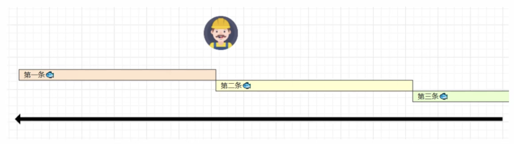

可以将每个鱼罐头的加工流程细分为5个步骤：

- 去鳞清洗10分钟
- 蒸煮沥水10分钟
- 加注汤料10分钟
- 杀菌出锅10分钟
- 真空封罐10分钟

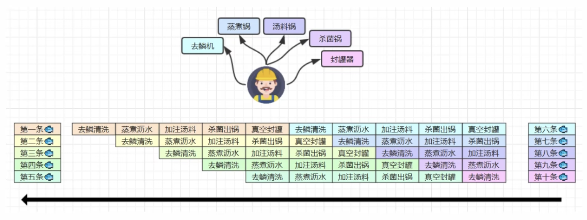

即使只有一个工人，最理想的情况是：他能够在10分钟内同时做好这5件事，因为对第一条鱼的真空装罐，不会影响对第二条鱼的杀菌出锅

### 10.4.2 指令重排序优化

事实上，现代处理器会涉及为一个时钟周期完成一条执行时间最长的CPU指令。为什么这么做呢？可以想到指令还可以再划分成一个个更小的阶段。例如，每条指令都可以分为：*取指令-指令译码-执行指令-内存访问-数据写回* 这5个阶段

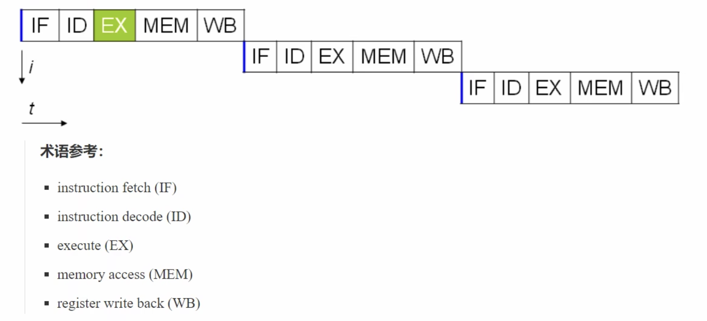

在不改变程序结果的前提下，这些指令的各个阶段可以通过指令重排序和组合来实现指令级并行，这一技术在80‘s中叶到90’s中叶占据了计算架构的重要地位。

指令重排的前提是，指令重排不能影响结果。例如：

```java
// 可以重排的例子
int a = 10;
int b = 20;
System.out.println(a + b);

// 不可以重排的例子
int a = 10;
int b = a - 5;
```

### 10.4.3 支持流水线的处理器

现代CPU支持多级指令流水线，例如支持同时执行 *取指令-指令译码-执行指令-内存访问-数据写回* 的处理器，就可以称之为五级指令流水线。这时CPU可以在一个时钟周期内，同时运行五条指令的不同阶段（相当于一条执行时间最长的复杂指令），IPC=1，本质上，流水线技术并不能缩短单条指令的执行时间，但它变相提高了指令吞吐率

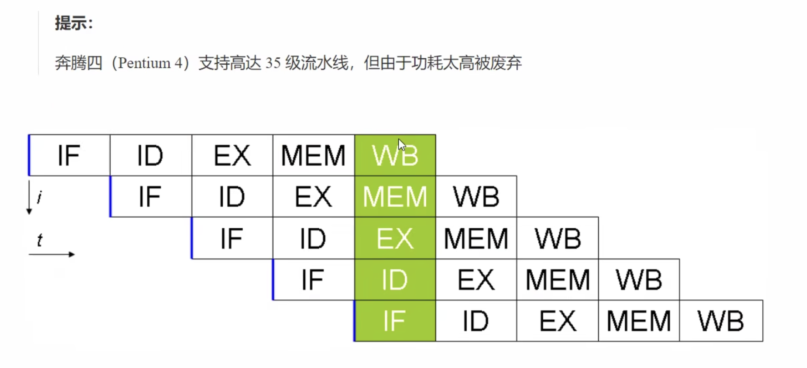

### 10.4.4 诡异的结果

查看如下代码：

```java
int num = 0;
boolean ready = false;

// 线程1执行此方法
public void actor1(I_Result r) {
  if (ready) {
    r.r1 = num + num;
  } else {
    r.r1 = 1;
  }
}

// 线程2执行此方法
public void actor2(I_Result r) {
  num = 2;
  ready = true;
}
```

`I_Result`是一个对象，有一个属性`r1`用来保存结果。问可能的结果有几种？

一种诡异的结果是0；因为对于`actor2()`方法来说，两行代码指令可能会重排为：

```java
public void actor2(I_Result r) {
  ready = true;
  num = 2;
}
```

该结果需要大量测试才能重现。现在我们使用openjdk提供的压力测试工具`jcstress`来测试：

首先创建maven项目如下：

```java
mvn archetype:generate -DinteractiveMode=false -DarchetypeGroupId=org.openjdk.jcstress -DarchetypeArtifactId=jcstress-java
-test-archetype -DarchetypeVersion=0.5 -DgroupId=com.nasuf.concurrentcy.pressuretest -DartifactId=ordering -Dversion=1.0
```

创建测试类：

```java
import org.openjdk.jcstress.annotations.*;
import org.openjdk.jcstress.infra.results.II_Result;

// See jcstress-samples or existing tests for API introduction and testing guidelines

@JCStressTest
// Outline the outcomes here. The default outcome is provided, you need to remove it:
@Outcome(id = "1, 4", expect = Expect.ACCEPTABLE, desc = "ok")
@Outcome(id = "0", expect = Expect.ACCEPTABLE_INTERESTING, desc = "!!!!")
@State
public class ConcurrencyTest {

    int num = 0;
    boolean ready = false;

    @Actor
    public void actor1(II_Result r) {
        if (ready) {
            r.r1 = num + num;
        } else {
            r.r1 = 1;
        }
    }

    @Actor
    public void actor2(II_Result r) {
        num = 2;
        ready = true;
    }
}
```

我们关注的是输出为0的情况。

使用`mvn package`打成jar包，然后执行`java -jar target/jcstress.jar`，部分输出如下：

```java
  [OK] com.nasuf.concurrentcy.pressuretest.ConcurrencyTest
    (JVM args: [])
  Observed state   Occurrences              Expectation  Interpretation
               0         1,568   ACCEPTABLE_INTERESTING  !!!!
               1    17,913,929               ACCEPTABLE  ok
               4    34,664,864               ACCEPTABLE  ok
```

可以看到有`1,568`次的输出出现了`0`，发生了指令重排。要防止这种情况，可以在`ready`上加上`volatile`修饰，这样能保证在`ready = true`之前的代码不会被重排序。

## 10.5 volatile原理

volatile的底层实现原理是内存屏障（Memory Barrier or Memory Fence）

- 对volatile变量的写指令后会加入写屏障
- 对volatile变量的读指令前会加入读屏障

### 10.5.1 如何保证可见性

写屏障（sfence）保证在该屏障之前的，对共享变量的改动，都同步到主存当中

```java
public void actor2(I_Result r) {
  num = 2;
  ready = true; // ready是volatile赋值带写屏障
  // 写屏障，将ready和之前的num一起同步到主存当中
}
```

读屏障（lfence）保证在该屏障之后，对共享变量的读取，加载的是主存中的最新数据

```java
public void actor1(I_Result r) {
  // 读屏障，将ready和之后的num一起同步到主存当中
  // ready是volatile读取值带读屏障
  if (ready) {
    r.r1 = num + num;
  } else {
    r.r1 = 1;
  }
}
```

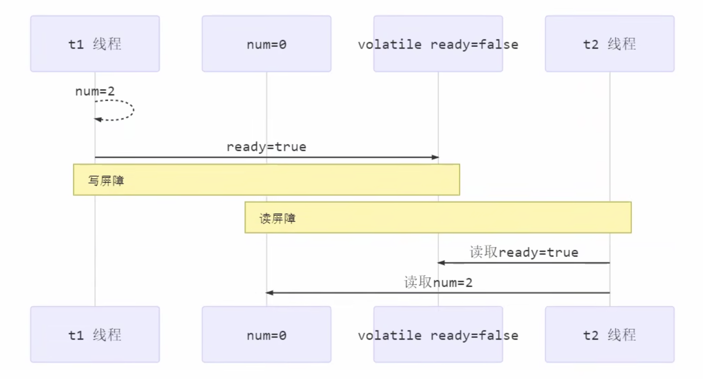

### 10.5.2 如何保证有序性

写屏障会确保指令重排时，不会将写屏障之前的代码排在写屏障之后

```java
public void actor2(I_Result r) {
  num = 2;
  ready = true; // ready是volatile赋值带写屏障
  // 写屏障，保证在此之前的代码指令重排到写屏障之后
}
```

读屏障会确保指令重排时，不会将读屏障之后的代码排在读屏障之前

```java
public void actor1(I_Result r) {
  // 读屏障，保证在此之后的代码指令重排到读屏障之前 
  // ready是volatile读取值带读屏障
  if (ready) {
    r.r1 = num + num;
  } else {
    r.r1 = 1;
  }
}
```

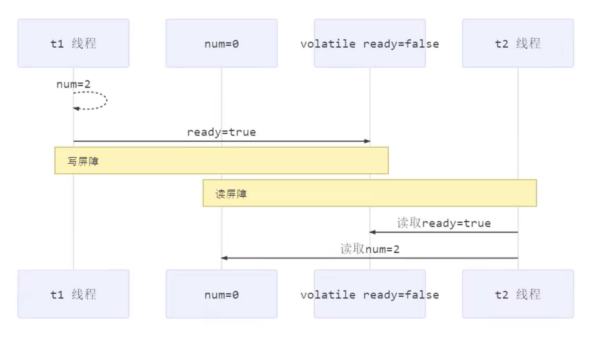

再次强调，volatile无法解决指令交错问题：

- 写屏障仅仅是保证之后的读能督导最新的结果，但不能保证读跑到它前面去
- 而有序性的保证也只是保证了本线程内相关代码不被重排序

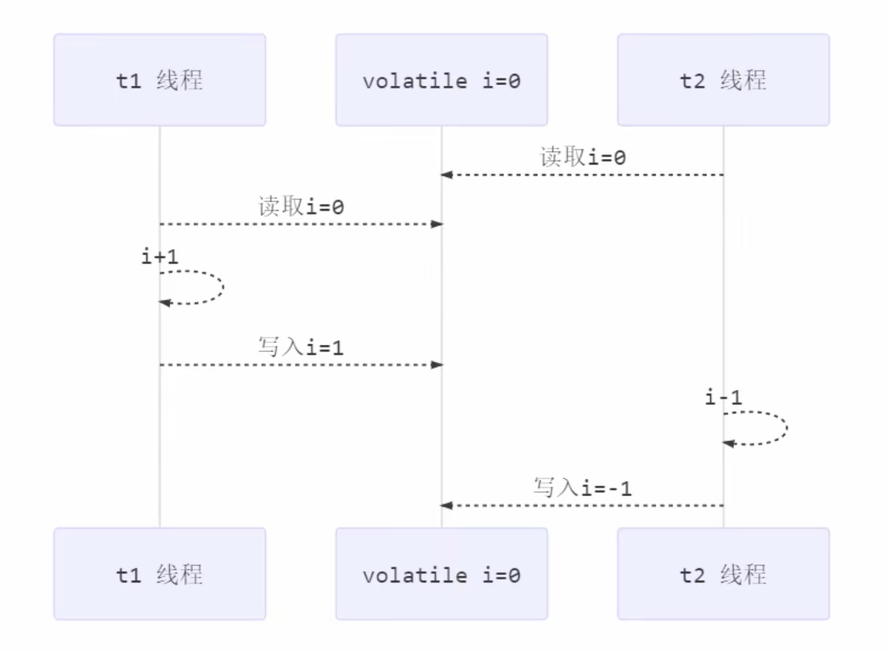

### 10.5.3 double-checked locking 问题

以著名的double-checked locking单例模式为例：

```java
public final class Singleton {
    private Singleton() {
    }

    private static Singleton INSTANCE = null;

    public static Singleton getInstance() {
        synchronized (Singleton.class) {
            if (INSTANCE == null) {
                INSTANCE = new Singleton();
            }
            return INSTANCE;
        }
    }
}
```

以上的实现特点是：

- 懒惰实例化
- 首次使用`getInstance()`才使用`synchronized`加锁，后续使用时无需加锁
- 有隐含的，但很关键的一点：第一个`if`使用了`INSTANCE`变量，是在同步块外

但在多线程环境下，上面的代码是有问题的。`getInstance()`方法对应的字节码为：

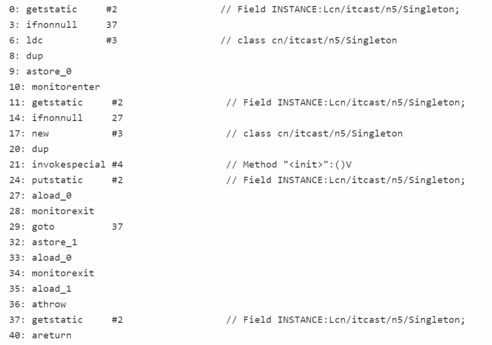

其中：

- 17 表示创建对象，将对象引用入栈 // new Singleton
- 20 表示复制一份对象引用 // 引用地址
- 21 表示利用一个对象引用，调用构造方法
- 24 表示利用一个对象引用，赋值给 static INSTANCE

也许JVM会优化为：先执行24，再执行21。**（synchronized关键字不能防止指令重排）**如果两个线程t1, t2按如下时间序列执行：

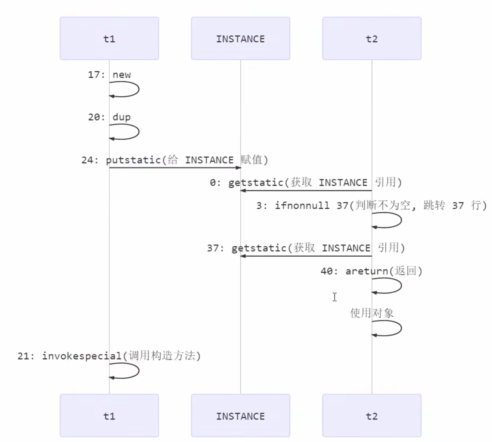

关键在于0: getstatic 这行代码在monitor控制之外，它可以越过monitor读取INSTANCE变量的值。这时t1还未完全将构造方法执行完毕，如果在构造方法中要执行很多初始化操作，那么t2拿到的将是一个未初始化完毕的单例。

对INSTANCE使用volatile修饰即可，可以禁用指令重排。但要注意在JDK5以上的版本的volatile才会真正有效。

### 10.5.4 double-checked locking 解决

使用volatile关键字修饰：

```java
public final class Singleton {
    private Singleton() {
    }

    // volatile 防止指令重排
    private static volatile Singleton INSTANCE = null;

    public static Singleton getInstance() {
        // 实例没创建，才会进入内部的synchronized代码块
        if (INSTANCE == null) {
            synchronized (Singleton.class) {
                // 也许有其他线程已经创建实例，所以再判断一次
                if (INSTANCE == null) {
                    INSTANCE = new Singleton();
                }
            }
        }
        return INSTANCE;
    }
}
```

从字节码层面看不出volatile指令的效果，我们需要从读写屏障层面分析：

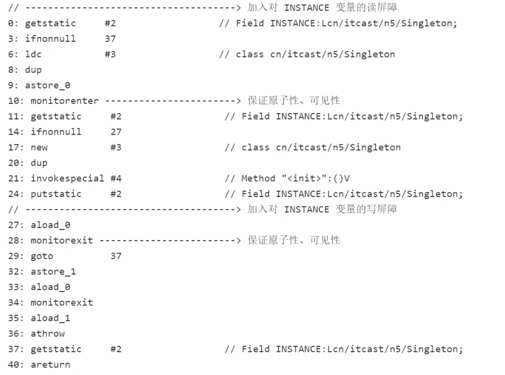

如上面的注释内容所示，读写volatile变量时会加入内存屏障，保证下面两点：

- 可见性
  - 写屏障 - 保证在该屏障之前的对t1对共享变量的改动，都同步到主存当中
  - 读屏障 - 保证在该屏障之后的对t2对共享变量的读取，加载的是主存中的最新数据
- 有序性
  - 写屏障会确保指令重排时，不会将写屏障之前的代码排在写屏障之后
  - 读屏障会确保指令重排时，不会将读屏障之后的代码排在读屏障之前
- 更底层是读写变量时，使用lock指令来多保证多核CPU之间的可见性和有序性

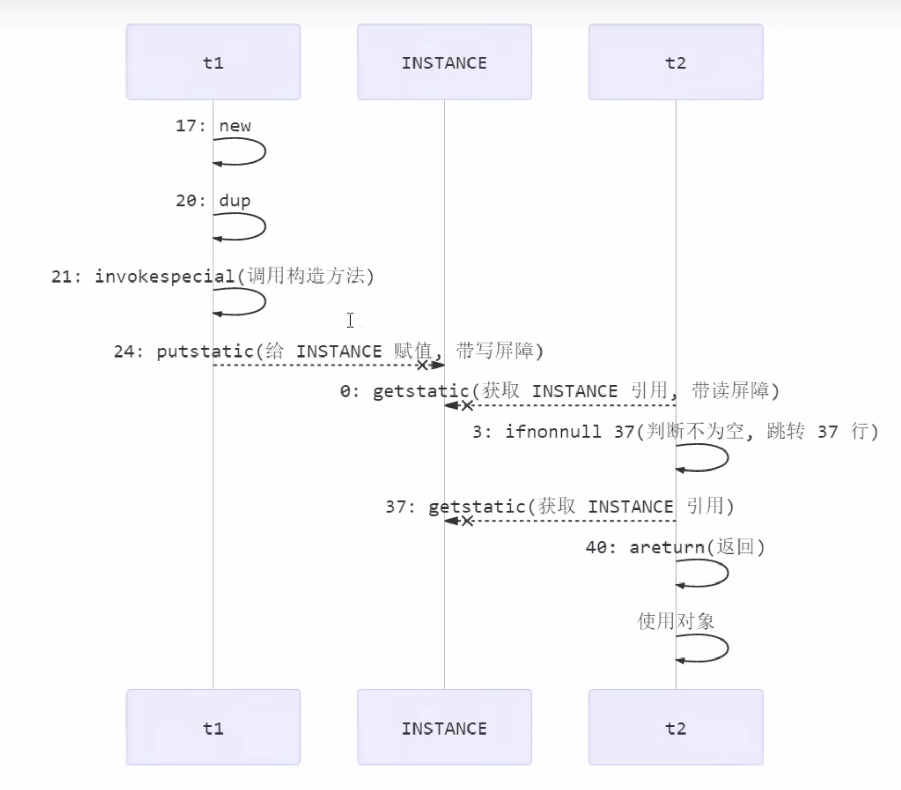


## 10.6 happens-before 规则

happens-before 规定了对共享变量的写操作对其他线程的读操作可见，它是可见性与有序性的一套规则总结。抛开以下happens-before规则，JVM并不能保证一个线程对共享变量的写，对于其他线程对该共享变量的读可见

- 线程解锁m之前对变量的写，对于接下来对m加锁的其他线程对该变量的读可见
  ```java
  static int x;
  static Object m = new Object();
  
  new Thread(() -> {
    synchronized (m) {
      x = 10;
    }
  }, "t1").start();
  
  new Thread(() -> {
    synchronized (m) {
      System.out.println(x);
    }
  }, "t2").start();
  ```

- 线程对volatile变量的写，对接下来其他线程对该变量的读可见
  ```java
  volatile static int x;
  
  new Thread(() -> {
    x = 10;
  }, "t1").start();
  
  new Thread(() -> {
    System.out.println(x);
  }, "t2").start();
  ```

- 线程start前对变量的写，对该线程开始后对该变量的读可见
  ```java
  static int x;
  x = 10;
  
  new Thread(() -> {
    System.out.println(x);
  }, "t2").start();
  ```

- 线程结束前对变量的写，对其他线程得知它结束后的读可见（比如其他线程调用`t1.isAlive()`或`t1.join()`等方法等待它结束
  ```java
  static int x;
  
  Thread t1 = new Thread(() -> {
    x = 10;
  }, "t1");
  t1.start();
  
  t1.join();
  System.out.println(x);
  ```

- 线程t1打断t2前对变量的写，对于其他线程得知t2被打断后对变量的读可见（通过`t2.interrupted()`或`t2.isInterrupted()`）
  ```java
  static int x;
  
  public static void main(String[] args) {
    Thread t2 = new Thred(() -> {
      while (true) {
        if (Thread.currentThread().isInterrupted()) {
          System.out.println(x);
          break;
        }
      }
    }, "t2");
    t2.start();
    
    new Thread(() -> {
      sleep(1);
      x = 10;
      t2.interrupt();
    }, "t1").start();
    
    while (!t2.isInterrupted()) {
      Thread.yield();
    }
    
    System.out.println(x);
  }
  ```

- 对变量默认值（0，false，null）的写，对其他线程对该变量的读可见

- 具有传递性，如果x hb -> y 并且 y hb -> z 那么有x hb -> z，配合volatile的防指令重排，有下面的例子：
  ```java
  volatile static int x;
  static int y;
  
  new Thread(() -> {
    y = 10;
    x = 20;
  }, "t1").start();
  
  new Thread(() -> {
    // x = 20 对t2可见，同时 y = 10 也对t2可见
    System.out.println(x);
  }, "t2").start();
  ```


## 10.7 线程安全单例模式

单例模式有很多实现方法，饿汉、懒汉、静态内部类、枚举类，试分析每种实现下获取单例对象（即调用`getInstance`）时的线程安全性，并思考注释中的问题

- 饿汉式：类加载就会导致该单例对象被创建
- 懒汉式：类加载不会导致该单例对象被创建，而是首次使用该对象时候被创建

> 实现一

```java
// 问题1：为什么加final -> 防止子类创建，子类中的方法覆盖会破坏单例
// 问题2：如果实现了序列化接口，还要做什么来防止反序列化破坏单例 -> 创建如下readResolve方法，直接返回单例对象
public final class Singleton implements Serializable {
  // 问题3：为什么设置私有？是否能防止反射创建新的实例 -> 私有是防止随意创建对象。但是不能防止反射创建实例
  private Singleton() {}
  // 问题4：这样初始化是否能保证单例对象创建时的线程安全 -> 能保证。因为静态变量的初始化是在类加载阶段完成的，jvm会保证线程安全性
  private static final Singleton INSTANCE = new Singleton();
  // 问题5：为什么提供静态方法而不是直接将INSTANCE设置为public -> 1) 封装性。该方法可提供懒惰初始化 2) 可以有泛型的支持
  public static Singleton getInstance() {
    return INSTANCE;
  }
  
  public Object readResolve() {
    return INSTANCE;
  }
}
```

> 实现二

```java
// 问题1：枚举单例是如何限制实例个数的 -> INSTANCE 本质上是Singleton class的一个静态变量。相关字节码见下面一段
// 问题2：枚举单例在创建时是否存在并发问题 -> 不会。因为是静态变量，所以类加载时期的初始化操作由jvm来保证线程安全性
// 问题3：枚举单例是否能被反射破坏单例 -> 不能
// 问题4：枚举单例是否能被反序列化破坏单例 -> 能。所有的枚举类都继承自Enum类，该类默认已经实现了Serializable接口。但是Enum类在实现时已经考虑了反序列化的问题，保证了反序列化时不会破坏单例
// 问题5：枚举单例属于饿汉式还是懒汉式 -> 饿汉式
// 问题6：枚举单例如果希望加入一些单例创建时的初始化逻辑，该如何做 -> 可以给枚举类加构造方法和成员方法
enum Singleton {
  INSTANCE;
}
```

该枚举类字节码如下：

```java
// class version 52.0 (52)
// access flags 0x4031
// signature Ljava/lang/Enum<Lcom/nasuf/concurrency/Singleton;>;
// declaration: com/nasuf/concurrency/Singleton extends java.lang.Enum<com.nasuf.concurrency.Singleton>
public final enum com/nasuf/concurrency/Singleton extends java/lang/Enum {

  // compiled from: Singleton.java

  // access flags 0x4019
  public final static enum Lcom/nasuf/concurrency/Singleton; INSTANCE

  // access flags 0x101A
  private final static synthetic [Lcom/nasuf/concurrency/Singleton; $VALUES

  // access flags 0x9
  public static values()[Lcom/nasuf/concurrency/Singleton;
   L0
    LINENUMBER 3 L0
    GETSTATIC com/nasuf/concurrency/Singleton.$VALUES : [Lcom/nasuf/concurrency/Singleton;
    INVOKEVIRTUAL [Lcom/nasuf/concurrency/Singleton;.clone ()Ljava/lang/Object;
    CHECKCAST [Lcom/nasuf/concurrency/Singleton;
    ARETURN
    MAXSTACK = 1
    MAXLOCALS = 0

  // access flags 0x9
  public static valueOf(Ljava/lang/String;)Lcom/nasuf/concurrency/Singleton;
   L0
    LINENUMBER 3 L0
    LDC Lcom/nasuf/concurrency/Singleton;.class
    ALOAD 0
    INVOKESTATIC java/lang/Enum.valueOf (Ljava/lang/Class;Ljava/lang/String;)Ljava/lang/Enum;
    CHECKCAST com/nasuf/concurrency/Singleton
    ARETURN
   L1
    LOCALVARIABLE name Ljava/lang/String; L0 L1 0
    MAXSTACK = 2
    MAXLOCALS = 1

  // access flags 0x2
  // signature ()V
  // declaration: void <init>()
  private <init>(Ljava/lang/String;I)V
   L0
    LINENUMBER 3 L0
    ALOAD 0
    ALOAD 1
    ILOAD 2
    INVOKESPECIAL java/lang/Enum.<init> (Ljava/lang/String;I)V
    RETURN
   L1
    LOCALVARIABLE this Lcom/nasuf/concurrency/Singleton; L0 L1 0
    MAXSTACK = 3
    MAXLOCALS = 3

  // access flags 0x8
  static <clinit>()V
   L0
    LINENUMBER 4 L0
    NEW com/nasuf/concurrency/Singleton
    DUP
    LDC "INSTANCE"
    ICONST_0
    INVOKESPECIAL com/nasuf/concurrency/Singleton.<init> (Ljava/lang/String;I)V
    PUTSTATIC com/nasuf/concurrency/Singleton.INSTANCE : Lcom/nasuf/concurrency/Singleton;
   L1
    LINENUMBER 3 L1
    ICONST_1
    ANEWARRAY com/nasuf/concurrency/Singleton
    DUP
    ICONST_0
    GETSTATIC com/nasuf/concurrency/Singleton.INSTANCE : Lcom/nasuf/concurrency/Singleton;
    AASTORE
    PUTSTATIC com/nasuf/concurrency/Singleton.$VALUES : [Lcom/nasuf/concurrency/Singleton;
    RETURN
    MAXSTACK = 4
    MAXLOCALS = 0
}

```

枚举类默认继承的Enum class如下，默认已经实现了Serializable接口。

```java
public abstract class Enum<E extends Enum<E>>
        implements Comparable<E>, Serializable {...}
```

> 实现三

```java
public final class Singleton {
  private Singleton() {}
  private static Singleton INSTANCE = null;
  
  // static synchronized 保证了线程安全
  public static synchronized Singleton getInstance() {
    if (INSTANCE != null) {
      return INSTANCE;
    }
    INSTANCE = new Singleton();
    return INSTANCE;
  }
}
```

> 实现四

```java
public final class Singleton {
  private Singleton() {}
  
  // 问题1：解释为什么要加volatile -> 保证指令不会重排序。详细解释见章节10.5.3
  private static volatile Sigleton INSTANCE = null;
  
  // 问题2：对比实现3，说出这样做的意义 -> 缩小了同步范围
  public static Singleton getInstance() {
    if (INSTANCE != null) {
      return INSTANCE;
    }
    synchronized(Singleton.class) {
      // 问题3：为什么还要在这里加空判断 -> 防止并发问题
      if (INSTANCE != null) {
        return INSTANCE;
      }
      INSTANCE = new Singleton();
      return INSTANCE;
    }
  }
}
```

> 实现五

```java
public final class Singleton {
  private Singleton() {}
  // 问题1：属于懒汉式还是饿汉式 -> 懒汉式。类加载本身是懒惰的，只有在首次使用时才会加载。因此内部的静态变量也不会进行初始化操作
  private static class LazyHolder {
    static final Singleton INSTANCE = new Singleton();
  }
  
  // 问题2：在创建时是否有并发问题 -> 类加载时，静态变量的赋值操作由JVM来保证
  public static Sigleton getInstance() {
    return LazyHolder.INSTANCE;
  }
}
```

