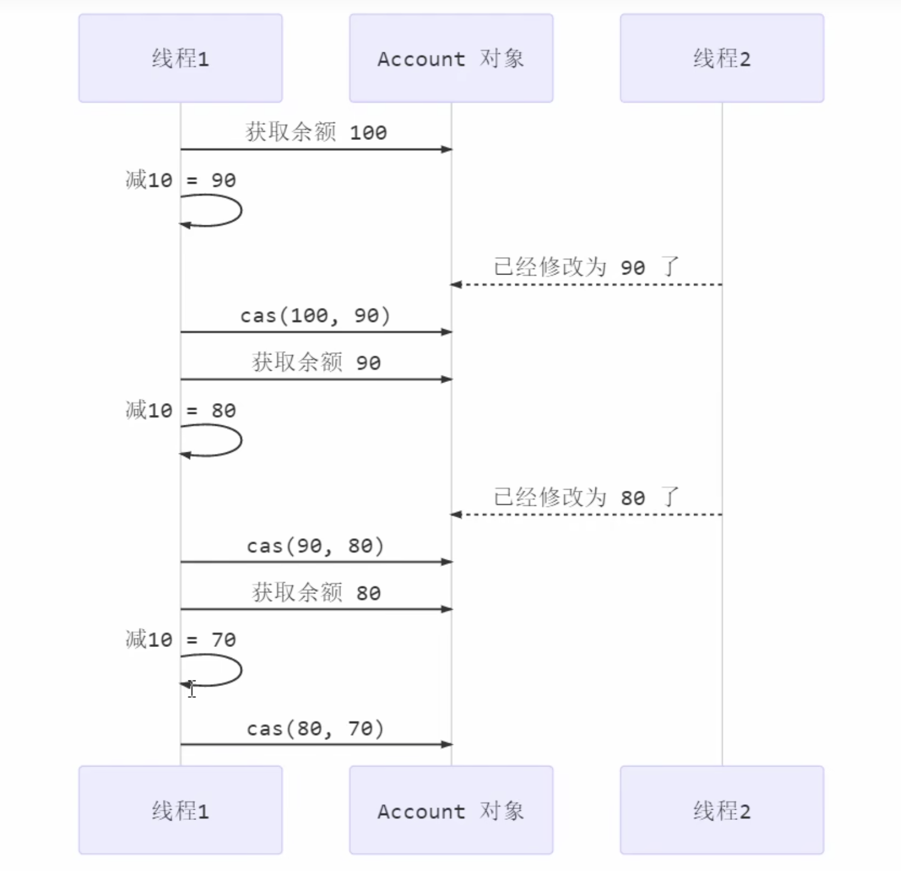
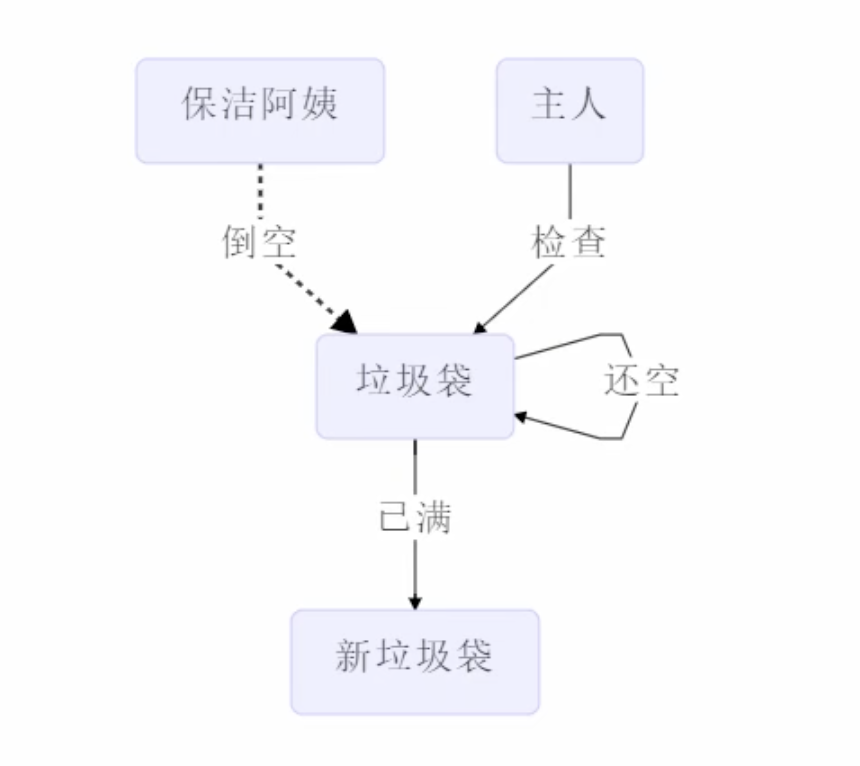
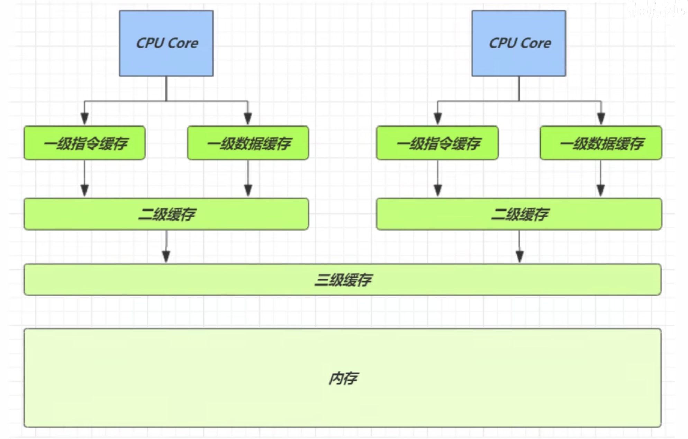
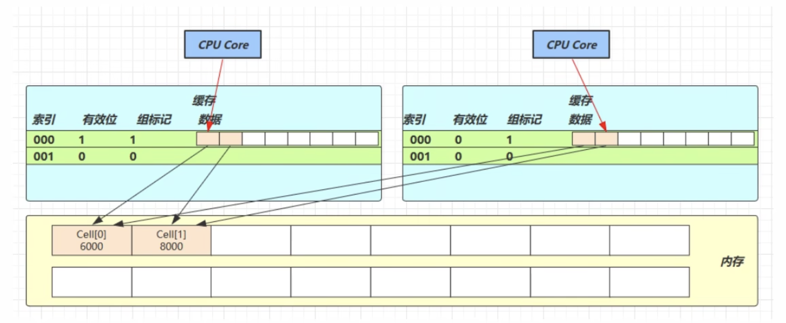
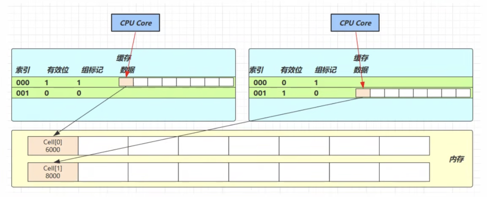
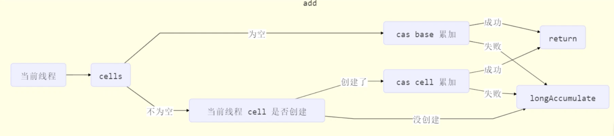
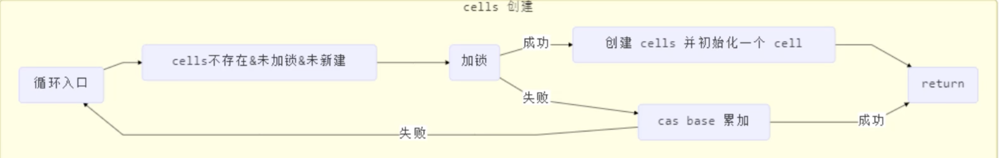
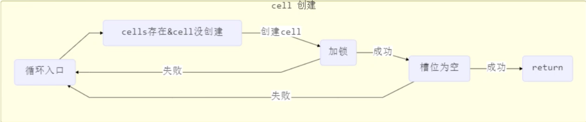
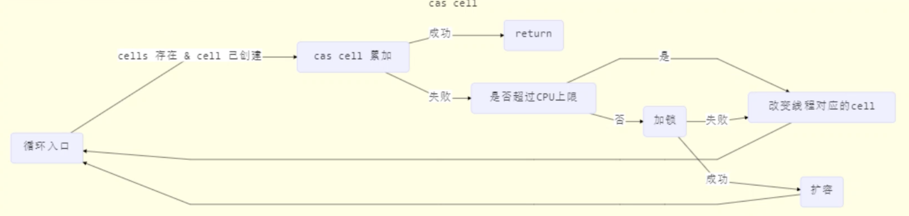

# 11 无锁并发

## 11.1 问题提出

假设有如下需求，保证`account.withdraw()`取款方法的线程安全。很容易想到的方式是使用`synchronized`对`account`实例进行加锁：

```java
public class TestAccount {
    public static void main(String[] args) {
        Account account = new AccountUnsafe(10000);
        Account.demo(account);
    }
}

class AccountUnsafe implements Account {

    private Integer balance;

    public AccountUnsafe(Integer balance) {
        this.balance = balance;
    }

    @Override
    public Integer getBalance() {
         // 临界区代码
        synchronized (this) {
            return this.balance;
        }
    }

    @Override
    public void withdraw(Integer amount) {
        // 临界区代码
        synchronized (this) {
            this.balance -= amount;
        }
    }
}

interface Account {
    Integer getBalance();

    void withdraw(Integer amount);

    static void demo(Account account) {
        List<Thread> ts = new ArrayList<>();
        for (int i = 0; i < 1000; i++) {
            ts.add(new Thread(() -> account.withdraw(10)));
        }
        long start = System.nanoTime();
        ts.forEach(Thread::start);
        ts.forEach(t -> {
            try {
                t.join();
            } catch (InterruptedException e) {
                throw new RuntimeException(e);
            }
        });
        long end = System.nanoTime();
        System.out.println(account.getBalance() + " cost: " + (end - start) / 1000_000 + " ms");
    }
}
```

输出：

```java
0 cost: 77 ms
```

接下来我们尝试使用一种无锁的方式来完成这个实现：

```java
public class TestAccount {
    public static void main(String[] args) {
        Account account = new AccountCas(10000);
        Account.demo(account);
    }
}

class AccountCas implements Account {
    private AtomicInteger balance;

    public AccountCas(int balance) {
        this.balance = new AtomicInteger(balance);
    }

    @Override
    public Integer getBalance() {
        return balance.get();
    }

    @Override
    public void withdraw(Integer amount) {
        while (true) {
            // 获取余额的最新值
            int prev = balance.get();
            // 要修改的余额
            int next = prev - amount;
            // 执行修改操作
            if (balance.compareAndSet(prev, next)) {
                break;
            }
        }
    }
}
```

输出：

```java
0 cost: 63 ms
```

## 11.2 CAS 与 volatile

### 11.2.1 CAS 实现

前面看到`AtomicInteger`的解决方法，内部并没有使用锁来保护共享变量的线程安全。那么它是如何实现的？

```java
public void withdraw(Integer amount) {
  while (true) {
    // 获取余额的最新值
    int prev = balance.get();
    // 要修改的余额
    int next = prev - amount;
    // 执行修改操作
    if (balance.compareAndSet(prev, next)) {
      break;
    }
  }
}
```

其中的关键是`compareAndSet`，它的简称是`CAS`（也有`Compare And Swap`的说法），它必须是原子操作



其实CAS底层是`lock cmpxchg`指令（x86架构），在单核CPU和多核CPU下都能够保证比较-交换的操作原子性

- 在多核状态下，某个核执行到带`lock`的指令时，CPU会让总线锁住，当这个核把此指令执行完毕，再开启总线。这个过程中不会被线程的调度机制所打断，保证了多个线程对内存操作的准确性，是原子的。

### 6.2.2 volatile

获取共享变量时，为了保证该变量的可见性，需要使用volatile修饰。

它可以用来修饰成员变量和静态成员变量，它可以避免线程从自己的工作缓存中查找变量的值，必须到主存中获取它的值，线程操作volatile变量都是直接操作主存。即一个线程对volatile变量的修改，对另一个线程可见。

但是注意，volatile仅仅保证了共享变量的可见性，让其他线程能够看到最新值，但是不能解决指令交错问题（不能保证原子性）。

CAS必须借助volatile才能读取到共享变量的最新值来实现比较-交换的效果。

```java
public class AtomicInteger extends Number implements java.io.Serializable {
    //...
    private volatile int value;
  	//...
}
```

### 11.2.3 为什么无锁效率高

- 无锁情况下，即使重试失败，线程始终在高速运行，没有停歇。而synchronized会让线程在没有获得锁的时候，发生上下文切换，进入阻塞
- 线程就好像高速跑到上的塞车，高速运行时，速度很快，一旦发生上下文切换，就好比赛车要减速、熄火，等待下次被唤醒又要重新打火、启动、加速，恢复到高速运行状态，代价比较大
- 无锁情况下，因为线程要保持运行，需要额外CPU的支持，CPU在这里就好比高速跑道，没有额外的跑道，线程想高速运行也无从谈起。虽然不会进入阻塞，但由于没有分到时间片，仍然会进入可运行状态，还是会导致线程上下文切换。所以CAS情况下，最好使用多核模式，而且线程数量最好少于CPU核心数

### 11.2.4 CAS 特点

结合CAS和volatile可以实现无锁并发，适用于线程数少、多核CPU的场景下

- CAS 是基于乐观锁的思想：最乐观的估计，不怕别的线程来修改共享变量，就算改了也没关系，我可以不断重试
- synchronized是基于悲观锁的思想：最悲观的估计，防止其他线程来修改共享变量，运行开始就直接加锁
- CAS体现的是无锁并发、无阻塞并发
  - 因为没有使用synchronized，所以线程不会陷入阻塞，这是效率提升的因素之一
  - 但如果竞争激烈，可以向到重试必然频繁发生，反而效率会受到影响

## 11.3 原子整数

JUC并发包提供了：

- AtomicBoolean
- AtomicInteger
- AtomicLong

以AtomicInteger为例：

```java
public class AtomicTest {
    public static void main(String[] args) {
        AtomicInteger i = new AtomicInteger(0);

        System.out.println(i.incrementAndGet()); // 1
        System.out.println(i.getAndIncrement()); // 1
        System.out.println(i.get()); // 2

        System.out.println(i.getAndAdd(5)); // 2
        System.out.println(i.get()); // 7
        System.out.println(i.addAndGet(5)); // 12

        System.out.println(i.updateAndGet(val -> val * 2)); // 24
        System.out.println(i.getAndUpdate(val -> val * 2)); // 24
        System.out.println(i.get()); // 48
    }
}
```

因此我们可以将11.1章节中的`withdraw`方法改进一下，由：

```java
public void withdraw(Integer amount) {
  while (true) {
    int prev = balance.get();
    int next = prev - amount;
    if (balance.compareAndSet(prev, next)) {
      break;
    }
  }
}
```

改为：

```java
public void withdraw(Integer amount) {
  balance.getAndAdd(-1 * amount);
}
```

## 11.4 原子引用

原子引用类型包括：

- AtomicReference
- AtomicMarkableReference
- AtomicStampedReference

先以AtomicReference为例：

```java
public class TestAccount {
    public static void main(String[] args) {
        DecimalAccount decimalAccount = new DecimalAccountCas(new BigDecimal("10000"));
        DecimalAccount.demo(decimalAccount);
    }
}


class DecimalAccountCas implements DecimalAccount {

    private AtomicReference<BigDecimal> balance;

    public DecimalAccountCas(BigDecimal balance) {
        this.balance = new AtomicReference<>(balance);
    }

    @Override
    public BigDecimal getBalance() {
        return balance.get();
    }

    @Override
    public void withdraw(BigDecimal amount) {
        while (true) {
            BigDecimal prev = balance.get();
            BigDecimal next = prev.subtract(amount);
            if (balance.compareAndSet(prev, next)) {
                break;
            }
        }
    }
}


interface DecimalAccount {
    BigDecimal getBalance();

    void withdraw(BigDecimal amount);

    static void demo(DecimalAccount decimalAccount) {
        List<Thread> ts = new ArrayList<>();
        for (int i = 0; i < 1000; i++) {
            ts.add(new Thread(() -> decimalAccount.withdraw(new BigDecimal(10))));
        }
        long start = System.nanoTime();
        ts.forEach(Thread::start);
        ts.forEach(t -> {
            try {
                t.join();
            } catch (InterruptedException e) {
                throw new RuntimeException(e);
            }
        });
        long end = System.nanoTime();
        System.out.println(decimalAccount.getBalance() + " cost: " + (end - start) / 1000_000 + " ms");
    }
}

```

### 11.4.1 ABA 问题

AtomicReference 无法保证共享变量没有被其他线程修改过。例如：

```java
@Slf4j(topic = "c.ABATest")
public class ABATest {
    static AtomicReference<String> ref = new AtomicReference<>("A");

    public static void main(String[] args) {
        log.debug("main thread starts.");

        String prev = ref.get();
        otherThreadsAction();
        sleep(1);
        log.debug("change A -> C. {}", ref.compareAndSet(prev, "C"));
    }

    private static void otherThreadsAction() {
        new Thread(() -> log.debug("change A -> B. {}",
                ref.compareAndSet(ref.get(), "B")),
                "t1").start();
        new Thread(() -> log.debug("change B -> A. {}",
                ref.compareAndSet(ref.get(), "A")),
                "t2").start();
    }
}
```

输出：

```java
17:00:30.654 [main] c.ABATest - main thread starts.
17:00:30.732 [t1] c.ABATest - change A -> B. true
17:00:30.732 [t2] c.ABATest - change B -> A. true
17:00:31.743 [main] c.ABATest - change A -> C. true
```

主线程仅能判断出共享变量的值与最初值A是否相同，不能感知到这种从A改为B又改回为A的情况。如果主线程希望：只要有其他线程更新过共享变量，那么自己的CAS操作就算失败，这时需要加一个版本号，使用`AtomicStampedReference`：

```java
@Slf4j(topic = "c.ABATest")
public class ABATest {
    static AtomicStampedReference<String> ref = new AtomicStampedReference<>("A", 0);

    public static void main(String[] args) {
        log.debug("main thread starts.");

        String prev = ref.getReference();
        int stamp = ref.getStamp(); // 获取当前版本号
        log.debug("stamp: {}", stamp);
        otherThreadsAction();
        sleep(1);
        log.debug("change A -> C. {}", ref.compareAndSet(prev, "C", stamp, stamp + 1));
    }

    private static void otherThreadsAction() {
        new Thread(() -> {
            int stamp = ref.getStamp();
            log.debug("stamp: {}", stamp);
            log.debug("change A -> B. {}",
                    ref.compareAndSet(ref.getReference(), "B", stamp, stamp + 1));
        }, "t1").start();
        new Thread(() -> {
            int stamp = ref.getStamp();
            log.debug("stamp: {}", stamp);
            log.debug("change B -> A. {}",
                    ref.compareAndSet(ref.getReference(), "A", stamp, stamp + 1));
        }, "t2").start();
    }
}

```

输出：

```java
17:11:12.490 [main] c.ABATest - main thread starts.
17:11:12.496 [main] c.ABATest - stamp: 0
17:11:12.577 [t1] c.ABATest - stamp: 0
17:11:12.578 [t2] c.ABATest - stamp: 0
17:11:12.578 [t1] c.ABATest - change A -> B. true
17:11:12.578 [t2] c.ABATest - change B -> A. false
17:11:13.583 [main] c.ABATest - change A -> C. false
```

`AtomicStampedReference`可以给原子引用加上版本号，追踪原子引用整个变化过程，如：A -> B -> A -> C，通过`AtomicStampedReference`，我们可以知道，引用变量中途被变更过几次。

但是有时候我们并不关心引用更改了几次，只是单纯关心引用是否更改过，那么就可以使用`AtomicMarkableReference`。参考下面案例：



```java
@Slf4j(topic = "c.Test12")
public class Test12 {
    public static void main(String[] args) {
        GarbageBag bag = new GarbageBag("Full");
        AtomicMarkableReference<GarbageBag> ref = new AtomicMarkableReference<>(bag, true);

        log.debug("start...");
        GarbageBag prev = ref.getReference();
        log.debug(prev.toString());

        new Thread(() -> {
            log.debug("start...");
            bag.setDesc("Empty");
            ref.compareAndSet(bag, bag, true, false);
            log.debug(bag.toString());
        }, "t1").start();

        sleep(1);
        log.debug("Try a new bag?");
        boolean success = ref.compareAndSet(prev, new GarbageBag("Empty"), true, false);
        log.debug("New bag now? {}", success);
        log.debug(ref.getReference().toString());
    }
}

class GarbageBag {
    String desc;

    public GarbageBag(String desc) {
        this.desc = desc;
    }

    public void setDesc(String desc) {
        this.desc = desc;
    }

    @Override
    public String toString() {
        return super.toString() + " " + desc;
    }
}
```

输出：

```java
21:04:48.629 [main] c.Test12 - start...
21:04:48.636 [main] c.Test12 - com.nasuf.concurrency.GarbageBag@5479e3f Full
21:04:48.704 [t1] c.Test12 - start...
21:04:48.706 [t1] c.Test12 - com.nasuf.concurrency.GarbageBag@5479e3f Empty
21:04:49.712 [main] c.Test12 - Try a new bag?
21:04:49.713 [main] c.Test12 - New bag now? false
21:04:49.723 [main] c.Test12 - com.nasuf.concurrency.GarbageBag@5479e3f Empty
```

## 11.5 原子数组

JUC提供了如下类：

- AtomicIntegerArray
- AtomicLongArray
- AtomicReferenceArray

我们使用如下代码来测试线程安全性：开启一个长度为10的数组，同时使用10个线程对数组每个index的元素执行累加操作10000次

```java
@Slf4j(topic = "c.Test13")
public class Test13 {
    public static void main(String[] args) {
        demo(
                () -> new int[10],
                (array) -> array.length,
                (array, index) -> array[index]++,
                (array) -> System.out.println(Arrays.toString(array))
        );
    }

    /**
     * @param arraySupplier  提供数组，可以是线程不安全或安全的数组
     * @param lengthFunction 获取数组长度的方法
     * @param putConsumer    自增方法，回传array, index
     * @param printConsumer  打印数组的方法
     */
    private static <T> void demo(Supplier<T> arraySupplier,
                                 Function<T, Integer> lengthFunction,
                                 BiConsumer<T, Integer> putConsumer,
                                 Consumer<T> printConsumer) {
        List<Thread> ts = new ArrayList<>();
        T array = arraySupplier.get();
        Integer length = lengthFunction.apply(array);
        for (int i = 0; i < length; i++) {
            ts.add(new Thread(() -> {
                for (int j = 0; j < 10000; j++) {
                    putConsumer.accept(array, j % length);
                }
            }));
        }
        ts.forEach(Thread::start);
        ts.forEach(t -> {
            try {
                t.join();
            } catch (InterruptedException e) {
                throw new RuntimeException(e);
            }
        });
        printConsumer.accept(array);
    }
}
```

输出：

```java
[8322, 8155, 8023, 7824, 8222, 8168, 8350, 8376, 8418, 8413]
```

可见使用线程不安全的数组类型导致输出不是期望的值。接下来我们使用线程安全的数组进行同样的测试：

```java
demo(
  () -> new AtomicIntegerArray(10),
  (array) -> array.length(),
  (array, index) -> array.getAndIncrement(index),
  (array) -> System.out.println(array)
);
```

输出：

```java
[10000, 10000, 10000, 10000, 10000, 10000, 10000, 10000, 10000, 10000]
```

## 11.6 字段更新器

- AtomicReferenceFieldUpdater // 域，字段
- AtomicIntegerFieldUpdater
- AtomicLongFieldUpdater

利用字段更新器，可以针对对象的某个域（Field）进行原子操作，只能配合volatile修饰的字段使用，否则会出现异常：

```java
Exception in thread "main" java.lang.IllegalArgumentException: Must be volatile type
```

基本用法：

```java
@Slf4j(topic = "c.Test14")
public class Test14 {
    public static void main(String[] args) {
        Student student = new Student();
        AtomicReferenceFieldUpdater updater =
                AtomicReferenceFieldUpdater.newUpdater(Student.class, String.class, "name");
        if (updater.compareAndSet(student, null, "Alice")) {
            System.out.println(student);
        }
    }
}

class Student {
    volatile String name;

    @Override
    public String toString() {
        return "Student{" +
                "name='" + name + '\'' +
                '}';
    }
}
```

输出：

```java
Student{name='Alice'}
```

## 11.7 原子累加器

原子类型例如`AtomicInteger`本身提供了线程安全的累加操作，但是性能上不如`LongAdder`等累加器。测试代码如下：

```java
@Slf4j(topic = "c.Test15")
public class Test15 {
    public static void main(String[] args) {
        log.debug("AtomicLong statistics ->");
        for (int i = 0; i < 5; i++) {
            demo(
                    () -> new AtomicLong(0),
                    (adder) -> adder.getAndIncrement()
            );
        }

        log.debug("LongAdder statistics ->");
        for (int i = 0; i < 5; i++) {
            demo(
                    () -> new LongAdder(),
                    (adder) -> adder.increment()
            );
        }
    }

    private static <T> void demo(Supplier<T> adderSupplier,
                                 Consumer<T> action) {
        List<Thread> ts = new ArrayList<>();
        T adder = adderSupplier.get();
        for (int i = 0; i < 4; i++) {
            ts.add(new Thread(() -> {
                for (int j = 0; j < 500_000; j++) {
                    action.accept(adder);
                }
            }));
        }
        long start = System.nanoTime();
        ts.forEach(Thread::start);
        ts.forEach(t -> {
            try {
                t.join();
            } catch (InterruptedException e) {
                throw new RuntimeException(e);
            }
        });
        long end = System.nanoTime();
        log.debug("adder: {}, cost: {}ns", adder, (end - start) / 1000_000);
    }
}
```

输出如下：

```java
21:46:14.320 [main] c.Test15 - AtomicLong statistics ->
21:46:14.452 [main] c.Test15 - adder: 2000000, cost: 52ns
21:46:14.497 [main] c.Test15 - adder: 2000000, cost: 40ns
21:46:14.534 [main] c.Test15 - adder: 2000000, cost: 36ns
21:46:14.570 [main] c.Test15 - adder: 2000000, cost: 35ns
21:46:14.604 [main] c.Test15 - adder: 2000000, cost: 34ns
21:46:14.604 [main] c.Test15 - LongAdder statistics ->
21:46:14.713 [main] c.Test15 - adder: 2000000, cost: 108ns
21:46:14.941 [main] c.Test15 - adder: 2000000, cost: 227ns
21:46:14.944 [main] c.Test15 - adder: 2000000, cost: 2ns
21:46:14.947 [main] c.Test15 - adder: 2000000, cost: 2ns
21:46:14.950 [main] c.Test15 - adder: 2000000, cost: 2ns
```

在多次循环计算后，jvm会对代码进行优化，能够看出明显的性能区别。其实性能提升的原因很简单，就是在有竞争时，设置多个累加单元，Thread-0累加Cell[0]，而Thread-1累加Cell[1]，最后将结果汇总。这样它们在累加时操作不同的Cell变量，因此减少了CAS重试次数，提升了性能

### 11.7.1 LongAdder源码解析

`LongAdder`类有几个关键域：

```java
    // 累加单元数组，懒惰初始化
    transient volatile Cell[] cells;

    // 基础值，如果没有竞争，则用cas累加这个域
    transient volatile long base;

    // 在cells创建或扩容时，置为1，表示加锁
    transient volatile int cellsBusy;
```

我们之前提过，CAS操作是无锁安全并发的方式，但是这里却有一个锁的概念`cellsBusy`。其实是使用CAS操作实现了锁操作。我们尝试使用类似的方式来测试：

```java
@Slf4j(topic = "c.LockCas")
public class LockCas {
    private AtomicInteger state = new AtomicInteger(0);

    public void lock() {
        while (true) {
            if (state.compareAndSet(0, 1)) {
                break;
            }
        }
    }

    public void unlock() {
        log.debug("unlock.");
        state.set(0);
    }

    public static void main(String[] args) {
        LockCas lock = new LockCas();
        new Thread(() -> {
            log.debug("begin.");
            lock.lock();
            try {
                log.debug("lock");
                sleep(1);
            } finally {
                lock.unlock();
            }
        }, "t1").start();

        new Thread(() -> {
            log.debug("begin.");
            lock.lock();
            try {
                log.debug("lock");
            } finally {
                lock.unlock();
            }
        }, "t2").start();
    }
}
```

输出：

```java
22:03:51.377 [t1] c.LockCas - begin.
22:03:51.377 [t2] c.LockCas - begin.
22:03:51.379 [t1] c.LockCas - lock
22:03:52.385 [t1] c.LockCas - unlock.
22:03:52.386 [t2] c.LockCas - lock
22:03:52.386 [t2] c.LockCas - unlock.
```

我们再来看`Cell`，即累加单元：

```java
@sun.misc.Contended // 该注解是为了防止缓存行的共享
static final class Cell {
  volatile long value;
  Cell(long x) { value = x; }
  final boolean cas(long cmp, long val) {
    return UNSAFE.compareAndSwapLong(this, valueOffset, cmp, val);
  }
  // ...
}
```

先从缓存说起：



| 从cpu到：      | 大约需要的时钟周期            |
| -------------- | ----------------------------- |
| 寄存器         | 1 cycle (4GHz的cpu约为0.25ns) |
| L1（一级缓存） | 3 ~ 4 cycle                   |
| L2（二级缓存） | 10 ~ 20 cycle                 |
| L3（三级缓存） | 40 ~ 45 cycle                 |
| 内存           | 120 ~ 240 cycle               |

由此可见，cpu与内存之间的读取速度比起寄存器和各级缓存之间差异很大。因此需要靠预读取数据至缓存来提升效率。而缓存以缓存行为单位，每个缓存行对应着一块内存，一般是64 byte（8个long）

缓存的加入会造成数据副本的产生，即同一份数据会缓存在不同核心的缓存行中。cpu要保证数据的一致性，如果某个cpu核心更改了数据，其他cpu核心对应的整个缓存行必须失效



因为Cell是数组形式，在内存中是连续存储的，一个Cell为24字节（16字节的对象头和8字节的value），因此缓存行可以存下2个Cell对象。那么问题来了：

- Core-0要修改Cell[0]
- Core-1要修改Cell[1]

无论谁修改成功，都会导致对方Core的缓存行失效，比如Core-0中Cell[0]=6000，Cell[1]=8000，要乐嘉Cell[0]=6001，Cell[1]=8000，这时会让Core-1的缓存行失效

`@sun.misc.Contended`用来解决这个问题，它的原理是在使用此注解的对象或字段前后各增加128字节大小的padding，从而让cpu将对象预读至缓存时占用不同的缓存行，这样，不会造成对方缓存行失效



我们继续来看源码：

```java
public void increment() {
  add(1L);
}

public void add(long x) {
  Cell[] as; long b, v; int m; Cell a;
  if ((as = cells) != null || !casBase(b = base, b + x)) {
    boolean uncontended = true;
    if (as == null || (m = as.length - 1) < 0 ||
        (a = as[getProbe() & m]) == null ||
        !(uncontended = a.cas(v = a.value, v + x)))
      longAccumulate(x, null, uncontended);
  }
}
```



```java
final void longAccumulate(long x, LongBinaryOperator fn,
                              boolean wasUncontended) {
        int h;
        if ((h = getProbe()) == 0) {
            ThreadLocalRandom.current(); // force initialization
            h = getProbe();
            wasUncontended = true;
        }
        boolean collide = false;                // True if last slot nonempty
        for (;;) {
            Cell[] as; Cell a; int n; long v;
            if ((as = cells) != null && (n = as.length) > 0) {
                if ((a = as[(n - 1) & h]) == null) {
                    if (cellsBusy == 0) {       // Try to attach new Cell
                        Cell r = new Cell(x);   // Optimistically create
                        if (cellsBusy == 0 && casCellsBusy()) {
                            boolean created = false;
                            try {               // Recheck under lock
                                Cell[] rs; int m, j;
                                if ((rs = cells) != null &&
                                    (m = rs.length) > 0 &&
                                    rs[j = (m - 1) & h] == null) {
                                    rs[j] = r;
                                    created = true;
                                }
                            } finally {
                                cellsBusy = 0;
                            }
                            if (created)
                                break;
                            continue;           // Slot is now non-empty
                        }
                    }
                    collide = false;
                }
                else if (!wasUncontended)       // CAS already known to fail
                    wasUncontended = true;      // Continue after rehash
                else if (a.cas(v = a.value, ((fn == null) ? v + x :
                                             fn.applyAsLong(v, x))))
                    break;
                else if (n >= NCPU || cells != as)
                    collide = false;            // At max size or stale
                else if (!collide)
                    collide = true;
                else if (cellsBusy == 0 && casCellsBusy()) {
                    try {
                        if (cells == as) {      // Expand table unless stale
                            Cell[] rs = new Cell[n << 1];
                            for (int i = 0; i < n; ++i)
                                rs[i] = as[i];
                            cells = rs;
                        }
                    } finally {
                        cellsBusy = 0;
                    }
                    collide = false;
                    continue;                   // Retry with expanded table
                }
                h = advanceProbe(h);
            }
            else if (cellsBusy == 0 && cells == as && casCellsBusy()) {
                boolean init = false;
                try {                           // Initialize table
                    if (cells == as) {
                        Cell[] rs = new Cell[2];
                        rs[h & 1] = new Cell(x);
                        cells = rs;
                        init = true;
                    }
                } finally {
                    cellsBusy = 0;
                }
                if (init)
                    break;
            }
            else if (casBase(v = base, ((fn == null) ? v + x :
                                        fn.applyAsLong(v, x))))
                break;                          // Fall back on using base
        }
    }
```







获取最终结果通过`sum`方法：

```java
public long sum() {
  Cell[] as = cells; Cell a;
  long sum = base;
  if (as != null) {
    for (int i = 0; i < as.length; ++i) {
      if ((a = as[i]) != null)
        sum += a.value;
    }
  }
  return sum;
}
```

## 11.8 Unsafe

Unsafe对象提供了非常底层的，操作内存、线程的方法，Unsafe对象不能直接调用，只能通过反射获得

```java
public class TestUnsafe {
    public static void main(String[] args) throws NoSuchFieldException, IllegalAccessException {
        Field theUnsafe = Unsafe.class.getDeclaredField("theUnsafe");
        theUnsafe.setAccessible(true);
        Unsafe unSafe = (Unsafe) theUnsafe.get(null);
        System.out.println(unSafe);

        // 获取field偏移地址
        long idOffset = unSafe.objectFieldOffset(Teacher.class.getDeclaredField("id"));
        long nameOffset = unSafe.objectFieldOffset(Teacher.class.getDeclaredField("name"));

        Teacher t = new Teacher();
        // 执行cas操作
        unSafe.compareAndSwapInt(t, idOffset, 0, 1);
        unSafe.compareAndSwapObject(t, nameOffset, null, "Alice");
        System.out.println(t);
    }
}

@Data
class Teacher {
    volatile int id;
    volatile String name;
}
```

接下来我们自己实现一个线程安全的整数类：

```java
@Slf4j(topic = "c.Test16")
public class Test16 {
    public static void main(String[] args) {
        Account.demo(new MyAtomicInteger(10000));
    }
}

class MyAtomicInteger implements Account {
    private volatile int value;
    private static final long valueOffset;
    static final Unsafe UNSAFE;

    static {
        UNSAFE = UnsafeAccessor.getUnsafe();
        try {
            valueOffset = UNSAFE.objectFieldOffset(MyAtomicInteger.class.getDeclaredField("value"));
        } catch (NoSuchFieldException e) {
            throw new RuntimeException(e);
        }
    }

    public int getValue() {
        return value;
    }

    public void decrement(int amount) {
        while (true) {
            int prev = this.value;
            int next = prev - amount;
            if (UNSAFE.compareAndSwapInt(this, valueOffset, prev, next)) {
                break;
            }
        }
    }

    public MyAtomicInteger(int value) {
        this.value = value;
    }

    @Override
    public Integer getBalance() {
        return getValue();
    }

    @Override
    public void withdraw(Integer amount) {
        decrement(amount);
    }
}

interface Account {
    Integer getBalance();

    void withdraw(Integer amount);

    static void demo(Account account) {
        List<Thread> ts = new ArrayList<>();
        for (int i = 0; i < 1000; i++) {
            ts.add(new Thread(() -> account.withdraw(new Integer(10))));
        }
        long start = System.nanoTime();
        ts.forEach(Thread::start);
        ts.forEach(t -> {
            try {
                t.join();
            } catch (InterruptedException e) {
                throw new RuntimeException(e);
            }
        });
        long end = System.nanoTime();
        System.out.println(account.getBalance() + " cost: " + (end - start) / 1000_000 + " ms");
    }
}

class UnsafeAccessor {
    private static final Unsafe unsafe;

    static {
        try {
            Field theUnsafe = Unsafe.class.getDeclaredField("theUnsafe");
            theUnsafe.setAccessible(true);
            unsafe = (Unsafe) theUnsafe.get(null);
        } catch (NoSuchFieldException | IllegalAccessException e) {
            throw new RuntimeException(e);
        }
    }

    public static Unsafe getUnsafe() {
        return unsafe;
    }
}
```

输出：

```java
0 cost: 73 ms
```

