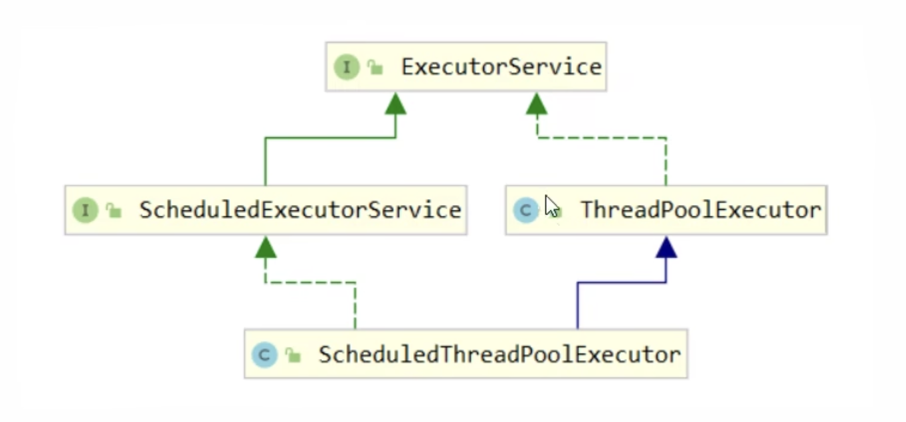
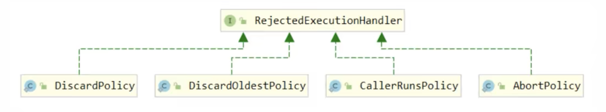

# 13 并发工具 - 线程池

## 13.1 自定义线程池


### 13.1.1 创建线程池

代码如下：

```java
@Slf4j(topic = "c.ThreadPool")
class ThreadPool {
    // 任务队列
    private BlockingQueue<Runnable> taskQueue;
    // 线程集合
    private HashSet<Worker> workers = new HashSet();
    // 核心线程数
    private int coreSize;
    // 超时时间
    private long timeout;
    private TimeUnit timeUnit;

    public ThreadPool(int coreSize, long timeout, TimeUnit timeUnit, int queueCapacity) {
        this.coreSize = coreSize;
        this.timeout = timeout;
        this.timeUnit = timeUnit;
        this.taskQueue = new BlockingQueue<>(queueCapacity);
    }

    // 执行任务
    public void execute(Runnable task) {
        // 当任务数没有超过coreSize时，直接交给worker对象执行
        // 如果任务数超过了coreSize，加入任务队列暂存
        synchronized (workers) {
            if (workers.size() < coreSize) {
                Worker worker = new Worker(task);
                log.debug("Creating new worker {} for task {}", worker, task);
                workers.add(worker);
                worker.start();
            } else {
                taskQueue.put(task);
            }
        }
    }

    class Worker extends Thread {
        private Runnable task;

        public Worker(Runnable task) {
            this.task = task;
        }

        @Override
        public void run() {
            // 执行任务
            // 当task不为空，执行任务
            // 当task执行完毕，继续从任务队列获取任务并执行
            while (task != null || (task = taskQueue.poll(timeout, timeUnit)) != null) {
                try {
                    log.debug("Task is executing now, {}", task);
                    task.run();
                } catch (Exception e) {
                    e.printStackTrace();
                } finally {
                    task = null;
                }
            }
            // 循环退出，说明任务结束
            synchronized (workers) {
                log.debug("Removing worker {}", this);
                workers.remove(this);
            }
        }
    }
}

@Slf4j(topic = "c.BlockingQueue")
class BlockingQueue<T> {
    // 任务队列
    private Deque<T> queue = new ArrayDeque<>();
    // 锁
    private ReentrantLock lock = new ReentrantLock();
    // 生产者条件变量
    private Condition fullWaitSet = lock.newCondition();
    // 消费者条件变量
    private Condition emptyWaitSet = lock.newCondition();
    // 容量上线
    private int capacity;

    public BlockingQueue(int capacity) {
        this.capacity = capacity;
    }

    // 阻塞获取 - 超时
    public T poll(long timeout, TimeUnit timeUnit) {
        lock.lock();
        try {
            // 将超时时间统一转换为nano time
            long nanos = timeUnit.toNanos(timeout);
            while (queue.isEmpty()) {
                try {
                    if (nanos <= 0) {
                        return null;
                    }
                    // 返回等待剩余时间，重新赋值给nanos，防止虚假唤醒
                    nanos = emptyWaitSet.awaitNanos(nanos);
                } catch (InterruptedException e) {
                    throw new RuntimeException(e);
                }
            }
            T t = queue.removeFirst();
            fullWaitSet.signal();
            return t;
        } finally {
            lock.unlock();
        }
    }

    // 阻塞获取
    public T take() {
        lock.lock();
        try {
            while (queue.isEmpty()) {
                try {
                    emptyWaitSet.await();
                } catch (InterruptedException e) {
                    throw new RuntimeException(e);
                }
            }
            T t = queue.removeFirst();
            fullWaitSet.signal();
            return t;
        } finally {
            lock.unlock();
        }
    }

    // 阻塞添加
    public void put(T element) {
        lock.lock();
        try {
            while (queue.size() == capacity) {
                try {
                    log.debug("Waiting to be added into task queue {}", element);
                    fullWaitSet.await();
                } catch (InterruptedException e) {
                    throw new RuntimeException(e);
                }
            }
            log.debug("Putting task to task queue: {}", element);
            queue.addLast(element);
            emptyWaitSet.signal();
        } finally {
            lock.unlock();
        }
    }

    // 获取队列大小
    public int size() {
        lock.lock();
        try {
            return queue.size();
        } finally {
            lock.unlock();
        }
    }
}
```

接下来我们测试当任务数小于任务队列容量的情况：

```java
@Slf4j(topic = "c.ThreadPoolTest")
public class ThreadPoolTest {
    public static void main(String[] args) {
        // corSize: 2, capaticy: 10
        ThreadPool threadPool = new ThreadPool(2, 1000, TimeUnit.MILLISECONDS, 10);
        // task num: 5
        for (int i = 0; i < 5; i++) {
            int j = i;
            threadPool.execute(() -> {
                log.debug("{}", j);
            });
        }
    }
}
```

输出：

```java
18:23:50.913 [main] c.ThreadPool - Creating new worker Thread[Thread-0,5,main] for task com.nasuf.concurrency.ThreadPoolTest$$Lambda$1/1914572623@357246de
18:23:50.919 [main] c.ThreadPool - Creating new worker Thread[Thread-1,5,main] for task com.nasuf.concurrency.ThreadPoolTest$$Lambda$1/1914572623@5a01ccaa
18:23:50.920 [main] c.BlockingQueue - Putting task to task queue: com.nasuf.concurrency.ThreadPoolTest$$Lambda$1/1914572623@19bb089b
18:23:50.920 [main] c.BlockingQueue - Putting task to task queue: com.nasuf.concurrency.ThreadPoolTest$$Lambda$1/1914572623@4563e9ab
18:23:50.921 [main] c.BlockingQueue - Putting task to task queue: com.nasuf.concurrency.ThreadPoolTest$$Lambda$1/1914572623@11531931
18:23:50.920 [Thread-1] c.ThreadPool - Task is executing now, com.nasuf.concurrency.ThreadPoolTest$$Lambda$1/1914572623@5a01ccaa
18:23:50.919 [Thread-0] c.ThreadPool - Task is executing now, com.nasuf.concurrency.ThreadPoolTest$$Lambda$1/1914572623@357246de
18:23:50.921 [Thread-1] c.ThreadPoolTest - 1
18:23:50.921 [Thread-0] c.ThreadPoolTest - 0
18:23:50.922 [Thread-1] c.ThreadPool - Task is executing now, com.nasuf.concurrency.ThreadPoolTest$$Lambda$1/1914572623@19bb089b
18:23:50.922 [Thread-0] c.ThreadPool - Task is executing now, com.nasuf.concurrency.ThreadPoolTest$$Lambda$1/1914572623@4563e9ab
18:23:50.922 [Thread-1] c.ThreadPoolTest - 2
18:23:50.922 [Thread-0] c.ThreadPoolTest - 3
18:23:50.922 [Thread-1] c.ThreadPool - Task is executing now, com.nasuf.concurrency.ThreadPoolTest$$Lambda$1/1914572623@11531931
18:23:50.922 [Thread-1] c.ThreadPoolTest - 4
18:23:51.929 [Thread-1] c.ThreadPool - Removing worker Thread[Thread-1,5,main]
18:23:51.929 [Thread-0] c.ThreadPool - Removing worker Thread[Thread-0,5,main]
```

现在我们修改测试方法，使得任务数超过队列容量：

```java
@Slf4j(topic = "c.ThreadPoolTest")
public class ThreadPoolTest {
    public static void main(String[] args) {
        // coreSize: 2, capacity: 10
        ThreadPool threadPool = new ThreadPool(2, 1000, TimeUnit.MILLISECONDS, 10);
        // task num: 15
        for (int i = 0; i < 15; i++) {
            int j = i;
            threadPool.execute(() -> {
                try {
                    Thread.sleep(1000000L);
                } catch (InterruptedException e) {
                    throw new RuntimeException(e);
                }
                log.debug("{}", j);
            });
        }
    }
}
```

输出：

```java
18:27:14.592 [main] c.ThreadPool - Creating new worker Thread[Thread-0,5,main] for task com.nasuf.concurrency.ThreadPoolTest$$Lambda$1/1914572623@357246de
18:27:14.603 [main] c.ThreadPool - Creating new worker Thread[Thread-1,5,main] for task com.nasuf.concurrency.ThreadPoolTest$$Lambda$1/1914572623@5a01ccaa
18:27:14.604 [main] c.BlockingQueue - Putting task to task queue: com.nasuf.concurrency.ThreadPoolTest$$Lambda$1/1914572623@19bb089b
18:27:14.604 [main] c.BlockingQueue - Putting task to task queue: com.nasuf.concurrency.ThreadPoolTest$$Lambda$1/1914572623@4563e9ab
18:27:14.605 [main] c.BlockingQueue - Putting task to task queue: com.nasuf.concurrency.ThreadPoolTest$$Lambda$1/1914572623@11531931
18:27:14.605 [main] c.BlockingQueue - Putting task to task queue: com.nasuf.concurrency.ThreadPoolTest$$Lambda$1/1914572623@5e025e70
18:27:14.605 [main] c.BlockingQueue - Putting task to task queue: com.nasuf.concurrency.ThreadPoolTest$$Lambda$1/1914572623@1fbc7afb
18:27:14.603 [Thread-0] c.ThreadPool - Task is executing now, com.nasuf.concurrency.ThreadPoolTest$$Lambda$1/1914572623@357246de
18:27:14.604 [Thread-1] c.ThreadPool - Task is executing now, com.nasuf.concurrency.ThreadPoolTest$$Lambda$1/1914572623@5a01ccaa
18:27:14.606 [main] c.BlockingQueue - Putting task to task queue: com.nasuf.concurrency.ThreadPoolTest$$Lambda$1/1914572623@45c8e616
18:27:14.606 [main] c.BlockingQueue - Putting task to task queue: com.nasuf.concurrency.ThreadPoolTest$$Lambda$1/1914572623@4cdbe50f
18:27:14.606 [main] c.BlockingQueue - Putting task to task queue: com.nasuf.concurrency.ThreadPoolTest$$Lambda$1/1914572623@66d33a
18:27:14.606 [main] c.BlockingQueue - Putting task to task queue: com.nasuf.concurrency.ThreadPoolTest$$Lambda$1/1914572623@7cf10a6f
18:27:14.606 [main] c.BlockingQueue - Putting task to task queue: com.nasuf.concurrency.ThreadPoolTest$$Lambda$1/1914572623@7e0babb1
18:27:14.606 [main] c.BlockingQueue - Waiting to be added into task queue com.nasuf.concurrency.ThreadPoolTest$$Lambda$1/1914572623@6debcae2
```

可见当第11个任务开始是，队列已满，新增任务等待被加入队列中，且一直保持阻塞状态。

### 13.1.2 自定义线程池拒绝策略

接下来我们优化`BlockingQueue.put(T e)`方法，应用不同的拒绝策略：

```java
// 不同的拒绝策略：
// 1. 等待
// 2. 等待超时
// 3. 放弃任务执行
// 4. 抛出异常
// 5. 让调用者自己执行任务
@FunctionalInterface
interface RejectPolicy<T> {
    void reject(BlockingQueue<T> queue, T task);
}
```

然后在`BlockingQueue`class中我们修改`put`为`tryPut`方法

```java
@Slf4j(topic = "c.ThreadPool")
class ThreadPool {
    private BlockingQueue<Runnable> taskQueue;
    private HashSet<Worker> workers = new HashSet();
    private int coreSize;
    private long timeout;
    private TimeUnit timeUnit;
    private RejectPolicy<Runnable> rejectPolicy;

    public ThreadPool(int coreSize, long timeout, TimeUnit timeUnit, int queueCapacity, RejectPolicy<Runnable> rejectPolicy) {
        this.coreSize = coreSize;
        this.timeout = timeout;
        this.timeUnit = timeUnit;
        this.taskQueue = new BlockingQueue<>(queueCapacity);
        this.rejectPolicy = rejectPolicy; // 将拒绝策略作为线程池的构造方法参数
    }

    // 执行任务
    public void execute(Runnable task) {
        // 当任务数没有超过coreSize时，直接交给worker对象执行
        // 如果任务数超过了coreSize，加入任务队列暂存
        synchronized (workers) {
            if (workers.size() < coreSize) {
                Worker worker = new Worker(task);
                log.debug("Creating new worker {} for task {}", worker, task);
                workers.add(worker);
                worker.start();
            } else {
                taskQueue.tryPut(rejectPolicy, task); // 应用不同的拒绝策略
            }
        }
    }
  // ...
}
```

然后我们测试：

>  拒绝策略（一）：持续等待

```java
@Slf4j(topic = "c.ThreadPoolTest")
public class ThreadPoolTest {
    public static void main(String[] args) {
        ThreadPool threadPool = new ThreadPool(
                1,
                1000,
                TimeUnit.MILLISECONDS,
                1,
                // 拒绝策略一：持续等待
                (queue, task) -> queue.put(task));
        for (int i = 0; i < 3; i++) {
            int j = i;
            threadPool.execute(() -> {
                try {
                    Thread.sleep(1000000L);
                } catch (InterruptedException e) {
                    throw new RuntimeException(e);
                }
                log.debug("{}", j);
            });
        }
    }
}
```

输出如下：

```java
18:54:59.644 [main] c.ThreadPool - Creating new worker Thread[Thread-0,5,main] for task com.nasuf.concurrency.ThreadPoolTest$$Lambda$2/1918627686@16c0663d
18:54:59.652 [main] c.BlockingQueue - Putting task to task queue: com.nasuf.concurrency.ThreadPoolTest$$Lambda$2/1918627686@5e025e70
18:54:59.652 [main] c.BlockingQueue - Waiting to be added into task queue com.nasuf.concurrency.ThreadPoolTest$$Lambda$2/1918627686@1fbc7afb
18:54:59.652 [Thread-0] c.ThreadPool - Task is executing now, com.nasuf.concurrency.ThreadPoolTest$$Lambda$2/1918627686@16c0663d
```

由于每个任务执行时间很长，第一个task开始执行后，第二个task加入queue等待，一直没释放，第三个task持续等待加入queue

> 拒绝策略（二）：超时等待

```java
@Slf4j(topic = "c.ThreadPoolTest")
public class ThreadPoolTest {
    public static void main(String[] args) {
        ThreadPool threadPool = new ThreadPool(
                1,
                1000,
                TimeUnit.MILLISECONDS,
                1,
                // 拒绝策略二：超时等待
                (queue, task) -> queue.offer(task, 500, TimeUnit.MILLISECONDS));
        for (int i = 0; i < 3; i++) {
            int j = i;
            threadPool.execute(() -> {
                try {
                    Thread.sleep(1000L); // 任务执行时间为1s
                } catch (InterruptedException e) {
                    throw new RuntimeException(e);
                }
                log.debug("{}", j);
            });
        }
    }
}
```

输出：

```java
19:06:02.728 [main] c.ThreadPool - Creating new worker Thread[Thread-0,5,main] for task com.nasuf.concurrency.ThreadPoolTest$$Lambda$2/1918627686@16c0663d
19:06:02.736 [main] c.BlockingQueue - Putting task to task queue: com.nasuf.concurrency.ThreadPoolTest$$Lambda$2/1918627686@5e025e70
19:06:02.736 [main] c.BlockingQueue - Waiting to be added into task queue com.nasuf.concurrency.ThreadPoolTest$$Lambda$2/1918627686@1fbc7afb
19:06:02.736 [Thread-0] c.ThreadPool - Task is executing now, com.nasuf.concurrency.ThreadPoolTest$$Lambda$2/1918627686@16c0663d
19:06:03.242 [main] c.BlockingQueue - Waiting to be added into task queue com.nasuf.concurrency.ThreadPoolTest$$Lambda$2/1918627686@1fbc7afb
19:06:03.743 [Thread-0] c.ThreadPoolTest - 0
19:06:03.744 [Thread-0] c.ThreadPool - Task is executing now, com.nasuf.concurrency.ThreadPoolTest$$Lambda$2/1918627686@5e025e70
19:06:04.746 [Thread-0] c.ThreadPoolTest - 1
19:06:05.749 [Thread-0] c.ThreadPool - Removing worker Thread[Thread-0,5,main]
```

两个任务依次执行（各执行1s），等到第三个任务时，已经超过了执行时间，未被加入队列并执行

假设我们将等待时间延长至1.5s，那么第三个任务就可以被加入队列并执行：

```java
@Slf4j(topic = "c.ThreadPoolTest")
public class ThreadPoolTest {
    public static void main(String[] args) {
        ThreadPool threadPool = new ThreadPool(
                1,
                1000,
                TimeUnit.MILLISECONDS,
                1,
                // 拒绝策略二：超时等待
                // 修改超时时间为1.5s
                (queue, task) -> queue.offer(task, 1500, TimeUnit.MILLISECONDS)); 
        for (int i = 0; i < 3; i++) {
            int j = i;
            threadPool.execute(() -> {
                try {
                    Thread.sleep(1000L);
                } catch (InterruptedException e) {
                    throw new RuntimeException(e);
                }
                log.debug("{}", j);
            });
        }
    }
}
```

> 拒绝策略（三）：调用者放弃执行

```java
@Slf4j(topic = "c.ThreadPoolTest")
public class ThreadPoolTest {
    public static void main(String[] args) {
        ThreadPool threadPool = new ThreadPool(
                1,
                1000,
                TimeUnit.MILLISECONDS,
                1,
                // 拒绝策略三：调用者放弃执行
                (queue, task) -> log.debug("Quit task execution."));
        for (int i = 0; i < 3; i++) {
            int j = i;
            threadPool.execute(() -> {
                try {
                    Thread.sleep(1000L);
                } catch (InterruptedException e) {
                    throw new RuntimeException(e);
                }
                log.debug("{}", j);
            });
        }
    }
}
```

输出：

```java
19:16:17.714 [main] c.BlockingQueue - Putting task to task queue: com.nasuf.concurrency.ThreadPoolTest$$Lambda$2/1918627686@5e025e70
19:16:17.714 [main] c.ThreadPoolTest - Quit task execution.
19:16:17.714 [Thread-0] c.ThreadPool - Task is executing now, com.nasuf.concurrency.ThreadPoolTest$$Lambda$2/1918627686@16c0663d
19:16:18.717 [Thread-0] c.ThreadPoolTest - 0
19:16:18.718 [Thread-0] c.ThreadPool - Task is executing now, com.nasuf.concurrency.ThreadPoolTest$$Lambda$2/1918627686@5e025e70
19:16:19.723 [Thread-0] c.ThreadPoolTest - 1
19:16:20.730 [Thread-0] c.ThreadPool - Removing worker Thread[Thread-0,5,main]
```

> 拒绝策略（四）：调用者抛出异常

```java
@Slf4j(topic = "c.ThreadPoolTest")
public class ThreadPoolTest {
    public static void main(String[] args) {
        ThreadPool threadPool = new ThreadPool(
                1,
                1000,
                TimeUnit.MILLISECONDS,
                1,
                // 拒绝策略四：调用者抛出异常
                (queue, task) -> {
                    throw new RuntimeException("Task execution failed." + task);
                });
        for (int i = 0; i < 4; i++) {
            int j = i;
            threadPool.execute(() -> {
                try {
                    Thread.sleep(1000L);
                } catch (InterruptedException e) {
                    throw new RuntimeException(e);
                }
                log.debug("{}", j);
            });
        }
    }
}
```

输出：

```java
19:24:08.147 [main] c.ThreadPool - Creating new worker Thread[Thread-0,5,main] for task com.nasuf.concurrency.ThreadPoolTest$$Lambda$2/1918627686@16c0663d
19:24:08.155 [main] c.BlockingQueue - Putting task to task queue: com.nasuf.concurrency.ThreadPoolTest$$Lambda$2/1918627686@5e025e70
19:24:08.155 [Thread-0] c.ThreadPool - Task is executing now, com.nasuf.concurrency.ThreadPoolTest$$Lambda$2/1918627686@16c0663d
Exception in thread "main" java.lang.RuntimeException: Task execution failed.com.nasuf.concurrency.ThreadPoolTest$$Lambda$2/1918627686@1fbc7afb
	at com.nasuf.concurrency.ThreadPoolTest.lambda$main$0(ThreadPoolTest.java:22)
	at com.nasuf.concurrency.BlockingQueue.tryPut(ThreadPoolTest.java:239)
	at com.nasuf.concurrency.ThreadPool.execute(ThreadPoolTest.java:81)
	at com.nasuf.concurrency.ThreadPoolTest.main(ThreadPoolTest.java:26)
19:24:09.163 [Thread-0] c.ThreadPoolTest - 0
19:24:09.164 [Thread-0] c.ThreadPool - Task is executing now, com.nasuf.concurrency.ThreadPoolTest$$Lambda$2/1918627686@5e025e70
19:24:10.169 [Thread-0] c.ThreadPoolTest - 1
19:24:11.178 [Thread-0] c.ThreadPool - Removing worker Thread[Thread-0,5,main]
```

抛出异常后，主线程不会继续执行

> 拒绝策略（五）：调用者自己执行任务

```java
@Slf4j(topic = "c.ThreadPoolTest")
public class ThreadPoolTest {
    public static void main(String[] args) {
        ThreadPool threadPool = new ThreadPool(
                1,
                1000,
                TimeUnit.MILLISECONDS,
                1,
                // 拒绝策略五：调用者自己执行任务
                (queue, task) -> task.run());
        for (int i = 0; i < 4; i++) {
            int j = i;
            threadPool.execute(() -> {
                try {
                    Thread.sleep(1000L);
                } catch (InterruptedException e) {
                    throw new RuntimeException(e);
                }
                log.debug("{}", j);
            });
        }
    }
}
```

输出：

```java
19:26:34.929 [main] c.ThreadPool - Creating new worker Thread[Thread-0,5,main] for task com.nasuf.concurrency.ThreadPoolTest$$Lambda$2/1918627686@16c0663d
19:26:34.938 [main] c.BlockingQueue - Putting task to task queue: com.nasuf.concurrency.ThreadPoolTest$$Lambda$2/1918627686@5e025e70
19:26:34.938 [Thread-0] c.ThreadPool - Task is executing now, com.nasuf.concurrency.ThreadPoolTest$$Lambda$2/1918627686@16c0663d
19:26:35.944 [main] c.ThreadPoolTest - 2
19:26:35.944 [Thread-0] c.ThreadPoolTest - 0
19:26:36.946 [main] c.ThreadPoolTest - 3
19:26:36.948 [Thread-0] c.ThreadPool - Task is executing now, com.nasuf.concurrency.ThreadPoolTest$$Lambda$2/1918627686@5e025e70
19:26:37.953 [Thread-0] c.ThreadPoolTest - 1
19:26:38.958 [Thread-0] c.ThreadPool - Removing worker Thread[Thread-0,5,main]
```

可以看到，任务2和3被主线程自己执行，而非线程池内的线程执行

## 13.2 ThreadPoolExecutor



### 13.2.1 线程池状态

ThreadPoolExecutor使用int的高3位来表示线程池状态，低29位表示线程数量：

| 状态名     | 高3位 | 接收新任务 | 处理阻塞队列任务 | 说明                                         |
| ---------- | ----- | ---------- | ---------------- | -------------------------------------------- |
| RUNNING    | 111   | Y          | Y                |                                              |
| SHUTDOWN   | 000   | N          | Y                | 不会接收新任务，但是会处理阻塞队列剩余任务   |
| STOP       | 001   | N          | N                | 会中断正在执行的任务，并抛弃阻塞队列剩余任务 |
| TIDYING    | 010   | -          | -                | 任务全部执行完毕，活动线程为0，即将进入终结  |
| TERMINATED | 011   | -          | -                | 终结状态                                     |

从数字上比较，TERMINATED > TIDYING > STOP > SHUTDOWN > RUNNING，这些信息存储在一个原子变量`ctl`中，目的是将线程池状态与线程个数合二为一，这样就可以用一次`cas`原子操作进行赋值，不然需要两次`cas`操作：

```java
// c为旧值，ctlOf返回结果为新值
ctl.compareAndSet(c, ctlOf(targetState, workerCountOf(c)));

// rs为高3位，代表线程池状态；wc为低29位，代表线程个数；ctl是二者合并
private static int ctlOf(int rs, int wc) { return rs | wc; }
```

### 13.2.2 构造方法

```java
public ThreadPoolExecutor(int corePoolSize,
                          int maximumPoolSize,
                          long keepAliveTime,
                          TimeUnit unit,
                          BlockingQueue<Runnable> workQueue,
                          ThreadFactory threadFactory,
                          RejectedExecutionHandler handler)
```

- corePoolSize -> 核心线程数目（最多保留的线程数）
- maximumPoolSize -> 最大线程数目
- keepAliveTime -> 生存时间（针对救急线程）
- unit -> 时间单位（针对救急线程）
- workQueue -> 阻塞队列
- threadFactory -> 线程工厂（可以为线程创建时起个清晰的名字，从属于哪个线程池）
- handler -> 拒绝策略

任务执行策略：

- 线程池中刚开始没有线程，当一个任务提交给线程池后，线程池会创建一个新线程来执行任务
- 当线程数达到corePoolSize并没有线程空闲，这时再加入任务，新加的任务会被加入workQueue队列排队，直到有空闲的线程
- 如果队列选择了有界队列，那么任务超过了队列大小时，会创建maximumPoolSize - corePoolSize数目的线程来救急
- 如果线程达到maximumPoolSize仍然有新任务，这时会执行拒绝策略。拒绝策略jdk提供了4种实现，其他注明框架也提供了实现
  - AbortPolicy - 让调用者抛出RejectedExecutionException异常，这是默认策略
  - CallerRunsPolicy - 让调用者运行任务
  - DiscardPolicy - 放弃本次任务执行
  - DiscardOldestPolicy - 放弃队列中最早的任务，本任务取而代之
  - Dubbo的实现 - 在抛出RejectedExecutionException异常之前会记录日志，并dump线程栈信息，方便定位问题
  - Netty的实现 - 创建一个新线程来执行任务
  - ActiveMQ的实现 - 带超时等待（60s）尝试放入队列，类似我们之前自定义的拒绝策略
  - PinPoint的实现 - 使用了一个拒绝策略链，会注意尝试策略链中每种拒绝策略
- 当高峰过去后，超过corePoolSize的救急线程如果一段时间没有任务做，需要结束节省资源，这个时间由keepAliveTime和unit来控制



根据这个构造方法，jdk Executors类中提供了众多工厂方法来创建各种用途的线程池

### 13.2.3 newFixedThreadPool

```java
public static ExecutorService newFixedThreadPool(int nThreads) {
  return new ThreadPoolExecutor(nThreads, nThreads, 0L, TimeUnit.MILLISECONDS,
                               new LinkedBlockingQueue<Runnable>());
}
```

特点：

- 核心线程数 == 最大线程数（没有救急线程被创建），因此也无需超时时间
- 阻塞队列是无界的，可以放任意数量的任务
- 适用于任务量已知，相对耗时的任务

测试：

```java
@Slf4j(topic = "c.TestThreadPoolExecutors")
public class TestThreadPoolExecutors {
    public static void main(String[] args) {
        ExecutorService executorService = Executors.newFixedThreadPool(2);
        for (int i = 0; i < 3; i++) {
            final int content = i;
            executorService.submit(() -> log.debug("{}", content));
        }
    }
}
```

输出：

```java
11:47:44.425 [pool-1-thread-1] c.TestThreadPoolExecutors - 1
11:47:44.425 [pool-1-thread-2] c.TestThreadPoolExecutors - 2
11:47:44.431 [pool-1-thread-1] c.TestThreadPoolExecutors - 3
```

我们也可以使用自定义的`ThreadFactory`来修改线程池内线程名称：

```java
@Slf4j(topic = "c.TestThreadPoolExecutors")
public class TestThreadPoolExecutors {
    public static void main(String[] args) {
        ExecutorService executorService = Executors.newFixedThreadPool(2, new ThreadFactory() {
            private final AtomicInteger t = new AtomicInteger(1);

            @Override
            public Thread newThread(Runnable r) {
                return new Thread(r, "MyPool_t_" + t.getAndIncrement());
            }
        });
        for (int i = 0; i < 3; i++) {
            final int content = i;
            executorService.submit(() -> log.debug("{}", content));
        }
    }
}
```

输出：

```java
11:53:10.803 [MyPool_t_2] c.TestThreadPoolExecutors - 1
11:53:10.803 [MyPool_t_1] c.TestThreadPoolExecutors - 0
11:53:10.811 [MyPool_t_2] c.TestThreadPoolExecutors - 2
```

### 13.2.4 newCachedThreadPool

```java
public static ExecutorService newCachedThreadPool() {
  return new ThreadPoolExecutor(0, Integer.MAX_VALUE,
                                60L, TimeUnit.SECONDS,
                                new SynchronousQueue<Runnable>());
}
```

特点：

- 核心线程数是0，最大线程数是Integer.MAX_VALUE，救急线程的空闲剩余时间为60s，意味着：
  - 全部都是救急线程（60s后可以回收）
  - 救急线程可以无限创建
- 队列采用了SynchronousQueue实现，特点是没有容量，没有线程来取是放不进去的（一手交钱、一手交货）

我们来测试下SynchronousQueue：

```java
@Slf4j(topic = "c.TestSynchronousQueue")
public class TestSynchronousQueue {
    public static void main(String[] args) {
        SynchronousQueue<Integer> integers = new SynchronousQueue<>();
        new Thread(() -> {
            try {
                log.debug("adding {}", 1);
                integers.put(1);
                log.debug("{} added", 1);

                log.debug("adding {}", 2);
                integers.put(2);
                log.debug("{} added", 2);
            } catch (InterruptedException e) {
                e.printStackTrace();
            }
        }, "t1").start();

        sleep(1);

        new Thread(() -> {
            try {
                log.debug("taking {}", 1);
                integers.take();
            } catch (InterruptedException e) {
                e.printStackTrace();
            }
        }, "t2").start();

        sleep(1);

        new Thread(() -> {
            try {
                log.debug("taking {}", 2);
                integers.take();
            } catch (InterruptedException e) {
                e.printStackTrace();
            }
        }, "t3").start();
    }
}
```

输出：

```java
12:19:27.112 [t1] c.TestSynchronousQueue - adding 1
12:19:28.118 [t2] c.TestSynchronousQueue - taking 1
12:19:28.121 [t1] c.TestSynchronousQueue - 1 added
12:19:28.121 [t1] c.TestSynchronousQueue - adding 2
12:19:29.121 [t3] c.TestSynchronousQueue - taking 2
12:19:29.121 [t1] c.TestSynchronousQueue - 2 added
```

因此整个线程池表现为线程数会根据任务量不断增长，没有上限，当任务执行完毕，空闲1分钟后释放线程。适合任务数比较密集，但每个任务执行时间较短的情况

### 13.2.5 newSingleThreadExecutor

```java
public static ExecutorService newSingleThreadExecutor() {
  return new FinilizableDelegatedExecutorService(
    new ThreadPoolExecutor(1, 1, 0L, TimeUnit.MILISECONDS,
                           new LinkedBlockingQueue<Runnable>()));
}
```

使用场景：

- 希望多个任务排队执行。线程数固定为1，任务数多于1时，会放入无界队列排队。任务执行完毕，这唯一的线程也不会被释放

区别：

- 自己创建一个单线程串行执行任务，如果任务执行失败而终止，那么没有任何补救措施，而线程池还会创建一个线程，保证线程池的正藏工作
- Executors.newSingleThreadExecutor() 线程个数始终为1，不能修改
  - FinalizableDelegatedExecutorService应用的是装饰器模式，只对外暴露了ExecutorService接口，因此不能调用ThreadPoolExecutor中特有的方法
- Executors.newFixedThreadPool(1) 初始时为1，以后还可以修改
  - 对外暴露的是ThreadPoolExecutor对象，可以强转后调用`setCorePoolSize`等方法进行修改

测试：

```java
@Slf4j(topic = "c.TestExecutors")
public class TestExecutors {
    public static void main(String[] args) {
        test1();
    }

    static void test1() {
        ExecutorService pool = Executors.newSingleThreadExecutor();
        pool.execute(() -> {
            log.debug("1");
            int i = 1 / 0;
        });

        pool.execute(() -> log.debug("2"));
        pool.execute(() -> log.debug("3"));
    }
}
```

输出：

```java
13:03:35.091 [pool-1-thread-1] c.TestExecutors - 1
13:03:35.096 [pool-1-thread-2] c.TestExecutors - 2
13:03:35.096 [pool-1-thread-2] c.TestExecutors - 3
Exception in thread "pool-1-thread-1" java.lang.ArithmeticException: / by zero
	at com.nasuf.concurrency.TestExecutors.lambda$test1$0(TestExecutors.java:18)
	at java.util.concurrent.ThreadPoolExecutor.runWorker(ThreadPoolExecutor.java:1149)
	at java.util.concurrent.ThreadPoolExecutor$Worker.run(ThreadPoolExecutor.java:624)
	at java.lang.Thread.run(Thread.java:750)

```

可见虽然第一个任务运行异常，并未影响第二个任务和第三个任务的执行，线程池创建了新的线程来执行剩余两个任务

### 13.2.6 任务提交

```java
// 执行任务
void execute(Runnable command);

// 提交任务task，用返回值Future获得任务执行结果
<T> Future<T> submit(Callable<T> task);

// 提交tasks中所有任务
<T> List<Future<T>> invokeAll(Collection<? extends Callable<T>> tasks) throws InterruptedException;

// 提交tasks中所有任务，带超时时间
<T> List<Future<T>> invokeAll(Collection<? extends Callable<T>> tasks,
                              long timeout, TimeUnit unit) throws InterruptedException;

// 提交tasks中所有任务，哪个任务线成功执行完毕，返回次任务执行结果，其他任务取消
<T> T invokeAny(Collection<? extends Callable<T>> tasks) throws InterruptedException;

// 提交tasks中所有任务，哪个任务线成功执行完毕，返回次任务执行结果，其他任务取消，带超时时间
<T> T invokeAny(Collection<? extends Callable<T>> tasks,
                long timeout, TimeUnit unit) throws InterruptedException;
```

> submit

```java
@Slf4j(topic = "c.TestSubmit")
public class TestSubmit {
    public static void main(String[] args) throws ExecutionException, InterruptedException {
        ExecutorService pool = Executors.newFixedThreadPool(2);
        Future<String> future = pool.submit(new Callable<String>() {
            @Override
            public String call() throws Exception {
                log.debug("running");
                Thread.sleep(1000);
                return "ok";
            }
        });
        log.debug("{}", future.get());
    }
}
```

输出：

```java
13:20:48.843 [pool-1-thread-1] c.TestSubmit - running
13:20:49.851 [main] c.TestSubmit - ok
```

> invokeAll

```java
@Slf4j(topic = "c.TestSubmit")
public class TestSubmit {
    public static void main(String[] args) throws ExecutionException, InterruptedException {
        ExecutorService pool = Executors.newFixedThreadPool(2);
        List<Future<String>> futures = pool.invokeAll(Arrays.asList(
                () -> {
                    log.debug("task 1 begin.");
                    Thread.sleep(1000);
                    return "1";
                },
                () -> {
                    log.debug("task 2 begin.");
                    Thread.sleep(500);
                    return "2";
                },
                () -> {
                    log.debug("task 3 begin.");
                    Thread.sleep(2000);
                    return "3";
                }
        ));
        futures.forEach(future -> {
            try {
                log.debug("{}", future.get());
            } catch (InterruptedException | ExecutionException e) {
                throw new RuntimeException(e);
            }
        });
    }
}
```

输出：

```java
13:26:51.315 [pool-1-thread-2] c.TestSubmit - task 2 begin.
13:26:51.315 [pool-1-thread-1] c.TestSubmit - task 1 begin.
13:26:51.825 [pool-1-thread-2] c.TestSubmit - task 3 begin.
13:26:53.836 [main] c.TestSubmit - 1
13:26:53.854 [main] c.TestSubmit - 2
13:26:53.854 [main] c.TestSubmit - 3
```

> invokeAny

```java
@Slf4j(topic = "c.TestSubmit")
public class TestSubmit {
    public static void main(String[] args) throws ExecutionException, InterruptedException {
        ExecutorService pool = Executors.newFixedThreadPool(2);
        String ret = pool.invokeAny(Arrays.asList(
                () -> {
                    log.debug("task 1 begin.");
                    Thread.sleep(1000);
                    log.debug("task 1 end.");
                    return "1";
                },
                () -> {
                    log.debug("task 2 begin.");
                    Thread.sleep(500);
                    log.debug("task 2 end.");
                    return "2";
                },
                () -> {
                    log.debug("task 3 begin.");
                    Thread.sleep(100);
                    log.debug("task 3 end.");
                    return "3";
                }
        ));
        log.debug("result: {}", ret);
    }
}
```

输出：

```java
13:48:29.794 [pool-1-thread-1] c.TestSubmit - task 1 begin.
13:48:29.794 [pool-1-thread-2] c.TestSubmit - task 2 begin.
13:48:30.299 [pool-1-thread-2] c.TestSubmit - task 2 end.
13:48:30.300 [pool-1-thread-2] c.TestSubmit - task 3 begin.
13:48:30.301 [main] c.TestSubmit - result: 2
```

由于pool只有2个线程，虽然task3执行时间最短，但是task1 & task2最先加入队列，且task2最先完成，所以task2完成后直接返回结果

### 13.2.7 关闭线程池

> shutdown

```java
/**
* 线程池状态变为 SHUTDOWN
* - 不会接收新任务
* - 但已提交的任务会执行完毕
* - 此方法不会阻塞调用线程的执行
*/
void shutdown() {
  final ReentrantLock mainLock = this.mainLock;
  mainLock.lock();
  try {
    checkShutdownAccess();
    // 修改线程池状态
    advanceRunState(SHUTDOWN);
    // 仅会打断空闲线程
    interruptIdleWorkers();
    onShutdown(); // 扩展点 ScheduledThreadPoolExecutor
  } finally {
    mainLock.unlock();
  }
  
  // 尝试终结（没有运行的线程可以立即终结，如果还有运行中的线程也不会等待）
  tryTerminate();
}
```

> shutdownNow

```java
/**
* 线程池状态变为 STOP
* - 不会接收新任务
* - 会将队列中的任务返回
* - 用intterrupt的方式中断正在执行的线程
*/
void shutdown() {
  List<Runnable> tasks;
  final ReentrantLock mainLock = this.mainLock;
  mainLock.lock();
  try {
    checkShutdownAccess();
    // 修改线程池状态
    advanceRunState(STOP);
		// 打断所有线程
    intterruptWorkers();
    // 获取队列中剩余任务
    tasks = drainQueue();
  } finally {
    mainLock.unlock();
  }
  
  // 尝试终结
  tryTerminate();
  return tasks;
}
```

> 其他相关方法

```java
// 不在RUNNING状态的线程池，此方法就返回true
boolean isShutdown();

// 线程池状态是否是 TERMINATED
boolean isTerminated();

// 调用shutdown后，由于调用线程并不会等待所有任务运行结束，因此如果它想在线程池TERMINATED之后做些事情，可以利用此方法等待
boolean awaitTermination(long timeout, TimeUnit unit) throws IntterruptedException;
```

代码测试：

```java
@Slf4j(topic = "c.TestShutDown")
public class TestShutDown {
    public static void main(String[] args) {
        ExecutorService pool = Executors.newFixedThreadPool(2);

        Future<Integer> result1 = pool.submit(() -> {
            log.debug("task 1 running.");
            sleep(1);
            log.debug("task 1 finished.");
            return 1;
        });

        Future<Integer> result2 = pool.submit(() -> {
            log.debug("task 2 running.");
            sleep(1);
            log.debug("task 2 finished.");
            return 2;
        });

        Future<Integer> result3 = pool.submit(() -> {
            log.debug("task 3 running.");
            sleep(1);
            log.debug("task 3 finished.");
            return 3;
        });

        log.debug("shutting down thread pool.");
        pool.shutdown();

        Future<Integer> result4 = pool.submit(() -> {
            log.debug("task 4 running.");
            sleep(1);
            log.debug("task 4 finished.");
            return 4;
        });
    }
}
```

输出：

```java
20:01:30.072 [pool-1-thread-2] c.TestShutDown - task 2 running.
20:01:30.072 [main] c.TestShutDown - shutting down thread pool.
20:01:30.072 [pool-1-thread-1] c.TestShutDown - task 1 running.
Exception in thread "main" java.util.concurrent.RejectedExecutionException: Task java.util.concurrent.FutureTask@35851384 rejected from java.util.concurrent.ThreadPoolExecutor@649d209a[Shutting down, pool size = 2, active threads = 2, queued tasks = 1, completed tasks = 0]
	at java.util.concurrent.ThreadPoolExecutor$AbortPolicy.rejectedExecution(ThreadPoolExecutor.java:2063)
	at java.util.concurrent.ThreadPoolExecutor.reject(ThreadPoolExecutor.java:830)
	at java.util.concurrent.ThreadPoolExecutor.execute(ThreadPoolExecutor.java:1379)
	at java.util.concurrent.AbstractExecutorService.submit(AbstractExecutorService.java:134)
	at com.nasuf.concurrency.TestShutDown.main(TestShutDown.java:40)
20:01:31.082 [pool-1-thread-1] c.TestShutDown - task 1 finished.
20:01:31.082 [pool-1-thread-2] c.TestShutDown - task 2 finished.
20:01:31.083 [pool-1-thread-1] c.TestShutDown - task 3 running.
20:01:32.088 [pool-1-thread-1] c.TestShutDown - task 3 finished.
```

可见shutdown后，前三个任务依然被执行完毕，但是shutdown后提交的task4没有被执行，抛出了异常。如果我们改用shutdownNow方法：

```java
@Slf4j(topic = "c.TestShutDown")
public class TestShutDown {
    public static void main(String[] args) throws InterruptedException {
        ExecutorService pool = Executors.newFixedThreadPool(2);

        Future<Integer> result1 = pool.submit(() -> {
            log.debug("task 1 running.");
            Thread.sleep(1000);
            log.debug("task 1 finished.");
            return 1;
        });

        Future<Integer> result2 = pool.submit(() -> {
            log.debug("task 2 running.");
            Thread.sleep(1000);
            log.debug("task 2 finished.");
            return 2;
        });

        Future<Integer> result3 = pool.submit(() -> {
            log.debug("task 3 running.");
            Thread.sleep(1000);
            log.debug("task 3 finished.");
            return 3;
        });

        log.debug("shutting down thread pool.");
        List<Runnable> runnables = pool.shutdownNow();
        log.debug("main thread keep running. {}", runnables);
    }
}
```

输出：

```java
20:10:42.603 [pool-1-thread-2] c.TestShutDown - task 2 running.
20:10:42.603 [main] c.TestShutDown - shutting down thread pool.
20:10:42.603 [pool-1-thread-1] c.TestShutDown - task 1 running.
20:10:42.609 [main] c.TestShutDown - main thread keep running. [java.util.concurrent.FutureTask@649d209a]
```

那么前两个已经被提交到pool中的task并未执行完毕，task3也未被提交pool中。该方法返回未提交成功的task3 future对象，可以做进一步处理

## 13.3 异步模式之工作线程

让有限的工作线程（Worker Thread）来轮流异步处理无限多的任务。也可以将其归类为分工模式，它的典型实现就是线程池，也体现了经典设计模式中的享元模式

例如，海底捞的服务员（线程），轮流处理每位客人的点餐请求（任务），如果每一位客人都专门配备一名服务员，成本就太高了（对比另一种多线程设计模式：Thread-Per-Message）

注意，不同任务类型应该使用不同的线程池，这样能够避免饥饿现象，并能提升效率

