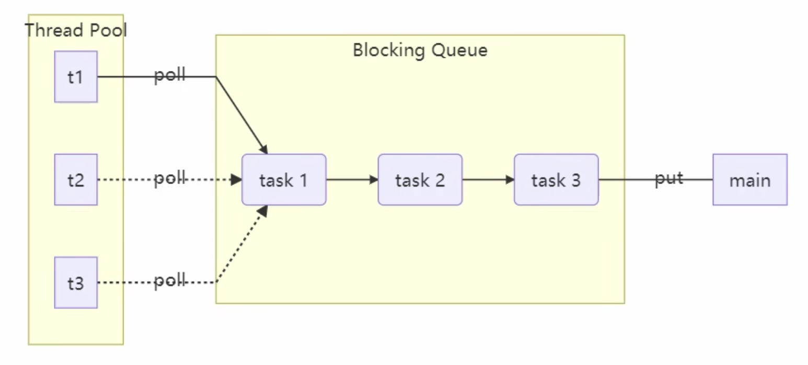

# 13 并发工具 - 线程池

## 13.1 自定义线程池



代码如下：

```java
@Slf4j(topic = "c.ThreadPool")
class ThreadPool {
    // 任务队列
    private BlockingQueue<Runnable> taskQueue;
    // 线程集合
    private HashSet<Worker> workers = new HashSet();
    // 核心线程数
    private int coreSize;
    // 超时时间
    private long timeout;
    private TimeUnit timeUnit;

    public ThreadPool(int coreSize, long timeout, TimeUnit timeUnit, int queueCapacity) {
        this.coreSize = coreSize;
        this.timeout = timeout;
        this.timeUnit = timeUnit;
        this.taskQueue = new BlockingQueue<>(queueCapacity);
    }

    // 执行任务
    public void execute(Runnable task) {
        // 当任务数没有超过coreSize时，直接交给worker对象执行
        // 如果任务数超过了coreSize，加入任务队列暂存
        synchronized (workers) {
            if (workers.size() < coreSize) {
                Worker worker = new Worker(task);
                log.debug("Creating new worker {} for task {}", worker, task);
                workers.add(worker);
                worker.start();
            } else {
                taskQueue.put(task);
            }
        }
    }

    class Worker extends Thread {
        private Runnable task;

        public Worker(Runnable task) {
            this.task = task;
        }

        @Override
        public void run() {
            // 执行任务
            // 当task不为空，执行任务
            // 当task执行完毕，继续从任务队列获取任务并执行
            while (task != null || (task = taskQueue.poll(timeout, timeUnit)) != null) {
                try {
                    log.debug("Task is executing now, {}", task);
                    task.run();
                } catch (Exception e) {
                    e.printStackTrace();
                } finally {
                    task = null;
                }
            }
            // 循环退出，说明任务结束
            synchronized (workers) {
                log.debug("Removing worker {}", this);
                workers.remove(this);
            }
        }
    }
}

@Slf4j(topic = "c.BlockingQueue")
class BlockingQueue<T> {
    // 任务队列
    private Deque<T> queue = new ArrayDeque<>();
    // 锁
    private ReentrantLock lock = new ReentrantLock();
    // 生产者条件变量
    private Condition fullWaitSet = lock.newCondition();
    // 消费者条件变量
    private Condition emptyWaitSet = lock.newCondition();
    // 容量上线
    private int capacity;

    public BlockingQueue(int capacity) {
        this.capacity = capacity;
    }

    // 阻塞获取 - 超时
    public T poll(long timeout, TimeUnit timeUnit) {
        lock.lock();
        try {
            // 将超时时间统一转换为nano time
            long nanos = timeUnit.toNanos(timeout);
            while (queue.isEmpty()) {
                try {
                    if (nanos <= 0) {
                        return null;
                    }
                    // 返回等待剩余时间，重新赋值给nanos，防止虚假唤醒
                    nanos = emptyWaitSet.awaitNanos(nanos);
                } catch (InterruptedException e) {
                    throw new RuntimeException(e);
                }
            }
            T t = queue.removeFirst();
            fullWaitSet.signal();
            return t;
        } finally {
            lock.unlock();
        }
    }

    // 阻塞获取
    public T take() {
        lock.lock();
        try {
            while (queue.isEmpty()) {
                try {
                    emptyWaitSet.await();
                } catch (InterruptedException e) {
                    throw new RuntimeException(e);
                }
            }
            T t = queue.removeFirst();
            fullWaitSet.signal();
            return t;
        } finally {
            lock.unlock();
        }
    }

    // 阻塞添加
    public void put(T element) {
        lock.lock();
        try {
            while (queue.size() == capacity) {
                try {
                    log.debug("Waiting to be added into task queue {}", element);
                    fullWaitSet.await();
                } catch (InterruptedException e) {
                    throw new RuntimeException(e);
                }
            }
            log.debug("Putting task to task queue: {}", element);
            queue.addLast(element);
            emptyWaitSet.signal();
        } finally {
            lock.unlock();
        }
    }

    // 获取队列大小
    public int size() {
        lock.lock();
        try {
            return queue.size();
        } finally {
            lock.unlock();
        }
    }
}
```

接下来我们测试当任务数小于任务队列容量的情况：

```java
@Slf4j(topic = "c.ThreadPoolTest")
public class ThreadPoolTest {
    public static void main(String[] args) {
        // corSize: 2, capaticy: 10
        ThreadPool threadPool = new ThreadPool(2, 1000, TimeUnit.MILLISECONDS, 10);
        // task num: 5
        for (int i = 0; i < 5; i++) {
            int j = i;
            threadPool.execute(() -> {
                log.debug("{}", j);
            });
        }
    }
}
```


输出：

```java
18:23:50.913 [main] c.ThreadPool - Creating new worker Thread[Thread-0,5,main] for task com.nasuf.concurrency.ThreadPoolTest$$Lambda$1/1914572623@357246de
18:23:50.919 [main] c.ThreadPool - Creating new worker Thread[Thread-1,5,main] for task com.nasuf.concurrency.ThreadPoolTest$$Lambda$1/1914572623@5a01ccaa
18:23:50.920 [main] c.BlockingQueue - Putting task to task queue: com.nasuf.concurrency.ThreadPoolTest$$Lambda$1/1914572623@19bb089b
18:23:50.920 [main] c.BlockingQueue - Putting task to task queue: com.nasuf.concurrency.ThreadPoolTest$$Lambda$1/1914572623@4563e9ab
18:23:50.921 [main] c.BlockingQueue - Putting task to task queue: com.nasuf.concurrency.ThreadPoolTest$$Lambda$1/1914572623@11531931
18:23:50.920 [Thread-1] c.ThreadPool - Task is executing now, com.nasuf.concurrency.ThreadPoolTest$$Lambda$1/1914572623@5a01ccaa
18:23:50.919 [Thread-0] c.ThreadPool - Task is executing now, com.nasuf.concurrency.ThreadPoolTest$$Lambda$1/1914572623@357246de
18:23:50.921 [Thread-1] c.ThreadPoolTest - 1
18:23:50.921 [Thread-0] c.ThreadPoolTest - 0
18:23:50.922 [Thread-1] c.ThreadPool - Task is executing now, com.nasuf.concurrency.ThreadPoolTest$$Lambda$1/1914572623@19bb089b
18:23:50.922 [Thread-0] c.ThreadPool - Task is executing now, com.nasuf.concurrency.ThreadPoolTest$$Lambda$1/1914572623@4563e9ab
18:23:50.922 [Thread-1] c.ThreadPoolTest - 2
18:23:50.922 [Thread-0] c.ThreadPoolTest - 3
18:23:50.922 [Thread-1] c.ThreadPool - Task is executing now, com.nasuf.concurrency.ThreadPoolTest$$Lambda$1/1914572623@11531931
18:23:50.922 [Thread-1] c.ThreadPoolTest - 4
18:23:51.929 [Thread-1] c.ThreadPool - Removing worker Thread[Thread-1,5,main]
18:23:51.929 [Thread-0] c.ThreadPool - Removing worker Thread[Thread-0,5,main]
```

现在我们修改测试方法，使得任务数超过队列容量：

```java
@Slf4j(topic = "c.ThreadPoolTest")
public class ThreadPoolTest {
    public static void main(String[] args) {
        // coreSize: 2, capacity: 10
        ThreadPool threadPool = new ThreadPool(2, 1000, TimeUnit.MILLISECONDS, 10);
        // task num: 15
        for (int i = 0; i < 15; i++) {
            int j = i;
            threadPool.execute(() -> {
                try {
                    Thread.sleep(1000000L);
                } catch (InterruptedException e) {
                    throw new RuntimeException(e);
                }
                log.debug("{}", j);
            });
        }
    }
}
```

输出：

```java
18:27:14.592 [main] c.ThreadPool - Creating new worker Thread[Thread-0,5,main] for task com.nasuf.concurrency.ThreadPoolTest$$Lambda$1/1914572623@357246de
18:27:14.603 [main] c.ThreadPool - Creating new worker Thread[Thread-1,5,main] for task com.nasuf.concurrency.ThreadPoolTest$$Lambda$1/1914572623@5a01ccaa
18:27:14.604 [main] c.BlockingQueue - Putting task to task queue: com.nasuf.concurrency.ThreadPoolTest$$Lambda$1/1914572623@19bb089b
18:27:14.604 [main] c.BlockingQueue - Putting task to task queue: com.nasuf.concurrency.ThreadPoolTest$$Lambda$1/1914572623@4563e9ab
18:27:14.605 [main] c.BlockingQueue - Putting task to task queue: com.nasuf.concurrency.ThreadPoolTest$$Lambda$1/1914572623@11531931
18:27:14.605 [main] c.BlockingQueue - Putting task to task queue: com.nasuf.concurrency.ThreadPoolTest$$Lambda$1/1914572623@5e025e70
18:27:14.605 [main] c.BlockingQueue - Putting task to task queue: com.nasuf.concurrency.ThreadPoolTest$$Lambda$1/1914572623@1fbc7afb
18:27:14.603 [Thread-0] c.ThreadPool - Task is executing now, com.nasuf.concurrency.ThreadPoolTest$$Lambda$1/1914572623@357246de
18:27:14.604 [Thread-1] c.ThreadPool - Task is executing now, com.nasuf.concurrency.ThreadPoolTest$$Lambda$1/1914572623@5a01ccaa
18:27:14.606 [main] c.BlockingQueue - Putting task to task queue: com.nasuf.concurrency.ThreadPoolTest$$Lambda$1/1914572623@45c8e616
18:27:14.606 [main] c.BlockingQueue - Putting task to task queue: com.nasuf.concurrency.ThreadPoolTest$$Lambda$1/1914572623@4cdbe50f
18:27:14.606 [main] c.BlockingQueue - Putting task to task queue: com.nasuf.concurrency.ThreadPoolTest$$Lambda$1/1914572623@66d33a
18:27:14.606 [main] c.BlockingQueue - Putting task to task queue: com.nasuf.concurrency.ThreadPoolTest$$Lambda$1/1914572623@7cf10a6f
18:27:14.606 [main] c.BlockingQueue - Putting task to task queue: com.nasuf.concurrency.ThreadPoolTest$$Lambda$1/1914572623@7e0babb1
18:27:14.606 [main] c.BlockingQueue - Waiting to be added into task queue com.nasuf.concurrency.ThreadPoolTest$$Lambda$1/1914572623@6debcae2
```

可见当第11个任务开始是，队列已满，新增任务等待被加入队列中，且一直保持阻塞状态。接下来我们优化`BlockingQueue.put(T e)`方法，应用不同的拒绝策略：

```java
// 不同的拒绝策略：
// 1. 等待
// 2. 等待超时
// 3. 放弃任务执行
// 4. 抛出异常
// 5. 让调用者自己执行任务
@FunctionalInterface
interface RejectPolicy<T> {
    void reject(BlockingQueue<T> queue, T task);
}
```

然后在`BlockingQueue`class中我们修改`put`为`tryPut`方法

```java
@Slf4j(topic = "c.ThreadPool")
class ThreadPool {
    private BlockingQueue<Runnable> taskQueue;
    private HashSet<Worker> workers = new HashSet();
    private int coreSize;
    private long timeout;
    private TimeUnit timeUnit;
    private RejectPolicy<Runnable> rejectPolicy;

    public ThreadPool(int coreSize, long timeout, TimeUnit timeUnit, int queueCapacity, RejectPolicy<Runnable> rejectPolicy) {
        this.coreSize = coreSize;
        this.timeout = timeout;
        this.timeUnit = timeUnit;
        this.taskQueue = new BlockingQueue<>(queueCapacity);
        this.rejectPolicy = rejectPolicy; // 将拒绝策略作为线程池的构造方法参数
    }

    // 执行任务
    public void execute(Runnable task) {
        // 当任务数没有超过coreSize时，直接交给worker对象执行
        // 如果任务数超过了coreSize，加入任务队列暂存
        synchronized (workers) {
            if (workers.size() < coreSize) {
                Worker worker = new Worker(task);
                log.debug("Creating new worker {} for task {}", worker, task);
                workers.add(worker);
                worker.start();
            } else {
                taskQueue.tryPut(rejectPolicy, task); // 应用不同的拒绝策略
            }
        }
    }
  // ...
}
```

然后我们测试：

>  拒绝策略（一）：持续等待

```java
@Slf4j(topic = "c.ThreadPoolTest")
public class ThreadPoolTest {
    public static void main(String[] args) {
        ThreadPool threadPool = new ThreadPool(
                1,
                1000,
                TimeUnit.MILLISECONDS,
                1,
                // 拒绝策略一：持续等待
                (queue, task) -> queue.put(task));
        for (int i = 0; i < 3; i++) {
            int j = i;
            threadPool.execute(() -> {
                try {
                    Thread.sleep(1000000L);
                } catch (InterruptedException e) {
                    throw new RuntimeException(e);
                }
                log.debug("{}", j);
            });
        }
    }
}
```

输出如下：

```java
18:54:59.644 [main] c.ThreadPool - Creating new worker Thread[Thread-0,5,main] for task com.nasuf.concurrency.ThreadPoolTest$$Lambda$2/1918627686@16c0663d
18:54:59.652 [main] c.BlockingQueue - Putting task to task queue: com.nasuf.concurrency.ThreadPoolTest$$Lambda$2/1918627686@5e025e70
18:54:59.652 [main] c.BlockingQueue - Waiting to be added into task queue com.nasuf.concurrency.ThreadPoolTest$$Lambda$2/1918627686@1fbc7afb
18:54:59.652 [Thread-0] c.ThreadPool - Task is executing now, com.nasuf.concurrency.ThreadPoolTest$$Lambda$2/1918627686@16c0663d
```

由于每个任务执行时间很长，第一个task开始执行后，第二个task加入queue等待，一直没释放，第三个task持续等待加入queue

> 拒绝策略（二）：超时等待

```java
@Slf4j(topic = "c.ThreadPoolTest")
public class ThreadPoolTest {
    public static void main(String[] args) {
        ThreadPool threadPool = new ThreadPool(
                1,
                1000,
                TimeUnit.MILLISECONDS,
                1,
                // 拒绝策略二：超时等待
                (queue, task) -> queue.offer(task, 500, TimeUnit.MILLISECONDS));
        for (int i = 0; i < 3; i++) {
            int j = i;
            threadPool.execute(() -> {
                try {
                    Thread.sleep(1000L); // 任务执行时间为1s
                } catch (InterruptedException e) {
                    throw new RuntimeException(e);
                }
                log.debug("{}", j);
            });
        }
    }
}
```

输出：

```java
19:06:02.728 [main] c.ThreadPool - Creating new worker Thread[Thread-0,5,main] for task com.nasuf.concurrency.ThreadPoolTest$$Lambda$2/1918627686@16c0663d
19:06:02.736 [main] c.BlockingQueue - Putting task to task queue: com.nasuf.concurrency.ThreadPoolTest$$Lambda$2/1918627686@5e025e70
19:06:02.736 [main] c.BlockingQueue - Waiting to be added into task queue com.nasuf.concurrency.ThreadPoolTest$$Lambda$2/1918627686@1fbc7afb
19:06:02.736 [Thread-0] c.ThreadPool - Task is executing now, com.nasuf.concurrency.ThreadPoolTest$$Lambda$2/1918627686@16c0663d
19:06:03.242 [main] c.BlockingQueue - Waiting to be added into task queue com.nasuf.concurrency.ThreadPoolTest$$Lambda$2/1918627686@1fbc7afb
19:06:03.743 [Thread-0] c.ThreadPoolTest - 0
19:06:03.744 [Thread-0] c.ThreadPool - Task is executing now, com.nasuf.concurrency.ThreadPoolTest$$Lambda$2/1918627686@5e025e70
19:06:04.746 [Thread-0] c.ThreadPoolTest - 1
19:06:05.749 [Thread-0] c.ThreadPool - Removing worker Thread[Thread-0,5,main]
```

两个任务依次执行（各执行1s），等到第三个任务时，已经超过了执行时间，未被加入队列并执行

假设我们将等待时间延长至1.5s，那么第三个任务就可以被加入队列并执行：

```java
@Slf4j(topic = "c.ThreadPoolTest")
public class ThreadPoolTest {
    public static void main(String[] args) {
        ThreadPool threadPool = new ThreadPool(
                1,
                1000,
                TimeUnit.MILLISECONDS,
                1,
                // 拒绝策略二：超时等待
                // 修改超时时间为1.5s
                (queue, task) -> queue.offer(task, 1500, TimeUnit.MILLISECONDS)); 
        for (int i = 0; i < 3; i++) {
            int j = i;
            threadPool.execute(() -> {
                try {
                    Thread.sleep(1000L);
                } catch (InterruptedException e) {
                    throw new RuntimeException(e);
                }
                log.debug("{}", j);
            });
        }
    }
}
```

> 拒绝策略（三）：调用者放弃执行

```java
@Slf4j(topic = "c.ThreadPoolTest")
public class ThreadPoolTest {
    public static void main(String[] args) {
        ThreadPool threadPool = new ThreadPool(
                1,
                1000,
                TimeUnit.MILLISECONDS,
                1,
                // 拒绝策略三：调用者放弃执行
                (queue, task) -> log.debug("Quit task execution."));
        for (int i = 0; i < 3; i++) {
            int j = i;
            threadPool.execute(() -> {
                try {
                    Thread.sleep(1000L);
                } catch (InterruptedException e) {
                    throw new RuntimeException(e);
                }
                log.debug("{}", j);
            });
        }
    }
}
```

输出：

```java
19:16:17.714 [main] c.BlockingQueue - Putting task to task queue: com.nasuf.concurrency.ThreadPoolTest$$Lambda$2/1918627686@5e025e70
19:16:17.714 [main] c.ThreadPoolTest - Quit task execution.
19:16:17.714 [Thread-0] c.ThreadPool - Task is executing now, com.nasuf.concurrency.ThreadPoolTest$$Lambda$2/1918627686@16c0663d
19:16:18.717 [Thread-0] c.ThreadPoolTest - 0
19:16:18.718 [Thread-0] c.ThreadPool - Task is executing now, com.nasuf.concurrency.ThreadPoolTest$$Lambda$2/1918627686@5e025e70
19:16:19.723 [Thread-0] c.ThreadPoolTest - 1
19:16:20.730 [Thread-0] c.ThreadPool - Removing worker Thread[Thread-0,5,main]
```

> 拒绝策略（四）：调用者抛出异常

```java
@Slf4j(topic = "c.ThreadPoolTest")
public class ThreadPoolTest {
    public static void main(String[] args) {
        ThreadPool threadPool = new ThreadPool(
                1,
                1000,
                TimeUnit.MILLISECONDS,
                1,
                // 拒绝策略四：调用者抛出异常
                (queue, task) -> {
                    throw new RuntimeException("Task execution failed." + task);
                });
        for (int i = 0; i < 4; i++) {
            int j = i;
            threadPool.execute(() -> {
                try {
                    Thread.sleep(1000L);
                } catch (InterruptedException e) {
                    throw new RuntimeException(e);
                }
                log.debug("{}", j);
            });
        }
    }
}
```

输出：

```java
19:24:08.147 [main] c.ThreadPool - Creating new worker Thread[Thread-0,5,main] for task com.nasuf.concurrency.ThreadPoolTest$$Lambda$2/1918627686@16c0663d
19:24:08.155 [main] c.BlockingQueue - Putting task to task queue: com.nasuf.concurrency.ThreadPoolTest$$Lambda$2/1918627686@5e025e70
19:24:08.155 [Thread-0] c.ThreadPool - Task is executing now, com.nasuf.concurrency.ThreadPoolTest$$Lambda$2/1918627686@16c0663d
Exception in thread "main" java.lang.RuntimeException: Task execution failed.com.nasuf.concurrency.ThreadPoolTest$$Lambda$2/1918627686@1fbc7afb
	at com.nasuf.concurrency.ThreadPoolTest.lambda$main$0(ThreadPoolTest.java:22)
	at com.nasuf.concurrency.BlockingQueue.tryPut(ThreadPoolTest.java:239)
	at com.nasuf.concurrency.ThreadPool.execute(ThreadPoolTest.java:81)
	at com.nasuf.concurrency.ThreadPoolTest.main(ThreadPoolTest.java:26)
19:24:09.163 [Thread-0] c.ThreadPoolTest - 0
19:24:09.164 [Thread-0] c.ThreadPool - Task is executing now, com.nasuf.concurrency.ThreadPoolTest$$Lambda$2/1918627686@5e025e70
19:24:10.169 [Thread-0] c.ThreadPoolTest - 1
19:24:11.178 [Thread-0] c.ThreadPool - Removing worker Thread[Thread-0,5,main]
```

抛出异常后，主线程不会继续执行

> 拒绝策略（五）：调用者自己执行任务

```java
@Slf4j(topic = "c.ThreadPoolTest")
public class ThreadPoolTest {
    public static void main(String[] args) {
        ThreadPool threadPool = new ThreadPool(
                1,
                1000,
                TimeUnit.MILLISECONDS,
                1,
                // 拒绝策略五：调用者自己执行任务
                (queue, task) -> task.run());
        for (int i = 0; i < 4; i++) {
            int j = i;
            threadPool.execute(() -> {
                try {
                    Thread.sleep(1000L);
                } catch (InterruptedException e) {
                    throw new RuntimeException(e);
                }
                log.debug("{}", j);
            });
        }
    }
}
```

输出：

```java
19:26:34.929 [main] c.ThreadPool - Creating new worker Thread[Thread-0,5,main] for task com.nasuf.concurrency.ThreadPoolTest$$Lambda$2/1918627686@16c0663d
19:26:34.938 [main] c.BlockingQueue - Putting task to task queue: com.nasuf.concurrency.ThreadPoolTest$$Lambda$2/1918627686@5e025e70
19:26:34.938 [Thread-0] c.ThreadPool - Task is executing now, com.nasuf.concurrency.ThreadPoolTest$$Lambda$2/1918627686@16c0663d
19:26:35.944 [main] c.ThreadPoolTest - 2
19:26:35.944 [Thread-0] c.ThreadPoolTest - 0
19:26:36.946 [main] c.ThreadPoolTest - 3
19:26:36.948 [Thread-0] c.ThreadPool - Task is executing now, com.nasuf.concurrency.ThreadPoolTest$$Lambda$2/1918627686@5e025e70
19:26:37.953 [Thread-0] c.ThreadPoolTest - 1
19:26:38.958 [Thread-0] c.ThreadPool - Removing worker Thread[Thread-0,5,main]
```

可以看到，任务2和3被主线程自己执行，而非线程池内的线程执行